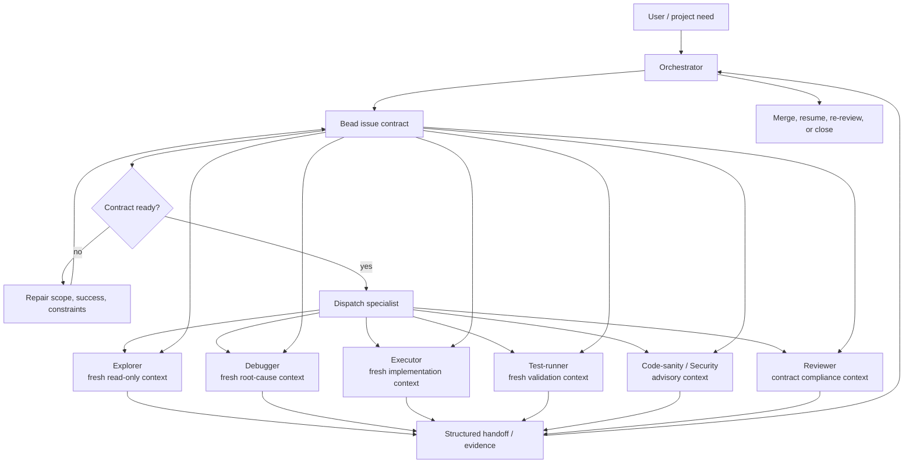

# Specialists

**One MCP server. Many specialist agents. Bead-first orchestration.**

[](https://www.npmjs.com/package/@jaggerxtrm/specialists)
[](LICENSE)
[](https://www.typescriptlang.org/)

Specialists is a project-scoped runtime for running focused AI agents from the CLI, MCP, scripts, CI, or HTTP sidecars. A specialist definition declares its model, tools, permission tier, prompt, skills, output contract, timeout/stall policy, worktree behavior, and tracking behavior. The orchestrator keeps task identity in a **bead**; specialists run as fresh scoped sessions that report evidence, changes, and results back to that bead.

Specialists sits in the xt/xtrm stack:

- **[pi coding agent](https://github.com/Jaggerxtrm/pi-coding-agent)** supplies the model/provider execution layer, JSONL/RPC subprocess boundary, tool events, and extension hooks.
- **[xtrm-tools](https://github.com/Jaggerxtrm/xtrm-tools)** supplies the surrounding operator workflow: worktree sessions, `.xtrm/` skills/hooks, session reports, update tooling, and workflow enforcement.
- **[beads](https://github.com/steveyegge/beads)** supplies issue IDs, dependency edges, claims, and durable task/result notes.

When a run starts from `--bead <id>`, the bead is the task prompt. Dependency context and relevant memory can be injected, the specialist output is appended back to the same bead, and edit-capable specialists work in isolated branches/worktrees that can be reviewed and merged through `sp merge` or `sp epic merge`.

---

## Vision

Specialists turns one overloaded agent chat into a coordinated agent mind: a central orchestrator keeps task identity, evidence, and publication control, while fresh specialist sessions act as scoped capabilities with their own prompts, rules, tools, memory, and output contracts.

The problem it solves is not just token count. Long single-agent sessions accumulate old hypotheses, partial plans, tool residue, self-review bias, and forgotten constraints. Specialists uses **contract-bound cognition** instead: write the task contract once, dispatch the right expert role with only the relevant context, require a structured handoff, and let the orchestrator decide the next step.

See [specialists.scheme.md](specialists.scheme.md) for the full diagrams and rationale. The core shape is:



## What you can run

| Need | Specialist / surface |
|---|---|
| Map unfamiliar local code | `explorer` |
| Diagnose a bug with unknown cause | `debugger` |
| Implement a scoped change | `executor` |
| Review an executor/debugger result | `reviewer --job <exec-job>` |
| Run/classify tests | `test-runner` |
| Current library/API/GitHub research | `researcher` |
| Plan a multi-file feature into beads | `planner` |
| Check code shape before review | `code-sanity` |
| Audit security-sensitive diffs | `security-auditor` |
| Sync exactly one doc | `sync-docs` |
| Draft changelog gaps | `changelog-keeper` |
| One-shot script/HTTP generation | `sp script` / `sp serve` |

The live registry is authoritative:

```bash
sp list
sp list --compact
sp list-rules
sp help
```

## Install and bootstrap

Specialists is **Bun-only** and expects xtrm-tools to be installed explicitly. xtrm-tools is a runtime prerequisite, not an npm dependency of this package.

```bash
# 1. Bun
curl -fsSL https://bun.sh/install | bash
bun --version

# 2. xtrm-tools
npm install -g xtrm-tools
xt install
xt init

# 3. Specialists
npm install -g @jaggerxtrm/specialists
sp init
sp doctor
sp list
```

`sp` is an alias for `specialists`.

`sp init` is an interactive, human-run bootstrap. It checks for `xt` and `.xtrm/`, wires project MCP registration, hooks, skill symlinks, `.specialists/` runtime directories, and the Specialists block in `AGENTS.md`. It does **not** require copying package-owned defaults into every repo.

## Update and drift repair

Specialists uses two distribution tracks:

| Track | Owned by | What it covers | Check / update |
|---|---|---|---|
| **Category A** runtime assets | `@jaggerxtrm/specialists` package | specialist JSON, mandatory rules, catalog, nodes, hooks shipped with the package | `sp doctor --check-drift`, `sp prune-stale-defaults --dry-run`, `sp prune-stale-defaults` |
| **Category B** filesystem assets | xtrm-tools | `.xtrm/skills`, `.claude/skills`, `.pi/skills`, hook snapshots read directly from disk | `xt doctor --cwd <repo> --json`, `xt update --repo <repo> --apply` |

`.specialists/user/` is your customization layer. `.specialists/default/` is now only for intentional pins or compatibility snapshots; stale default files are drift debt and `sp prune-stale-defaults` removes them by default. `sp init --sync-defaults` remains as a compatibility path, but it is deprecated because it creates repo-local snapshots that can drift from the package-canonical source.

For an interactive, agent-guided update flow that runs both tracks, diagnoses drift, and asks before applying destructive changes, invoke the `/update-specialists` skill in Claude Code instead of running the raw commands manually.

## Operator skills

These skills load into your Claude Code session on demand and guide the most common operator workflows:

| Skill | Invoke | When to use |
|---|---|---|
| `using-specialists-v3` | `/using-specialists-v3` | **Canonical orchestration guide.** Use for any substantial delegated work: implementation, debugging, review, planning, security audit, doc sync, multi-chain epics. Covers bead contracts, role selection, chain lifecycle, merge path, and escalation. |
| `using-specialists-auto` | `/using-specialists-auto` | **Autonomous / offline mode.** Activates when you hand over a multi-item list and step away ("auto mode", "run the list"). Layers pacing discipline and escalation triggers on top of `using-specialists-v3`. |
| `update-specialists` | `/update-specialists` | **Guided drift repair.** Runs both Category A and Category B diagnostics, presents a combined plan, and asks before applying anything. Prefer this over running raw `sp`/`xt` commands directly. |

## Core tracked workflow

```bash
bd create "Investigate auth bug" -t bug -p 1 --json
bd update <id> --claim --json

sp run debugger --bead <id> --context-depth 3
sp ps
sp feed <job-id> --follow
sp result <job-id>

# Human-in-the-loop alternative: launch with a live TUI
sp chat debugger --bead <id>          # feed-style timeline + status + final result + input

# After implementation and reviewer PASS
sp merge <chain-root-bead>          # standalone chain
sp epic status <epic-id>            # multi-chain publication check
sp epic merge <epic-id>             # canonical epic publication

bd close <id> --reason "Done" --json
```

Ad-hoc work is still available, but tracked work should use beads:

```bash
sp run explorer --prompt "Map the CLI architecture"
```

## Background jobs and monitoring

Normal runtime is DB-first: `.specialists/db/observability.db` stores jobs, events, and results. File mirrors under `.specialists/jobs/` are legacy/operator recovery surfaces.

Useful commands:

```bash
sp ps                         # actionable dashboard
sp ps -f                      # TTY dashboard follow; pipes emit ANSI-free snapshots
sp feed <job-id>              # full DB-backed event replay
sp feed -f                    # follow all active jobs
sp chat explorer --bead <id>    # launch interactive TUI; input auto-steers/resumes
sp result <job-id> --wait
sp steer <job-id> "focus only on X"
sp resume <job-id> "continue with these findings"
sp finalize <any-chain-job>   # cascade-close waiting keep-alive chain after PASS if needed
sp clean --reap-orphans --dry-run
sp clean --ps                 # hide terminal dashboard history without deleting DB audit rows
```

`sp chat` is for launching a new interactive specialist session. It renders the same normalized feed style as `sp feed -f`, shows startup/payload context and the final result, and maps typed input to `steer` while running or `resume` while waiting. `/quit` and Ctrl+C detach the TUI without stopping the job; use `/stop` when you intend to stop it. Current `sp attach <job-id>` remains the legacy tmux attach path; chat-style attach to an existing job is tracked separately.

## Script and service specialists

Use `sp run` for interactive agent orchestration. Use the script/service surfaces when you need a synchronous, READ_ONLY, one-shot generation path:

```bash
sp script <name> --vars key=value --json
sp serve --port 8000 --readiness-canary warn
curl -sS http://localhost:8000/v1/generate \
  -H 'content-type: application/json' \
  -d '{"specialist":"hello","variables":{"name":"world"}}'
```

`sp serve` is intended as a sidecar for script-class specialists. For container deployments, mount the whole `.specialists/` directory read-write, set `HOME=/pi-home`, and align container UID/GID with the host user. See [docs/specialists-service.md](docs/specialists-service.md), [docs/specialists-service-install.md](docs/specialists-service-install.md), and [docs/deploying-alongside.md](docs/deploying-alongside.md).

## Documentation map

| Need | Doc |
|---|---|
| Install, update, and distribution model | [docs/installation.md](docs/installation.md) |
| Project bootstrap and `sp init` | [docs/bootstrap.md](docs/bootstrap.md) |
| Bead-first workflow | [docs/workflow.md](docs/workflow.md) |
| CLI commands and flags | [docs/cli-reference.md](docs/cli-reference.md) |
| Background jobs / `ps` / `feed` / `result` | [docs/background-jobs.md](docs/background-jobs.md) |
| Specialist JSON authoring | [docs/authoring.md](docs/authoring.md) |
| Built-in specialists | [docs/specialists-catalog.md](docs/specialists-catalog.md) |
| Tool catalog and permission resolver | [docs/manifest.md](docs/manifest.md) |
| MCP registration and tool surface | [docs/mcp-servers.md](docs/mcp-servers.md), [docs/mcp-tools.md](docs/mcp-tools.md) |
| Hooks | [docs/hooks.md](docs/hooks.md) |
| Skills and operator skill reference | [docs/skills.md](docs/skills.md) |
| Orchestration skill (`using-specialists-v3`) | [docs/skills.md#using-specialists-v3](docs/skills.md#using-specialists-v3) |
| Auto mode skill (`using-specialists-auto`) | [docs/skills.md#using-specialists-auto](docs/skills.md#using-specialists-auto) |
| Update / drift repair skill (`update-specialists`) | [docs/skills.md#update-specialists](docs/skills.md#update-specialists) |
| Worktrees and session close | [docs/worktrees.md](docs/worktrees.md), [docs/worktree.md](docs/worktree.md) |
| Runtime architecture | [docs/ARCHITECTURE.md](docs/ARCHITECTURE.md) |
| Pi subprocess isolation / RPC boundary | [docs/pi-session.md](docs/pi-session.md), [docs/pi-rpc-boundary.md](docs/pi-rpc-boundary.md) |
| NodeSupervisor | [docs/nodes.md](docs/nodes.md) |
| Service sidecar / HTTP contract | [docs/specialists-service.md](docs/specialists-service.md) |
| Compose deployment recipe | [docs/deploying-alongside.md](docs/deploying-alongside.md) |
| Release notes | [CHANGELOG.md](CHANGELOG.md) |

## Project structure

```text
config/
├── specialists/       package-canonical specialist definitions (.specialist.json)
├── mandatory-rules/   package-canonical rule sets injected into specialist prompts
├── catalog/           package-canonical tool catalog
├── nodes/             package-canonical node configs
├── hooks/             bundled hook scripts
└── skills/            repo-local skills shipped by this package

.specialists/
├── user/              repo-owned specialists and overrides (highest precedence)
├── default/           optional pins / compatibility snapshots; prune stale files
├── mandatory-rules/   legacy/repo rule overlay compatibility
├── db/                runtime SQLite state (gitignored)
├── jobs/              legacy runtime mirror (gitignored)
└── ready/             legacy ready markers (gitignored)

.xtrm/
├── skills/            xtrm-managed skill snapshots and active links
└── hooks/             xtrm-managed hook snapshots

src/                   CLI, server, loader, runner, supervisor, MCP tool
```

## Core rules

- Use `--bead` for tracked work; use `--prompt` only for quick untracked work.
- `--context-depth` controls completed dependency context injection; default is 3 for bead runs.
- `--no-beads` disables tracking bead creation/updates, but it does not disable reading the input bead when `--bead` is provided.
- Edit-capable specialists run in isolated worktrees. Review/fix passes should use `--job <exec-job>` to reuse the same workspace.
- Reviewer PASS is the publish gate. Code-sanity/security/test-runner outputs are advisory evidence, not merge approval.
- Specialists are project-scoped. User-scope specialist discovery is deprecated.

## Deprecated commands

These commands are still recognized for migration guidance but are no longer onboarding paths:

- `specialists setup`
- `specialists install`
- `sp release prepare` / `sp release publish` (deprecated aliases; release flow is skill-driven)

Use `sp init`, `xt update`, and the release skill flow instead.

## Development

```bash
bun run build
bun test           # bun vitest run (default)
bun run test:node  # node vitest run (subprocess-safe alternative)
sp help
sp quickstart
```

## License

MIT — see [LICENSE](LICENSE).
