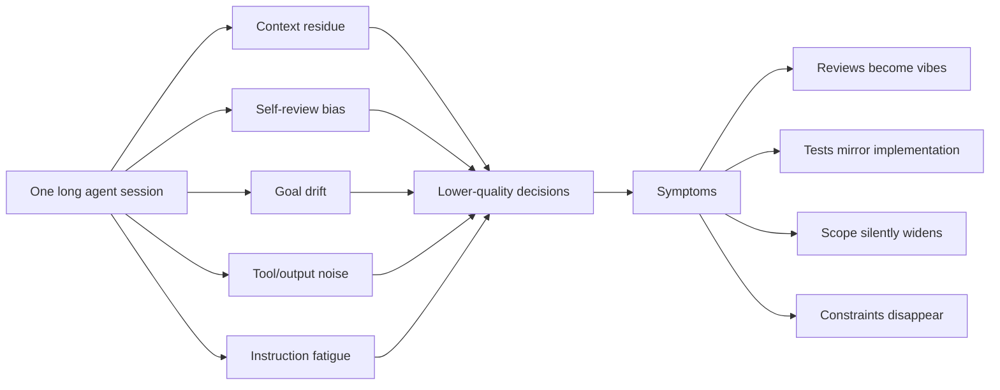
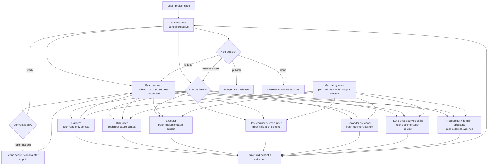

# Specialists

[](https://www.npmjs.com/package/@jaggerxtrm/specialists)
[](LICENSE)
[](https://www.typescriptlang.org/)

Deep material lives in `docs/` — start with `docs/installation.md`, `docs/bootstrap.md`, `docs/workflow.md`, and `docs/cli-reference.md`; `sp --help` is authoritative for flags.

**Specialists is an agent-mind runtime for getting real work done.**

It is not just “run many agents”. The core idea is that a long single-agent chat becomes cognitively contaminated: old hypotheses, abandoned plans, tool residue, self-review bias, forgotten constraints, and context-window noise all accumulate in one mind. Quality drops because the same context tries to be explorer, implementer, tester, reviewer, security auditor, memory keeper, and release operator at once.

Specialists gives an AI workflow a healthier shape:

- the **orchestrator** stays the central executive — it owns the user intent, task identity, evidence, and publication decision;
- the **bead** is the contract and durable working memory — problem, scope, success criteria, validation, dependencies, and handoffs live there;
- **specialists** are fresh, scoped cognitive faculties — explorer, debugger, executor, test-engineer, reviewer, sync-docs, researcher, and domain roles each get only the context, tools, rules, and output contract they need;
- **structured handoffs** flow back to the orchestrator — results are evidence to consume, not conversational vibes to remember;
- **workspaces and gates** keep changes publishable — edit-capable roles work in branches/worktrees, reviewer/QA/security roles judge against the contract.

The result is a shared project mind: continuity without hoarding every detail in one agent’s context.

Specialists sits in the xt/xtrm stack:

- **[pi coding agent](https://github.com/earendil-works/pi-coding-agent)** executes model sessions and exposes tool events/RPC boundaries.
- **[xtrm-tools](https://github.com/Jaggerxtrm/xtrm-tools)** provides operator workflow: worktree sessions, `.xtrm/` skills/hooks, reports, update tooling, and gates.
- **[beads](https://github.com/steveyegge/beads)** provides issue IDs, claims, dependencies, task contracts, and durable notes.

See [specialists.scheme.md](specialists.scheme.md) for the full rationale.

---

## Why not one big agent chat?


```mermaid
flowchart LR
  Long[One long agent session] --> Residue[Context residue]
  Long --> Bias[Self-review bias]
  Long --> Drift[Goal drift]
  Long --> Noise[Tool/output noise]
  Long --> Fatigue[Instruction fatigue]

  Residue --> Bad[Lower-quality decisions]
  Bias --> Bad
  Drift --> Bad
  Noise --> Bad
  Fatigue --> Bad

  Bad --> Symptoms[Symptoms]
  Symptoms --> Vibes[Reviews become vibes]
  Symptoms --> Mirrors[Tests mirror implementation]
  Symptoms --> Scope[Scope silently widens]
  Symptoms --> Forgotten[Constraints disappear]
```

The problem is not only token count. It is **cognitive contamination**. A single context window carries every role’s history, including false starts and stale assumptions. The agent starts defending its own implementation, testing what it built instead of what was requested, and treating completion claims as proof.

Specialists replaces context hoarding with **contract-bound cognition**.

---

## The common-mind model


```mermaid
flowchart TD
  U[User / project need] --> O[Orchestrator\ncentral executive]
  O --> B[Bead contract\nproblem · scope · success · validation]
  B --> Check{Contract ready?}
  Check -->|repair needed| Refine[Refine scope / constraints / outputs]
  Refine --> B
  Check -->|ready| O

  O --> Choose{Choose faculty}
  Choose --> E[Explorer\nfresh read-only context]
  Choose --> D[Debugger\nfresh root-cause context]
  Choose --> X[Executor\nfresh implementation context]
  Choose --> QA[Test-engineer / test-runner\nfresh validation context]
  Choose --> R[Seconder / reviewer\nfresh judgment context]
  Choose --> Docs[Sync-docs / service-skills\nfresh documentation context]
  Choose --> Research[Researcher / domain specialist\nfresh external evidence]

  B --> E
  B --> D
  B --> X
  B --> QA
  B --> R
  B --> Docs
  B --> Research

  Rules[Mandatory rules\npermissions · tools · output schema] --> E
  Rules --> D
  Rules --> X
  Rules --> QA
  Rules --> R
  Rules --> Docs
  Rules --> Research

  E --> H[Structured handoff / evidence]
  D --> H
  X --> H
  QA --> H
  R --> H
  Docs --> H
  Research --> H

  H --> O
  O --> Decision{Next decision}
  Decision -->|resume / steer| Choose
  Decision -->|fix loop| B
  Decision -->|publish| Merge[Merge / PR / release]
  Decision -->|done| Close[Close bead + durable notes]
```

This is close to how a human mind works: a central executive does not consciously compute every perception, motor skill, language move, and memory lookup at once. It activates specialized faculties, receives summaries/evidence, and decides what to do next.

Specialists gives an AI workflow the same structure. The orchestrator remains the “self”; specialists are bounded capabilities that can be activated without permanently polluting the central context.

---

## What Specialists lets you do

| Need | Use |
|---|---|
| Turn vague work into an executable task contract | bead + planner / orchestrator |
| Map unfamiliar local code | `sp run explorer --bead <id>` |
| Diagnose a bug with unknown cause | `sp run debugger --bead <id>` |
| Implement a scoped change in an isolated workspace | `sp run executor --bead <id> --worktree` |
| Add tests from the actual implementation diff | `test-engineer` |
| Run and classify validation commands | `test-runner` |
| Check scope/quality before final review | `seconder` |
| Review implementation evidence against the bead contract | `sp run reviewer --bead <id> --job <exec-job>` |
| Research current docs, repos, APIs, papers, or domain evidence | `researcher`, `quant-researcher`, `transcriber` |
| Sync one stale doc safely | `sync-docs` |
| Keep service-expert skill docs aligned with code drift | `service-knowledge-sync` |
| Generate immediate JSON/text from a specialist | `sp script` or `sp serve` |
| Watch all active specialist work across repos | `sp console` |
| Inspect runtime evidence and telemetry | `sp feed`, `sp log`, `sp forensic`, `sp metrics` |
| Configure package specialists for your machine | `sp init --global`, `sp edit --global`, `sp setup` |

The live catalog is authoritative:

```bash
sp list
sp list --compact
sp list-rules
sp help
```

---

## Install and bootstrap

Specialists is **Bun-first** and expects xtrm-tools to be installed explicitly. xtrm-tools is a runtime prerequisite, not an npm dependency of this package.

```bash
# 1. Bun
curl -fsSL https://bun.sh/install | bash
bun --version

# 2. xtrm-tools
npm install -g xtrm-tools
xt install
xt init

# 3. Specialists
npm install -g @jaggerxtrm/specialists
sp init --global       # machine-level user config and model defaults
sp setup --discovery   # inspect available models/config gaps
sp setup --plan cheap  # optional: propose model assignments
sp init                # per-repo wiring: MCP, hooks, skills, db paths
sp doctor --specialists
sp list
```

`sp` is an alias for `specialists`.

### Claude Code plugin (optional)

Specialists ships a Claude Code plugin, `substrate`, that exposes specialist activation as
MCP tools and injects live activation state at session start. It is opt-in: nothing installs
or enables it for you.

```bash
claude plugin marketplace add xtrm-dev/specialists
claude plugin install specialists@xtrm
```

Verify the server is reachable from Claude Code:

```bash
claude mcp list | grep substrate
# plugin:specialists:specialists: ... - ✔ Connected
```

The plugin requires Bun on `PATH` and reads Substrate's canonical store at `~/.xtrm/state.db`
(override with `XTRM_STATE_DB` only for operator/test use). To develop against a checkout
instead of an install, use `claude --plugin-dir ./plugins/specialists`.

### Global model config

Package specialist definitions ship with `execution.model = null`. This is intentional: the package defines roles, tools, contracts, and safety boundaries; your machine-level config defines provider/model choices.

Use:

```bash
sp init --global
sp edit --global
sp setup --fetch-benchmarks --json
sp setup --plan <budget-preset>
sp doctor --specialists
```

The loader merges configuration in this order:

1. package canonical specialist JSON;
2. `~/.config/specialists/user.json` global overrides;
3. `.specialists/user/` repo-local overrides.

See [docs/installation.md](docs/installation.md), [docs/bootstrap.md](docs/bootstrap.md), and [docs/authoring.md](docs/authoring.md).

---

## First tracked run

```bash
bd create "Investigate flaky checkout flow" -t bug -p 1 --json
bd update <id> --claim --json

sp run explorer --bead <id> --context-depth 2
sp feed <job-id> --follow
sp result <job-id>

sp run debugger --bead <id> --context-depth 3
sp run executor --bead <id> --worktree
sp run reviewer --bead <id> --job <executor-job>

bd close <id> --reason "Root cause found, fix reviewed" --json
```

Ad-hoc one-offs are still supported, but tracked work should use beads:

```bash
sp run explorer --prompt "Map the CLI architecture"
```

---

## Operator console

`sp console` is the multi-repo terminal dashboard for live specialist work.

It provides:

- an **ALL** view aggregating active jobs across configured repos;
- per-repo tabs and persistent repo registry (`~/.config/specialists/console.json`);
- job list, feed, result, bead, diff, config, and repo-config views;
- cursor navigation and direct actions (`↵`, `r`, `i`, `b`, `d`, `g`, `R`, `x`, `0`, `tab`, `1-9`);
- TUI-styled rows shared with `sp ps`.

```text
sp console
# Press R, then + to add a repository; select one and press d to remove it.
```

For shell-only workflows:

```bash
sp ps
sp feed <job-id>
sp feed -f
sp result <job-id>
sp log <job-id>
sp steer <job-id> "focus only on the API boundary"
sp resume <job-id> "continue with this additional evidence"
sp stop <job-id>
sp clean --reap-orphans --dry-run
```

---

## Publication and review

Specialists separates **doing work** from **publishing work**.

- `executor`, `debugger`, `test-engineer`, and `sync-docs` may create changes.
- `seconder`, `test-runner`, and `reviewer` produce evidence/verdicts.
- Reviewer PASS is the normal publish gate for implementation work.
- `sp merge` and `sp epic merge` exist but are currently marked broken. Do not use them.

Follow [the merge and integration procedure](config/skills/using-specialists/references/merge-and-integration.md) for reviewed publication work. `sp epic status <epic-id>` remains available for inspection.

Keep-alive specialists may stop in `waiting` after producing a result. Use `sp result <job-id>` to read the handoff, then `sp stop <job-id>` when no follow-up is needed.

---

## Script and service specialists

Use `sp run` for interactive agent orchestration. Use `sp script` / `sp serve` when you need an immediate one-shot generation contract from a specialist.

```bash
sp script <name> --vars key=value --json
sp serve --port 8000 --readiness-canary warn
curl -sS http://localhost:8000/v1/generate \
  -H 'content-type: application/json' \
  -d '{"specialist":"hello","variables":{"name":"world"}}'
```

`sp script` flags:

```bash
sp script <name> [--vars k=v ...] [--template <text> | --template-field <name>] \
  [--model <override>] [--thinking <level>] [--json] \
  [--allow-local-scripts] [--allow-write-capable] [--single-instance <lockpath>]
```

`sp serve` flags (HTTP sidecar for the same runtime path):

```bash
sp serve [--port <n>] [--concurrency <n>] [--project-dir <path>] \
  [--allow-skills] [--allow-skills-roots <p1>:<p2>]
```

Script/service mode is useful for CI, internal services, deterministic JSON generation, and sidecar deployments. Only `sp script` supports trusted local scripts or write-capable execution through `--allow-local-scripts` and `--allow-write-capable`. `sp serve` supports neither — it remains `READ_ONLY`. Skills remain disabled unless `--allow-skills` is set; `--allow-skills-roots` restricts accepted canonical skill sources when supplied, but it is **not** a filesystem read boundary. Specialists 3.21.6 does not provide host-read isolation: allowed tools, extensions, MCP processes, and child processes can read paths visible to the runtime identity. Its bounded waiver permits only trusted single-tenant callers with private authenticated ingress, a dedicated container or OS account, minimal mounts, least-privilege credentials, trusted definitions, and reviewed extension sources. Untrusted, public, cross-tenant, and multi-tenant deployments are excluded. The waiver does not authorize publication and expires at 3.21.7.

See [docs/specialists-service.md](docs/specialists-service.md) and [docs/specialists-service-install.md](docs/specialists-service-install.md).

---

## Observability and telemetry

Specialists is DB-first. Runtime state lives in `.specialists/db/observability.db`; file mirrors under `.specialists/jobs/` are legacy/operator recovery surfaces.

Useful surfaces:

```bash
sp ps                         # dashboard row view
sp feed <job-id>              # event stream replay
sp log <job-id>               # control/status/error log
sp forensic <job-id> --json   # persisted forensic envelopes
sp metrics --prometheus       # low-cardinality metrics
sp serve --port 8000          # exposes /metrics and job feed endpoints
```

Telemetry uses bounded labels and avoids high-cardinality IDs in Prometheus labels. Forensic events retain drill-down detail in SQLite/JSON output where IDs are appropriate.

### Project-pack Service Knowledge

`service-knowledge-sync` declares the logical `service-knowledge` skill. On Pi and Claude role launches, the runtime resolves that name from the consumer repository rather than requiring a stale global install:

```text
.xtrm/skills/<pack>/service-knowledge/
├── SKILL.md
├── service-registry.json
└── services/
```

Resolution is deterministic and fail-closed. Core first honors an enabled runtime-specific repository view. Otherwise:

- one matching project pack wins;
- multiple matching packs fail as ambiguous;
- a discovered malformed, unreadable, symlinked, or escaping candidate fails instead of falling back;
- zero project-pack matches permit the existing home/global fallback chain;
- direct/script paths are canonicalized against canonical allowed roots before Pi starts.

The pack directory contains repository-specific knowledge. Shared executable machinery remains separate at `.xtrm/skills/default/service-knowledge/scripts/`; the runtime does not copy scripts into each pack umbrella. Pre-scripts run from the consumer repository, clear registry-selection environment overrides, label repository output as untrusted data, redact host paths, and enforce bounded raw and rendered output.

Core forwards the resolved absolute pack path to Pi. For Claude, Core creates a bounded worktree-local `.claude/skills/<name>` link and verifies link, prefix, shadow, and canonical identity before launch. Codex rejects project-pack skill paths because Core does not materialize Codex-native pack skills.

Direct surfaces remain narrower: `sp script` confines skill paths to its project root, `service-knowledge-sync` itself is rejected there because it requires a worktree, and `sp serve` does not permit local pre-scripts.

The extension source for this skill is pinned to an exact reviewed npm spec (e.g. `npm:@jaggerxtrm/pi-service-knowledge@1.10.0`); floating or range specs are rejected.

> **Release state:** This coordinated behavior was validated at merged Core `ef14bf44030ee6cd02d4dd21f0856f067baf54f3`, Specialists `f683f5f6172bdb7ab4a7b7324b7feabd9b918b31`, and `service-knowledge-sync` 1.10.0. These are coordinated-head evidence references, not a published 3.21.6 compatibility guarantee.

---

## Mandatory rules

Every package-class specialist receives mandatory rules at spawn time (bare mode skips injection). These enforce behaviors regardless of the task.

```bash
sp list-rules
sp list-rules --rule <rule-id>
sp list-rules --specialist <name>
sp list-rules --json
```

The loader unions indexes from `.specialists/user/mandatory-rules/`, `config/mandatory-rules/`, `.specialists/default/mandatory-rules/`, and `.specialists/mandatory-rules/`; if none exists, it uses the package-canonical index. Rule bodies use first-existing precedence in the same order.

Per-specialist additions can be declared in the specialist JSON via `mandatory_rules.template_sets` and `mandatory_rules.inline_rules`.

### Global `mandatory_rules.template_sets` selection

You can override which specialist-specific rule sets apply via `mandatory_rules.template_sets` in `~/.config/specialists/user.json` (global) or `.specialists/user/<name>.specialist.json` (repo-local):

```json
{
  "executor": {
    "mandatory_rules": {
      "template_sets": ["my-global-rules"]
    }
  }
}
```

- `null` — inherits package defaults
- `[]` — clears only your specialist-specific sets (required/default index sets always load)
- non-empty array — replaces your specialist-specific sets entirely

Blocked fields `mandatory_rules.inline_rules` and `mandatory_rules.disable_default_globals` cannot be set at global/repo layers; they are package-canonical only. Other blocked fields include `capabilities`, `execution.auto_commit`, `prompt.output_schema`, and `skills.scripts`. See [docs/overrides-guide.md](docs/overrides-guide.md) and [config/mandatory-rules/README.md](config/mandatory-rules/README.md).

Template-set ids are validated as kebab-case and path-contained before overlay.

---

## Extension sources

Specialists spawns Pi with `--no-extensions`, then selectively re-enables extensions via repeated `-e <source>` pairs derived from `execution.extensions`.

| Key | Value | Behavior |
|-----|-------|----------|
| `gitnexus` | `false` | Skips GitNexus MCP injection |
| `serena` | any | Deprecated and ignored (Serena retired) |
| any other key | `true` | Trusted source string forwarded to Pi as `-e <source>` in insertion order |
| any key | `false` or `null` | Skips that source |

Remote sources (`npm:`, `git:`, `http:`, `https:`) cause the run to omit `--offline`; local paths retain it. The per-run offline decision is global: if any enabled source is remote, `--offline` is omitted for the entire Pi invocation. Fail-closed duplicate detection rejects two distinct `npm:` keys for the same package (e.g. a pinned canonical `npm:@scope/pkg@1.0.0` plus a floating `npm:@scope/pkg`) before Pi spawns; fix the overlay by aligning to the exact pinned spec. Configured sources are not equivalent to active tools — only runtime-confirmed allowed tools are advertised.

See [docs/pi-session.md](docs/pi-session.md) and [docs/overrides-guide.md](docs/overrides-guide.md).

---

## Active-tool policy and tool catalog

Specialists operates a **fail-closed active-tool policy**:

- Configured sources are not active tools. Only runtime-confirmed allowed tools are advertised to the specialist.
- Denied built-ins remain denied regardless of configuration.
- The extension tool-policy gate validates at `session_start` and hard-fails the launch if the bundled policy extension is missing while extension sources are enabled.

Tool catalog resolution is also fail-closed. A missing, unreadable, malformed, or empty catalog aborts tracked, script, serve, MCP, and pipeline execution before Pi starts. Specialists never omits `--tools` for a requested tier. Reinstall or rebuild the package if `config/catalog/index.json` is unavailable.

---

## First-class tools: Python and ast-grep

Specialists treats **Python** and **ast-grep** as first-class tools alongside shell, Git, and GitNexus.

| Tool | When to use |
|------|-------------|
| **Python** | Multi-step processing, parsing, aggregation, or structured transforms where a small script replaces many shell round-trips. The Pi `python` tool persists state across calls (variables, imports, functions survive). |
| **ast-grep** | Syntax-aware structural search when `grep` would false-positive on strings. Use `pattern` / `kind` queries for code-shape matching. |

```bash
# ast-grep: find call patterns without string noise
ast_grep run --pattern 'console.log($A)' --language ts
```

Guidance in prompts is advisory. Actual availability depends on Pi agent toolset declaration, extension loading status, and platform support.

---

## Supported models and presets

Package presets ship with the following mappings (see `config/presets.json`):

| Preset | Model | Thinking | Stall timeout |
|--------|-------|----------|---------------|
| `cheap` | `nano-gpt/moonshotai/kimi-k2.5` | `off` | 60s |
| `medium` | `anthropic/claude-sonnet-4-6` | `low` | 120s |
| `power` | `openai-codex/gpt-5.4` | `high` | 300s |

Set via `sp edit --global`:

```bash
sp edit --global --set executor.execution.model @preset/medium
sp edit --global --set "executor.execution.fallback_models" '["@preset/cheap"]'
sp edit --list-presets
```

Package specs ship `execution.model = null` intentionally; your machine config provides the real model. `thinking_level: off` on Kimi-class models can produce empty assistant text (model quirk). Resolution depth cap is 5 levels; cycles surface a structured error at dispatch.

---

## Built-in specialist families

| Family | Examples | Purpose |
|---|---|---|
| Exploration/debugging | `explorer`, `debugger`, `overthinker` | map systems, find root causes, reason deeply |
| Implementation/review | `executor`, `reviewer`, `seconder` | write changes, verify scope, check quality |
| QA | `test-engineer`, `test-runner`, `obligations-scanner` | create tests, run exact commands, track TODO/FIXME obligations |
| Research | `researcher`, `transcriber` | gather current docs, papers, and video transcripts |
| Documentation/release | `sync-docs`, `service-knowledge-sync`, `changelog-keeper`, `changelog-drafter` | keep docs and release notes current |
| Operations | `xt-merge`, `memory-processor`, `node-coordinator` | merge queues, curate memory, coordinate node workers |
| Domain specialists | `quant-researcher`, `quant-methodologist` | market-data and quantitative-method evidence/methodology |

Run `sp list --compact` for the exact installed catalog and versions.

---

## Documentation map

| Need | Doc |
|---|---|
| Install, update, global config | [docs/installation.md](docs/installation.md) |
| Bootstrap a project | [docs/bootstrap.md](docs/bootstrap.md) |
| Bead-first workflow | [docs/workflow.md](docs/workflow.md) |
| CLI commands and flags | [docs/cli-reference.md](docs/cli-reference.md) |
| Feature-level behavior | [docs/features.md](docs/features.md) |
| Background jobs / feed / result | [docs/background-jobs.md](docs/background-jobs.md) |
| Specialist JSON authoring | [docs/authoring.md](docs/authoring.md) |
| Built-in specialist catalog | [docs/specialists-catalog.md](docs/specialists-catalog.md) |
| Mandatory rules authoring | [config/mandatory-rules/README.md](config/mandatory-rules/README.md) |
| Overrides guide (global config) | [docs/overrides-guide.md](docs/overrides-guide.md) |
| Pi subprocess isolation | [docs/pi-session.md](docs/pi-session.md), [docs/pi-rpc-boundary.md](docs/pi-rpc-boundary.md) |
| MCP server/tool surface | [docs/mcp-servers.md](docs/mcp-servers.md), [docs/mcp-tools.md](docs/mcp-tools.md) |
| Script/service sidecar | [docs/specialists-service.md](docs/specialists-service.md), [docs/specialists-service-install.md](docs/specialists-service-install.md) |
| Worktrees and publication | [docs/worktrees.md](docs/worktrees.md), [docs/worktree.md](docs/worktree.md) |
| Architecture | [docs/ARCHITECTURE.md](docs/ARCHITECTURE.md) |
| Release notes | [CHANGELOG.md](CHANGELOG.md) |

---

## Project layout

```text
config/
├── specialists/       package-canonical specialist definitions
├── mandatory-rules/   package-canonical rule sets injected into prompts
├── catalog/           tool catalog and permission metadata
├── nodes/             node coordinator configs
├── hooks/             bundled hook scripts
└── skills/            package-shipped skills

.specialists/
├── user/              repo-local specialists and overrides
├── default/           optional pins / compatibility snapshots; prune stale files
├── mandatory-rules/   repo-local mandatory rule set additions/overrides
├── db/                runtime SQLite state (gitignored)
├── jobs/              legacy runtime mirror (gitignored)
└── ready/             legacy ready markers (gitignored)

.xtrm/
├── skills/            xtrm-managed skill snapshots and active links
└── hooks/             xtrm-managed hook snapshots

src/                   CLI, server, loader, runner, supervisor, MCP tool
```

---

## Core rules

- Use `--bead` for tracked work; use `--prompt` only for quick untracked work.
- Put scope, success criteria, constraints, validation, and output expectations in the bead before dispatch.
- Use `--context-depth` to inject completed dependency context; default is 3 for bead runs.
- Use `--job <prior-job>` when a follow-up role must reuse the same worktree.
- Prefer `sp console`, `sp ps`, `sp feed`, `sp log`, and `sp result` for operations; inspect raw files only for recovery.
- Keep package defaults canonical. Put machine preferences in `~/.config/specialists/user.json` and repo exceptions in `.specialists/user/`.
- Run `sp doctor --specialists` and `xt update --apply` when runtime or xtrm-managed assets drift.

---

## Troubleshooting

```bash
sp view <name> --section execution    # inspect resolved execution config
sp view <name> --section mandatory_rules
sp doctor --specialists               # global user.json validation
```

```bash
sp list-rules --json | jq -r '.sets[].id' | sort -u
sp validate ./config/specialists/<name>.specialist.json --target=script
```

Common issues:

- **No model configured**: Run `sp init --global` and `sp edit --global`
- **Extension not loading**: Check `sp view <name> --section execution` for `extensions` keys; remote sources disable `--offline`
- **Mandatory rules not applying**: Verify set id is kebab-case; check `sp list-rules --rule <id>`
- **Fork bomb / too many jobs**: Use `sp clean --reap-orphans` or `sp stop <job-id>`
- **Stalled waiting jobs**: Default no auto-close; opt-in via `stall_detection.waiting_auto_close_ms`

---

## Deprecated / compatibility surfaces

These commands or paths may still exist for migration, but they are not the preferred onboarding path:

- `specialists setup`
- `specialists install`
- `sp init --sync-defaults` for routine setup
- `.specialists/default/` as an always-synced mirror
- `sp release prepare` / `sp release publish` aliases (release flow is skill-driven)
- `execution.extensions.serena` (retired; ignored if present)

Use `sp init`, `sp init --global`, `sp setup`, `xt update`, and the release skill flow instead.

---

## Development

```bash
bun run build
bun run test       # runs Vitest through Bun (the supported test runner)
sp help
sp quickstart
```

## License

MIT — see [LICENSE](LICENSE).
