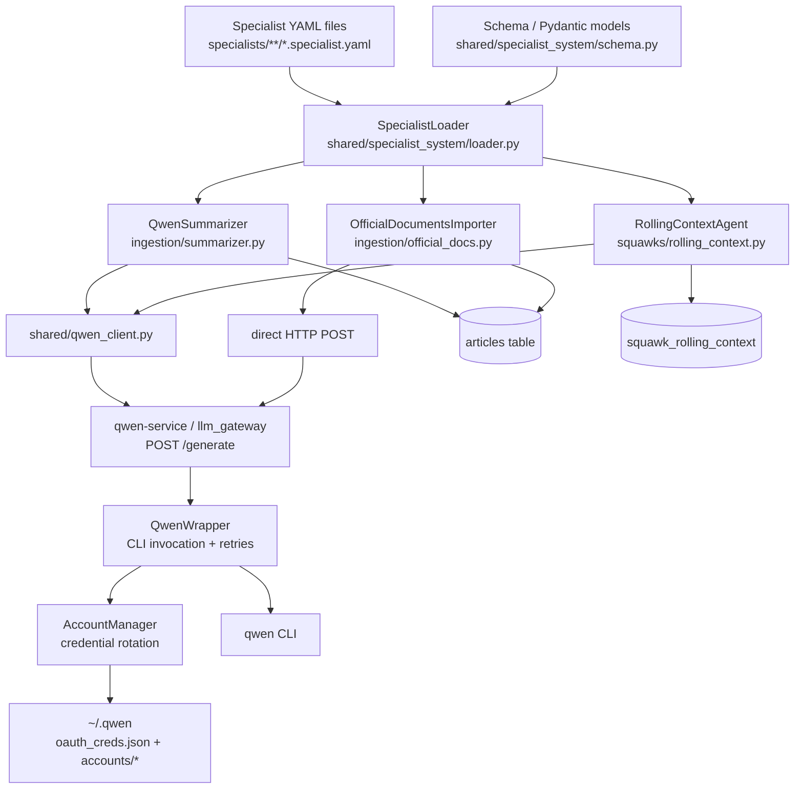
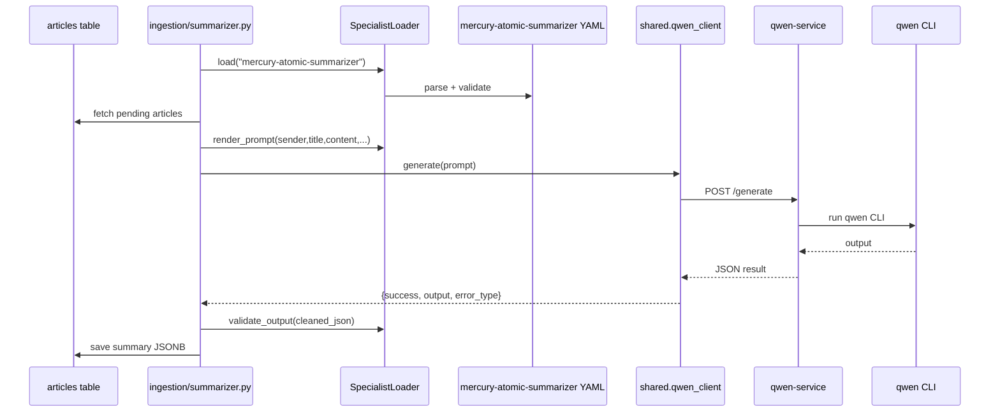
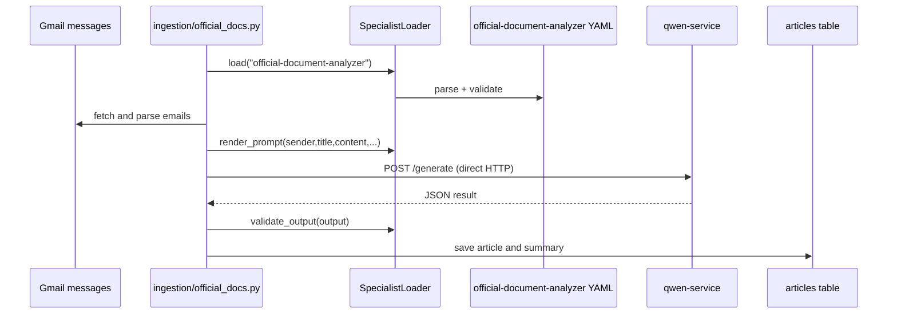
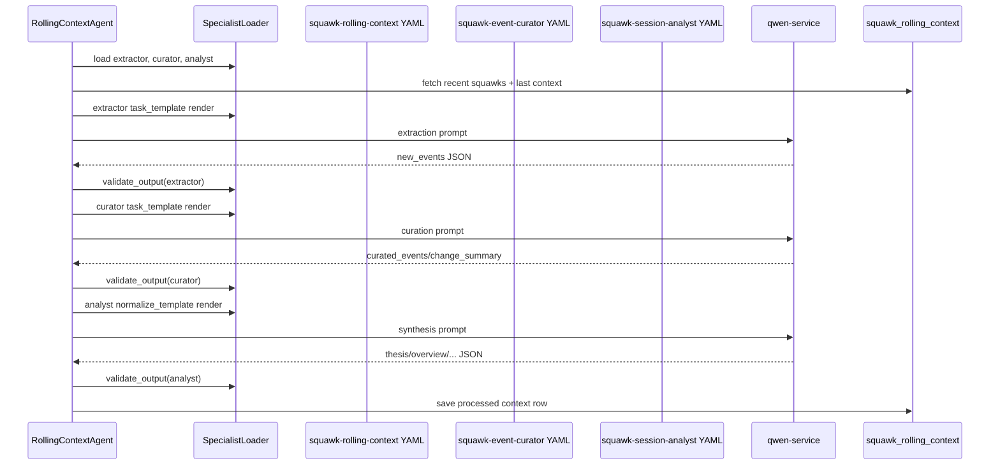

# Script-Specialists Architecture Report

**Date:** 2026-04-24  
**Scope:** Current legacy "script-specialists" design used by services and scripts in this repo  
**Status:** Active in production-facing Python services, but conceptually superseded by the newer `.specialists/*.specialist.json` orchestration system

---

## Executive Summary

This repository currently contains **two different specialist systems**:

1. **Legacy script-specialists system** — YAML-defined prompt/config artifacts used directly by Python services and scripts.
2. **Newer orchestration specialists system** — JSON-defined agent/runtime specialists under `.specialists/` with hooks, jobs, nodes, and background execution.

This report describes the **legacy script-specialists system**, because that is what the ingestion and squawk services still run today.

At a high level, the script-specialists design is:

- a **YAML prompt/config registry** in `specialists/`
- a **Pydantic-backed loader** in `shared/specialist_system/`
- several **Python service consumers** that load a named specialist at startup
- a centralized **qwen-service** HTTP gateway (`llm_gateway/`) that executes the actual LLM request

The system is best understood as a **configuration-driven prompt layer for scripts/services**, not as a complete specialist runtime. The specialist YAML provides metadata, prompt templates, and nominal execution settings, but only part of that configuration is enforced at runtime.

---

## Naming and Scope Clarification

### What "script-specialists" means here

In this report, **script-specialists** means the older system built around:

- `specialists/**/*.specialist.yaml`
- `shared/specialist_system/schema.py`
- `shared/specialist_system/loader.py`

It is called "script-specialists" because it is consumed directly by application code and service scripts.

### What it is *not*

It is **not** the newer orchestrated agent system found in:

- `.specialists/default/*.specialist.json`
- `.specialists/default/nodes/*.node.json`
- `.claude/hooks/specialists-session-start.mjs`
- `.claude/hooks/specialists-complete.mjs`

That newer system has jobs, background execution, keep-alive sessions, nodes, reviewers, worktrees, and hook-driven UX. The script-specialists system has none of that.

---

## Repository Map

### Core legacy script-specialists files

- `specialists/ingestion/mercury-atomic-summarizer.specialist.yaml`
- `specialists/ingestion/official-document-analyzer.specialist.yaml`
- `specialists/ingestion/squawk-rolling-context.specialist.yaml`
- `specialists/ingestion/squawk-event-curator.specialist.yaml`
- `specialists/ingestion/squawk-session-analyst.specialist.yaml`
- `shared/specialist_system/schema.py`
- `shared/specialist_system/loader.py`
- `shared/specialist_system/__init__.py`

### Runtime consumers

- `ingestion/summarizer.py`
- `ingestion/official_docs.py`
- `squawks/rolling_context.py`

### LLM transport / execution layer

- `shared/qwen_client.py`
- `llm_gateway/src/llm_gateway/main.py`
- `llm_gateway/src/llm_gateway/wrapper.py`
- `llm_gateway/src/llm_gateway/manager.py`
- `llm_gateway/infra/docker-compose.yml`

### Infra wiring

- `ingestion/infra/docker-compose.yml`

### Tests and implementation notes

- `specialists/SPECIALIST_SYSTEM_IMPLEMENTATION.md`
- `specialists/test/test_specialist_system.py`
- `tests/test_qwen_client.py`
- `tests/test_rolling_context_specialists.py`
- `llm_gateway/tests/test_wrapper.py`
- `.serena/memories/specialist-system_ssot.md`

---

## High-Level Architecture



---

## Design Goals of the Legacy System

The legacy system was built to move prompt logic out of code and into editable config files.

Primary intended benefits:

- prompt changes without code edits
- prompt changes without rebuilding images
- discoverable specialists via filesystem scanning
- startup validation with Pydantic
- reusable prompt templates across multiple services
- lighter-weight experimentation than hardcoding prompts in Python

Operationally, the workflow is:

1. define a specialist YAML file
2. mount `specialists/` into a container
3. service loads the specialist by name at startup
4. service renders prompt variables into `task_template`
5. service sends the rendered prompt to `qwen-service`
6. service parses/validates the result and persists it

---

## Specialist File Format

All legacy specialists are rooted under a top-level `specialist:` key.

Example structure:

```yaml
specialist:
  metadata:
    name: mercury-atomic-summarizer
    version: 1.1.0
    description: "..."
    category: ingestion/summarization
    created: 2026-02-08T00:00:00Z
    updated: 2026-02-11T02:00:00Z
    author: jagger

  validation:
    files_to_watch:
      - ingestion/summarizer.py
    references:
      - type: code
        path: ingestion/summarizer.py
        symbol: QwenSummarizer.generate_summary
        purpose: "Integration point"
    stale_threshold_days: 30

  execution:
    model: qwen-coder
    temperature: 0.3
    max_tokens: 2000
    response_format: json
    fallback_model: gemini-2.0-flash-thinking

  prompt:
    system: |
      ...
    task_template: |
      ... $title ... $content ...
    normalize_template: |
      ... optional second-stage template ...
    output_schema:
      type: object
      required: [...]
      properties: ...
```

### Field groups

#### `metadata`
Descriptive information used for identification and traceability.

#### `validation`
Operational metadata for drift/staleness awareness:

- `files_to_watch`
- `references`
- `stale_threshold_days`

#### `execution`
Nominal runtime settings:

- `model`
- `temperature`
- `max_tokens`
- `response_format`
- `fallback_model`

#### `prompt`
The actual behavioral contract:

- `system`
- `task_template`
- `normalize_template` (optional)
- `output_schema`
- `examples`

---

## Schema Layer

File:

- `shared/specialist_system/schema.py`

This is the authoritative typed schema for the legacy system.

### Main models

- `SpecialistConfig`
- `SpecialistMetadata`
- `ValidationConfig`
- `ExecutionConfig`
- `PromptConfig`
- `FileReference`
- `SpecialistCategory`

### Important constraints enforced at load time

Examples of actual schema constraints:

- `metadata.name` must match `^[a-z0-9-]+$`
- `metadata.version` must match semantic version pattern
- `description` has length bounds
- `prompt.task_template` must be non-empty and at least 10 chars
- `execution.temperature` is bounded
- `execution.max_tokens` is bounded
- `validation.stale_threshold_days` is bounded
- `metadata.updated >= metadata.created`

### Category model

The enum in `schema.py` is still narrow and oriented around the original ingestion/analysis use case:

- `ingestion/summarization`
- `ingestion/processing`
- `monitoring/health`
- `monitoring/diagnostics`
- `analysis/macro`
- `analysis/technical`

That reflects the age of the system: it was designed first for service prompts, not for general-purpose agent orchestration.

---

## Loader Layer

File:

- `shared/specialist_system/loader.py`

`SpecialistLoader` is the central runtime for the legacy system.

### Responsibilities

1. discover YAML files recursively
2. parse YAML
3. validate specialist configs via Pydantic
4. cache loaded specialists in memory
5. render prompt templates using variables
6. perform lightweight runtime output validation
7. warn about stale/missing watched files

### Startup discovery

On initialization:

- `SpecialistLoader()` defaults to `Path("specialists")`
- `_scan_specialists()` recursively scans for `*.specialist.yaml`
- each file is loaded via `_load_yaml_file()`
- valid specialists are cached by `metadata.name`

### Cache model

The cache is an in-memory dict:

- key = specialist name
- value = validated `SpecialistConfig`

No persistent index exists. Discovery is filesystem-based.

### Loading behavior

`load(name)`:

- looks up the cached config
- runs `_check_health()`
- returns the `SpecialistConfig`

### Health checks

`_check_health()` currently does basic checks only:

- warn if specialist age exceeds `stale_threshold_days`
- warn if a watched file path does not exist

It does **not** currently implement deeper semantic drift detection.

### Prompt rendering

`render_prompt()`:

- prepends `prompt.system` if present
- renders `prompt.task_template` using `string.Template`
- raises `KeyError` if a required template variable is missing

This means all prompt variables are strict string-template substitutions like:

- `$title`
- `$content`
- `$sender`
- `$controlled_tags`

### Runtime output validation

`validate_output()` is intentionally lightweight.

What it actually does today:

1. if there is no `output_schema`, returns `True`
2. if response format is not `json`, skips strict checking
3. strips `<think>...</think>` blocks
4. extracts the outermost JSON object from the output text
5. parses JSON
6. checks only presence of fields listed in `output_schema.required`

What it does **not** fully enforce:

- nested schema types
- enum validity
- array cardinality
- string length limits
- `properties` shape correctness

So the loader gives **strong config validation** but only **shallow runtime payload validation**.

---

## Runtime Consumers

## 1. `ingestion/summarizer.py`

Class:

- `QwenSummarizer`

Specialist used:

- `mercury-atomic-summarizer`

### Role

This service processes pending articles and generates structured summaries.

### Startup flow

At initialization it:

1. constructs `QwenClient()`
2. constructs `SpecialistLoader()`
3. loads `mercury-atomic-summarizer`
4. logs success or fails hard on `SpecialistLoadError`

### Prompt construction

For each article, `generate_summary()`:

- truncates content to 40,000 chars
- optionally injects extracted table markdown
- injects source-specific context
- injects controlled tags vocabulary
- renders the specialist prompt

Variables passed include:

- `sender`
- `source_type`
- `title`
- `content`
- `truncation_notice`
- `tables_section`
- `is_truncated`
- `controlled_tags`

### LLM call path

It uses:

- `shared.qwen_client.QwenClient.generate(prompt)`

### Result handling

After response:

- extracts JSON by first `{` and last `}`
- calls `validate_output()`
- saves even if schema validation warns
- normalizes tags before writing to `articles.summary`

### Architectural note

This is the cleanest expression of the script-specialists pattern: YAML defines the prompt contract; Python provides domain variables and persistence.

---

## 2. `ingestion/official_docs.py`

Class:

- `OfficialDocumentsImporter`

Specialist used:

- `official-document-analyzer`

### Role

This service ingests official government documents from Gmail and produces policy-analysis summaries.

### Startup flow

At initialization it:

1. resolves `QWEN_SERVICE_URL`
2. constructs `SpecialistLoader()`
3. loads `official-document-analyzer`
4. stores the specialist for later prompt rendering

### Prompt construction

`generate_summary()` renders prompt variables such as:

- `sender`
- `title`
- `content`
- `truncation_notice`
- `is_truncated`

### LLM call path

Unlike `QwenSummarizer`, this module performs **direct HTTP POST** to qwen-service.

It posts:

```json
{
  "prompt": "...",
  "model": "...",
  "temperature": 0.1,
  "max_tokens": 2500
}
```

### Architectural note

This consumer reveals an important mismatch:

- the specialist execution block is read and forwarded
- but the current qwen-service request model only formally defines `prompt` and `timeout`

So the intent is richer than the actually enforced contract.

---

## 3. `squawks/rolling_context.py`

Class:

- `RollingContextAgent`

Specialists used:

- `squawk-rolling-context`
- `squawk-event-curator`
- `squawk-session-analyst`

### Role

This is the most evolved consumer of the legacy system. It uses **multiple specialists in a staged pipeline**.

### Startup flow

At initialization it:

1. constructs `SpecialistLoader()`
2. loads extractor specialist
3. loads curator specialist
4. loads analyst specialist
5. derives `llm_model` from analyst execution config

### Pipeline stages

#### Stage 1 — Extraction
Method:

- `_run_extraction()`

Uses:

- `squawk-rolling-context.prompt.task_template`

Behavior:

- scans raw squawks from the last 30 minutes
- asks the LLM to emit `new_events`
- retries once on invalid output
- resolves authoritative timestamps from source squawk indices

#### Stage 2 — Event curation
Method:

- `_run_event_curation()`

Uses:

- `squawk-event-curator.prompt.task_template`

Behavior:

- compares new events against existing memory
- asks the LLM to consolidate / enrich / suppress duplicates
- returns:
  - `curated_events`
  - `change_summary`
  - `material_change_hint`
- falls back to extracted events on curator failure/emptiness

#### Stage 3 — Session synthesis
Method:

- `_run_synthesis()`

Uses:

- `squawk-session-analyst.prompt.normalize_template`

Behavior:

- builds a richer synthesis prompt from:
  - curated events
  - change summary
  - previous-day summary
  - LSEG digest context
  - economic calendar context
  - market snapshot context
  - trusted article context
- asks the LLM for:
  - `thesis`
  - `overview`
  - `what_changed`
  - `contradictions`
  - `watch_items`
  - `mechanisms`
  - `key_data`
  - `session_themes`
  - optional `previous_day_summary`
- rejects weak candidates that fail topical grounding heuristics
- computes degraded input metadata and confidence

### Why this consumer matters

This is where the legacy design stretched beyond its original shape.

The script-specialists system started as:

- one YAML specialist
- one script
- one prompt

But `rolling_context.py` now uses it as a **multi-stage LLM orchestration framework**, even though the loader/runtime itself was never upgraded into a full orchestration system.

---

## qwen-service Integration

The script-specialists design does not execute models directly. It relies on a shared qwen HTTP gateway.

## Shared client

File:

- `shared/qwen_client.py`

### Responsibilities

- resolve `QWEN_SERVICE_URL`
- send prompt to `/generate`
- expose `health_check()`
- emit Prometheus metrics
- normalize connection failures into a simple result dict

### Effective request contract

`QwenClient.generate(prompt, timeout=...)` sends:

```json
{
  "prompt": "...",
  "timeout": 60
}
```

This is the main path used by:

- `ingestion/summarizer.py`
- `squawks/utils.py`
- `ext_mcp/server.py`
- effectively most non-direct callers

---

## qwen-service server

Files:

- `llm_gateway/src/llm_gateway/main.py`
- `llm_gateway/src/llm_gateway/wrapper.py`
- `llm_gateway/src/llm_gateway/manager.py`

Container:

- `qwen-service`

### API surface

#### `GET /health`
Returns:

- `status`
- `current_account`
- `total_switches`

#### `POST /generate`
Consumes a request model with:

- `prompt`
- `timeout`

Returns:

- `success`
- `output`
- `error`
- `error_type`
- `attempts`
- `accounts_tried`

#### Additional endpoints

- `POST /switch-next`
- `GET /accounts`
- `POST /accounts/{account_id}/reset`
- `GET /metrics`

### Concurrency and resilience

`main.py` enforces:

- semaphore with concurrency limit = 2
- circuit breaker after repeated all-account failures
- HTTP 503 while breaker is open

---

## qwen CLI wrapper and account rotation

### Wrapper

File:

- `llm_gateway/src/llm_gateway/wrapper.py`

The wrapper shells out to the installed CLI:

```bash
qwen <prompt> --output-format text --auth-type qwen-oauth --model qwen3-coder-plus --yolo
```

It classifies failures into:

- quota
- auth
- safety
- timeout
- network/unknown

### Rotation manager

File:

- `llm_gateway/src/llm_gateway/manager.py`

Responsibilities:

- discover account files under `~/.qwen/accounts/`
- physically swap active credentials into `~/.qwen/oauth_creds.json`
- persist state in `~/.qwen/state.yaml`
- write rotation events to `~/.qwen/rotation.log`
- avoid races with file lock

### Storage assumptions

The design assumes the following layout:

- `~/.qwen/oauth_creds.json` — active credential
- `~/.qwen/accounts/oauth_creds_<n>.json` — account pool
- `~/.qwen/state.yaml` — rotation state
- `/tmp/qwen_rotation.lock` — lock file used by account manager

### Why this matters for script-specialists

Every script-specialist consumer ultimately depends on this wrapper behavior. If the Qwen CLI changes:

- flags
- output patterns
- auth file layout
- refresh behavior
- model naming

then the legacy specialist stack breaks even if the YAML files remain valid.

---

## Container / Infra Wiring

File:

- `ingestion/infra/docker-compose.yml`

### Volume mount contract

The legacy specialist registry is mounted into consuming containers as:

```yaml
- ../../specialists:/app/specialists:ro
```

This appears on:

- `ext-official-documents`
- `ext-summarizer`
- `ext-squawk-summarizer`
- some adjacent services

### qwen-service contract

Consuming services rely on:

```yaml
- QWEN_SERVICE_URL=http://qwen-service:8000
```

### Operational pattern

The legacy system is therefore **volume-driven** and **restart-applied**:

1. edit YAML on host
2. container sees file via read-only mount
3. restart service/container
4. service reloads specialist at startup

This is often described as "hot reload", but it is not live in-process auto-reload.

---

## Detailed End-to-End Flows

## Flow A — Article summarization



## Flow B — Official document analysis



## Flow C — Rolling context multi-stage pipeline



---

## Strengths of the Legacy Design

## 1. Clear separation of prompt logic from application logic

Service code owns:

- data retrieval
- truncation
- variable assembly
- persistence

Specialist YAML owns:

- system prompt
- task instructions
- output contract

## 2. Fast iteration on prompts

Because `specialists/` is mounted into containers, prompt changes do not require code changes.

## 3. Startup-time safety via Pydantic

Malformed YAML fails early.

## 4. Good fit for domain-specific scripted tasks

The pattern works well for:

- article summarization
- policy document analysis
- structured extraction
- deterministic script pipelines that need prompt externalization

## 5. Rolling context proved the concept can scale to multi-stage prompting

Even though the runtime is simple, the staged use in `rolling_context.py` demonstrates that a specialist registry can support richer chains.

---

## Real Design Limits and Mismatches

## 1. `execution` is mostly declarative, not operative

This is the biggest architectural mismatch.

The YAML exposes:

- `model`
- `temperature`
- `max_tokens`
- `fallback_model`

But in the main runtime path:

- `shared.qwen_client.QwenClient.generate()` only sends `prompt` and `timeout`

That means the specialist execution block is largely **not enforced** for the main consumers.

### Consequence

The system *looks* like a full execution config layer, but operationally it is mostly a prompt/config registry.

## 2. Direct and shared call paths diverge

There are two LLM transport patterns:

- shared client (`QwenClient`)
- direct `requests.post()`

That means behavior is not fully centralized.

## 3. Runtime output validation is shallow

The loader checks required fields, but not the full JSON schema contract.

### Consequence

Specialists can declare rich schemas, but runtime enforcement is weaker than the YAML suggests.

## 4. Hot reload is restart-based, not live

The implementation supports:

- edit YAML
- restart process/container
- reload at startup

It does not provide live watches or in-process reload triggers.

## 5. The design is tightly coupled to qwen-service internals

The entire stack assumes:

- qwen CLI exists
- CLI flags remain stable
- CLI output patterns are classifiable by substring checks
- OAuth files live in the expected shape
- model names remain stable

When Qwen changes behavior, script-specialists break at the transport layer even if the specialist configs are fine.

## 6. The schema/doc story has drifted ahead of the actual implementation

`.serena/memories/specialist-system_ssot.md` describes a richer pipeline:

- normalize phase
- field-drift correction
- word-count checks
- more advanced validation semantics

But `shared/specialist_system/loader.py` is much simpler.

### Consequence

The conceptual docs describe a more mature system than the actual loader/runtime currently implements.

## 7. The repo now contains two overlapping specialist concepts

Legacy:

- `specialists/*.specialist.yaml`

New:

- `.specialists/*.specialist.json`

There is also UX overlap: hooks and docs increasingly describe the newer system, while runtime services still depend on the older one.

---

## Testing and Operational Evidence

## Specialist system tests

File:

- `specialists/test/test_specialist_system.py`

Confirms the legacy loader can:

- load specialists
- render prompts
- validate basic output
- list specialists

## Rolling-context specialist tests

File:

- `tests/test_rolling_context_specialists.py`

This is important because it shows the intended boundary behavior of the legacy multi-specialist pipeline:

- multiple specialists load together
- invalid curator output falls back safely
- extraction retries once on invalid output
- synthesis candidate validation enforces topical grounding
- source-coverage and degraded input metadata are computed

## qwen client tests

File:

- `tests/test_qwen_client.py`

Confirms:

- URL configuration
- HTTP request shape
- timeout behavior
- health check behavior
- Prometheus metric emission

## qwen wrapper tests

File:

- `llm_gateway/tests/test_wrapper.py`

Confirms:

- quota/auth/safety error classification
- rotation logic
- retry behavior
- auth-failure clearing

---

## Architectural Interpretation

The legacy script-specialists design should be interpreted as a **four-layer system**:

### Layer 1 — Config registry
Filesystem YAML specialists.

### Layer 2 — Local runtime adapter
`SpecialistLoader` parses, validates, renders, and lightly validates outputs.

### Layer 3 — Service-specific orchestration
Each Python service decides:

- what variables to inject
- when to call the LLM
- how to parse results
- how to handle fallbacks
- how to persist output

### Layer 4 — Shared LLM gateway
`qwen-service` abstracts CLI execution and credential rotation.

This means the legacy system is **not** a standalone runtime platform. It is a **thin config layer embedded into service code**.

---

## Contrast With the Newer `.specialists` System

The newer system under `.specialists/` introduces concepts absent from the script-specialists design:

- specialist jobs
- background runs
- keep-alive interactions
- worktree isolation
- nodes and coordinators
- hook-driven notifications
- reusable reviewer/executor patterns
- JSON specialist definitions aligned to an agent platform

By contrast, legacy script-specialists provide only:

- config file discovery
- template rendering
- shallow schema checking

### Practical implication

A migration from script-specialists to the new system is **not** just a file-format rewrite. It is a shift from:

- prompt templates consumed by services

to:

- a richer specialist runtime/orchestration platform

That migration requires decisions about:

- how services invoke specialists
- whether specialists remain in-process/config-driven or become external runtime entities
- how execution config is actually enforced
- whether qwen-service remains the transport layer or is replaced

---

## Key Findings for Refactor Planning

## Finding 1
The legacy system is still structurally important.

It is not dead code. It is active in:

- `ingestion/summarizer.py`
- `ingestion/official_docs.py`
- `squawks/rolling_context.py`

## Finding 2
The biggest hidden debt is the **illusion of execution control**.

Specialists declare execution parameters that are not consistently honored.

## Finding 3
The main fragility is now **qwen-service coupling**, not YAML itself.

The YAML loader is simple and stable. The unstable piece is the Qwen transport/execution substrate.

## Finding 4
Rolling context is the hardest migration case.

It already behaves like a multi-stage orchestration pipeline while still using the simple legacy loader.

## Finding 5
The repository has a **conceptual split-brain** around the word "specialists".

Any refactor should explicitly resolve the distinction between:

- runtime script/service specialists
- agent/orchestration specialists

---

## Recommended Mental Model

If you need one sentence to explain the current script-specialists design:

> The current script-specialists system is a YAML-backed prompt/config registry for Python services, loaded via a lightweight Pydantic/Template runtime, with actual LLM execution delegated to qwen-service.

And if you need one sentence about its main limitation:

> It looks like a full specialist execution framework, but in reality it is mostly a prompt registry layered on top of service code and a fragile qwen-service transport.

---

## Appendix A — Active Legacy Specialists

### `mercury-atomic-summarizer`
Used by article summarization pipeline.

### `official-document-analyzer`
Used by official government document importer.

### `squawk-rolling-context`
Extractor stage for rolling context.

### `squawk-event-curator`
Event curation stage for rolling context.

### `squawk-session-analyst`
Session synthesis stage for rolling context.

---

## Appendix B — Current Consumer Matrix

| Consumer | Specialist(s) | Call path | Output target |
|---|---|---|---|
| `ingestion/summarizer.py` | `mercury-atomic-summarizer` | `shared.qwen_client.QwenClient` | `articles.summary` |
| `ingestion/official_docs.py` | `official-document-analyzer` | direct HTTP to qwen-service | article summary / DB |
| `squawks/rolling_context.py` | `squawk-rolling-context`, `squawk-event-curator`, `squawk-session-analyst` | direct HTTP helper to qwen-service | `squawk_rolling_context.processed_data` |

---

## Appendix C — Current Runtime Reality vs Declared Model

| Area | Declared by design | Actual current behavior |
|---|---|---|
| Specialist config | full structured runtime config | mostly prompt + metadata + nominal execution hints |
| Execution settings | model/temperature/max_tokens specialist-specific | mostly ignored on main client path |
| Output schema validation | JSON-schema-like contract | required-fields-only check in practice |
| Hot reload | implied quick prompt iteration | edit + container restart |
| Orchestration | specialist-defined behavior | still owned mostly by Python service code |
| LLM backend independence | specialist abstracted from model transport | tightly coupled to qwen-service/qwen CLI assumptions |

---

## Appendix D — Files Most Relevant to Any Migration

### Must-read

- `shared/specialist_system/loader.py`
- `shared/specialist_system/schema.py`
- `shared/qwen_client.py`
- `ingestion/summarizer.py`
- `ingestion/official_docs.py`
- `squawks/rolling_context.py`
- `llm_gateway/src/llm_gateway/main.py`
- `llm_gateway/src/llm_gateway/wrapper.py`
- `llm_gateway/src/llm_gateway/manager.py`
- `ingestion/infra/docker-compose.yml`

### Useful context

- `specialists/SPECIALIST_SYSTEM_IMPLEMENTATION.md`
- `docs/guides/qwen-service-integration-guide.md`
- `tests/test_rolling_context_specialists.py`
- `.serena/memories/specialist-system_ssot.md`

---

## Closing Assessment

The script-specialists design was a strong and pragmatic step: it externalized prompt logic, enabled fast iteration, and proved especially useful in ingestion and rolling-context services. But the system has now outgrown its original shape.

Today it sits in an in-between state:

- more structured than hardcoded prompts
- less capable than the newer specialist runtime
- increasingly constrained by qwen-service assumptions
- partially mismatched between declared configuration and actual execution behavior

That makes this a good moment to replace or adapt it — especially because the brittle part is no longer the YAML concept itself, but the old execution substrate and the conceptual split with the newer `.specialists` platform.
