# Chain Templates — Canonical Reference

> **Status.** Canonical. Living document — updated as new templates, new pipeline lessons, and the (currently pending) DevOps gates emerge. Last revision: 2026-05-30 (initial promotion absorbing `iron-review-hardening.html` + `iron-review-hardening-qa-chain-substrate.md`; restructure same-day to drop the "overlay" framing — Iron is canonical via `using-specialists-v3`, QA is imminent-canonical via `unitAI-sfwe1`; the only genuine pending gap is DevOps gates, §4).
>
> **Audience.** Operator (deciding which template fits a given bead), planner (composing chains), specialist authors (knowing where their role fires in the pipeline), substrate designers (the catalog substrate §6.9.10 absorbs at landing).
>
> **Scope.** This document is the source of truth for: (a) **the canonical pipeline** every production-diff chain runs (§2); (b) **the template catalog** of 13 named chain shapes (§3); (c) the **DevOps gates gap** that is the only currently-pending design (§4); (d) the **composition mechanism** the dispatcher uses (§5); (e) the **evolution protocol** that folds new lessons back (§6).
>
> **Reference layout.** Foreground (today): `docs/design/roadmap/chain-templates/*.formula.json` — executable formula files; `docs/design/roadmap/chain-templates/README.md` — operator quick-start. Background (substrate-canonical): `docs/design/substrate/substrate.md` §6.9.10 — the substrate-side framing of the same catalog. This document is the **conceptual bridge** between them — neither implementation detail nor substrate primitive, but the *philosophy* both sides agree on.
>
> **Companion file** `docs/design/chain-templates.html` exists as an editorial snapshot in `substrate.html` visual style. It is **not maintained** going forward — this Markdown is the only living source. The HTML is preserved as initial editorial framing for external reading.

---

## Table of contents

1. **Concept** — what a chain template is, and why templates instead of ad-hoc dispatch
2. **The canonical pipeline** — what every production-diff chain runs, severity-modulated
3. **The template catalog** — the 13 templates with their canonical resolved chains
4. **DevOps gates — design pending** — the only genuine gap left to fill
5. **Composition mechanism** — how the dispatcher resolves a chain shape
6. **Evolution protocol** — how new templates and lessons are absorbed
7. **Cross-references**

---

## 1. Concept

A **chain template** is a named, reusable shape for a multi-step specialist chain. It encodes:

- **The resolved canonical chain** — the full sequence of steps the dispatcher runs for that template at a given severity (writer-role, behavioral validation, code-quality gates, security checks if applicable, obligations gate, reviewer with Release Checklist).
- **Per-step contracts** — each step's bead carries a MANDATE/INPUTS/OUTPUTS/SCOPE/NON_GOALS; the root carries the change-contract.
- **Severity sensitivity** — which steps fire is modulated by the bead's `SCRUTINY` field, with auto-escalation on sensitive surfaces.

Templates exist because **ad-hoc dispatch produced inconsistent chains**. Across 96+ session reports (explorer pass 2026-05-27 over mercury / gitboard / specialists) the same recurring shapes emerged. Naming them — and making each a versionable `.formula.json` artifact — turns *"what chain do I run"* from per-bead reasoning into per-bead *selection*.

**Three phases, three concerns.**

1. **Selection.** Given a bead (its type, scope, scrutiny, keywords), which template fits? Lives in: the Claude Code `bd create` hook (roadmap §4) + `sp chain plan` dispatcher (roadmap Opp 4). **NOT** in formula files — `bd formula` does not support `applies_when`.
2. **Composition.** Given a selected template, the dispatcher resolves the canonical chain for the bead's actual severity, pours the formula → creates the molecule (the chain identity bd issue) + child step beads with the right dependency edges. Reviewed / approved / insert-mutated via `sp chain review/approve/insert` (roadmap Opp 4).
3. **Execution.** The composed chain runs step-by-step; gates fire at the right points; coordinator (post-substrate-landing, substrate §4.3) judges borderlines.

This document concerns itself with **what the canonical pipeline is** and **what templates exist** — it does not redocument the formula schema (that's in `chain-templates/README.md`) or the dispatcher semantics (that's in the roadmap).

**One source of truth principle.** When this document and a `.formula.json` disagree on step shape, **the formula wins** for executable shape (it is the executable artifact). When this document and `using-specialists-v4` SKILL disagree, **this document wins** for canonical intent (the SKILL is the operator how-to derived from this). When this document and `substrate.md` §6.9.10 disagree, **substrate wins post-substrate-landing**, **this document wins pre-substrate-landing** (substrate is the future canonical; this is the bridge canonical).

---

## 2. The canonical pipeline

Every chain that produces a production diff runs the same canonical pipeline. The pipeline is **canonical**, not optional, not pluggable, not "overlaid." Severity modulates depth (which steps fire); it does not modulate whether the pipeline exists.

> **Status of canonical steps as of 2026-05-31.** The Iron portion (writer → code-sanity → security-auditor? → obligations-scanner → reviewer) is **in production** via `config/skills/using-specialists-v3/SKILL.md`. The QA portion (`test-engineer` + upgraded `test-runner`) is **imminent-canonical** via epic `unitAI-sfwe1`. The **`seconder` step** between writer and the rest of the pipeline is **design-canonical** as of this revision — it fuses the prior `code-sanity` cheap-quality pass with the reviewer's pre-existing phase-1 compliance check into a single READ_ONLY dual-verdict step (see §2.3 + revision history note on the fusion); the reviewer keeps only its phase-2 (adversarial deep audit + Release Checklist). Implementation epic Opp 15. The **§4 DevOps gates** remain under design.

### 2.1 The shape

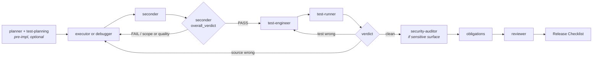

The pipeline has six roles past the writer (seconder, test-engineer, test-runner, security-auditor, obligations-scanner, reviewer) plus the writer itself (executor or debugger). The writer's choice is template-determined (`debug` uses `debugger`, others use `executor`); the rest is the same across every production-diff template.

**Why the seconder fuses scope and quality checks.** The earlier draft of this canonical (2026-05-30) had two separate gates between writer and test-engineer: `contract-coverage` (scope/compliance, extracted from the reviewer's pre-existing phase-1) and `code-sanity` (Iron quality seconder). The 2026-05-31 designer + operator review collapsed both into a single **`seconder`** step with a structured dual-verdict output. Three empirical reasons drove the fusion: (1) real bead contracts are long and writer diffs often touch 3+ files of 500+ lines — a "cheap dispatch" model for scope-only checks produces poor verdicts that force escalation to a capable model anyway; (2) operator's nano-gpt subscription (asian providers — deepseek/qwen) makes "cheap dispatch saves tokens" optimism rather than real savings; (3) **scope-FAIL and quality-FAIL correlate empirically** — when an executor errs, it usually errs on both dimensions together, so the theoretical short-circuit (scope-FAIL blocks before quality check) doesn't pay on this workflow. One dispatch, one capable model, two verdicts in one output: cheaper, simpler, more accurate. The reviewer's phase-1 still exists conceptually — it now lives inside the seconder's `scope_verdict`. The reviewer keeps only phase-2 (adversarial deep audit + Release Checklist + ddiff re-review). See §2.3 for the seconder's output schema and the reviewer's phase-2-only mandate. Design rationale: designer handoff 2026-05-31 (reversal of `contract-coverage` extraction proposed in the same-day overthinker analysis `unitAI-wf834` — the overthinker's break-even calculation was from-the-table, not grounded in operator workflow data).

### 2.2 SCRUTINY is a chain property — it modulates structure, not quality

`SCRUTINY: none|low|medium|high|critical` is a **required field on every root bead's change-contract**. Step beads inherit from root and do not redeclare (single source of truth).

**Key principle — quality is invariant, chain structure is the variable.** SCRUTINY does NOT mean "low scrutiny → executor can write lower-quality code." Every specialist always does the highest-quality work possible regardless of tier. What SCRUTINY modulates is **which structural pieces of the chain fire**: how many independent advisors run pre-impl, which conditional gates activate (security-auditor presence, behavioral-evidence mandate), whether a second-opinion turn runs at critical, how strictly the reviewer enforces the Release Checklist, whether UNCLEAR verdicts auto-escalate to the chain-coordinator (substrate §4.3) instead of single-PARTIAL-loop. The work itself is always at maximum quality; the *amount of structural defense around the work* is what changes.

**Tier semantics:**

| Tier | When | Chain-structure modulation |
|---|---|---|
| `none` | Design / read-only chains only — `planning`, `premortem`, `research-only`, `triage`, `doc-sync`, `memory-hygiene`. Never valid when chain produces a code diff. | No Iron + QA pipeline (these chains don't produce production diffs). |
| `low` | Trivial code-touching work — single-file fix, typo, log-message tweak, isolated config. Floor for any chain that touches code. | `contract-coverage` skippable with explicit reason; `code-sanity` advisory not gate; `test-engineer` skippable with reason; `security-auditor` N/A; reviewer minimal Release Checklist pass. |
| `medium` (default) | Most production diffs. | Full canonical pipeline mandatory. `contract-coverage`, `code-sanity`, `test-engineer`, `test-runner`, `obligations-scanner`, `reviewer` all required. `security-auditor` if surface matches. |
| `high` | Cross-cutting refactor, library boundary, public API, persistence, agent-orchestration code. | + `contract-coverage` UNCLEAR escalates to chain-coordinator (substrate §4.3, post-substrate) or operator (pre-substrate) BEFORE QA starts (don't let test-engineer waste effort on borderline scope). + `gitnexus_impact` evidence required at reviewer phase. + Release Checklist file-by-file sign-off. |
| `critical` | Auth, money, data integrity, irreversible state, security-sensitive surfaces. | + `security-auditor` runs **twice** (advisor pre-impl + gate post-impl). + behavioral QA evidence required in Release Checklist. + independent second-opinion turn (overthinker premortem OR independent reviewer pass) on UNCLEAR / FAIL-prone surfaces. |

**Tier `none` rules.**
- Only valid when the chain produces no code diff. Hard-deny at bead creation if the bead's scope detects source-file paths (pre-substrate: `bd create` hint enforces; substrate: seed-phase validator hard-denies per §6.4).
- Reviewer / contract-coverage / code-sanity / test-engineer / obligations / security-auditor: none of these run on `none` chains. The chain runs its specialist (planner / overthinker / explorer / sync-docs / memory-processor / etc.) and closes.

**Floor + ceiling rules.**
- Declared SCRUTINY is the **floor**. Auto-escalation (§2.4) can raise the effective floor when scope hits a sensitive surface; the reviewer / dispatcher never lowers it.
- The operator can always declare a bead `critical` regardless of apparent size. Cost-of-being-wrong is operator judgment; a small bead in a sensitive area is `critical` if the operator says so.

**Creation enforcement.**
- Pre-substrate (today): the `bd create` hook (roadmap §4 / Layer A) proposes SCRUTINY at bead creation time and rejects missing field on new beads (default `medium` applies only to pre-existing beads as backward-compat fallback). Hard-deny `none` if scope-detection finds source files in the bead's declared scope.
- Substrate (future): seed-phase (§5) validator hard-denies container open without SCRUTINY on the root contract. Chain coordinator (§4.3 entry-gate, §6.3.1 third validation moment) verifies tier-vs-scope appropriateness as part of `verdict: ready`.

### 2.3 Roles in the canonical pipeline

| Role | Permission | Phase | Owns | Must not do |
|---|---|---|---|---|
| `planner` + xtrm `test-planning` | LOW | pre-impl | Phase-level decomposition; logging/telemetry + smoke/E2E contracts; initial test strategy | Write final tests from an unknown future diff |
| `executor` | HIGH | impl | Production implementation from clear bead contract; static lint/typecheck | Own full behavioral validation or broad test writing |
| `debugger` | HIGH | impl (bug chain) | Root-cause fixes for symptoms/failing tests; targeted repro verification | Run broad suites or redesign unrelated tests |
| **`seconder`** | **LOW (READ_ONLY hard)** | **post-writer / pre-QA** | **Compound gate: scope/compliance check (was reviewer phase-1) + code-quality smell pass (was code-sanity). One dispatch, capable model (inherits `code-sanity`'s `openai-codex/gpt-5.4-mini` + fallback `zai/glm-5-turbo`). Structured dual-verdict output: `scope_verdict` + `quality_verdict` + `overall_verdict`. Findings tagged by dimension. UNCLEAR at high+ scrutiny escalates to chain-coordinator borderline-judge (substrate §4.3 role 2).** | **Do style review for taste; do release blessing; do broad audit (that's `reviewer`'s job)** |
| `test-engineer` | MEDIUM | post-seconder | Reads actual diff; writes/updates tests + fixtures + smoke scripts + telemetry assertions; emits exact `test-runner` commands. Ambidextrous role — primary writer in `test-only` template, secondary writer in `code-with-tests` template (see §3 + the "On ambidextrous roles" subsection). | Patch production source by default (unless step contract explicitly designates primary-writer mode); decide release readiness |
| `test-runner` | LOW | post-test-write | Executes exact commands; captures log/telemetry artifacts; classifies failures by owner | Write tests; fix source; silently expand scope |
| `security-auditor` | LOW | conditional (sensitive surface) | Threat-model the diff (advisor pre-impl) + verify diff matches model (gate post-impl) | Bless release; write fixes |
| `obligations-scanner` | LOW | pre-reviewer | Scans diff for newly-introduced `TODO/FIXME/HACK/XXX/TEMP/WIP/NOTE(release)`; distinguishes production vs test; recognizes structured `TODO(<bead-id>)` format | Act as test gate |
| `reviewer` | LOW | final gate | **Phase-2 only** (phase-1 compliance check now lives in `seconder`'s `scope_verdict`): adversarial deep code-quality audit on every changed file + mandatory Release Checklist + ddiff re-review on PARTIAL. PASS / PARTIAL / FAIL verdict. In multi-writer chains (e.g. `code-with-tests`), output `findings_per_writer` attribution so the channel reducer can route fix-loop work to the right writer-step. | Re-check scope compliance (that's `seconder`'s job and is an established PASS gate by the time reviewer runs); write missing tests itself |

**Seconder structured output schema.** The seconder produces a single JSON block consumed by the chain reducer and the downstream reviewer:

```jsonc
{
  "scope_verdict":   "PASS|FAIL|UNCLEAR",
  "scope_findings":  [{ "section": "PROBLEM|SUCCESS|SCOPE|NON_GOALS|VALIDATION", "issue": "..." }],
  "quality_verdict": "PASS|FAIL|UNCLEAR",
  "quality_findings":[{ "file": "...", "category": "type-safety|complexity|smell|...", "issue": "..." }],
  "overall_verdict": "PASS|PARTIAL|FAIL"
}
```

- The chain reducer (substrate §3.1, pre-substrate: the `sp` runtime) reads `overall_verdict` to decide whether the chain advances to `test-engineer` or routes back to the writer for fix.
- The reviewer reads the **tagged findings** (`scope_findings` + `quality_findings`) in its final phase-2 audit; the dimension tagging is what the ddiff re-review loop uses to decide which part of the writer's work needs revisiting (usually both together — the dimensions correlate empirically — but the distinction stays available for the clean cases).
- `UNCLEAR` on either dimension at `high|critical` scrutiny escalates to the chain-coordinator borderline-judge (substrate §4.3 role 2) rather than blocking; it does not auto-route back to the writer without judgment.

**On the seconder / reviewer split.** Pre-2026-05-31, `reviewer.specialist.json` declared a two-phase audit: (1) compliance check against bead requirements, (2) adversarial code-quality review. The 2026-05-30 first-pass canonical extracted phase-1 as a separate `contract-coverage` specialist sitting alongside `code-sanity`. The 2026-05-31 designer + operator review reverted that into the seconder fusion described above — empirical data (long contracts, nano-gpt subscription = cheap dispatch is fiction, scope/quality failure correlation) made the separation more expensive and less accurate than the fusion. The phase-2 deep adversarial audit + Release Checklist + ddiff re-review remain the reviewer's mandate, unchanged in substance.

### 2.4 Auto-escalation on sensitive surfaces

The reviewer raises the SCRUTINY floor when scope hits a sensitive surface. The bead's declared scrutiny is the floor the reviewer can raise; never lower.

| If scope touches | Minimum SCRUTINY |
|---|---|
| `src/auth/**`, secrets / token / credential code | `critical` |
| `config/specialists/**` | `high` |
| `package.json`, `*lock*`, `bun.lock`, `package-lock.json`, requirements files | `high` |
| `migrations/**`, schema files | `high` |
| `.claude/**`, `.xtrm/hooks/**`, `permissions/**` | `high` |
| Default | bead-declared `SCRUTINY` |

When the floor is raised to `critical`, the `security-deep` template's twice-running `security-auditor` shape applies regardless of which template was originally selected — the gate composes onto the chain at the post-`code-sanity` position, and additionally a pre-implementation `security-auditor` advisor is inserted before the writer.

### 2.5 The behavioral-validation contract

`test-engineer` reads the *actual* diff (not the bead's planning-time test plan in isolation) and produces:

```json
{
  "status": "tests_written|blocked|source_bug_suspected",
  "files_changed": ["tests/..."],
  "coverage_map": [
    {"impl_path": "src/...", "test_path": "tests/...", "critical_path": "..."}
  ],
  "smoke_e2e_commands": ["..."],
  "telemetry_assertions": [
    {"event": "...", "fields": ["..."], "query_or_grep": "...", "redaction": "..."}
  ],
  "test_runner_commands": ["..."],
  "known_deferred_paths": [
    {"path": "...", "reason": "...", "follow_up_bead": "..."}
  ],
  "source_bug_suspicions": ["..."]
}
```

If `test-engineer` finds the implementation not testable without a source change, it returns `source_bug_suspected` + files a discovered-from followup. **It does not silently patch production code.**

`test-runner` executes exact commands and classifies failures by owner:

| Finding | Routes to | Example |
|---|---|---|
| Test expectation wrong | `test-engineer` | "Expected JSON field renamed by accepted implementation; update assertion only." |
| Fixture/harness broken | `test-engineer` | "Fixture omits required env var; fix setup/teardown, rerun same command." |
| Required telemetry missing | `debugger`/`executor` | "Implementation never emits `component=runner event=job_finished`; add source instrumentation." |
| Source behavior regression | `debugger` | "Smoke exits 0 but state is stale; root-cause before edits." |
| New source feature untested | `test-engineer` | "Diff added retry fallback; add failure-path test + log assertion." |
| Infrastructure unavailable | orchestrator / reviewer note | "Prometheus unavailable; mark infra failure, use recorded fallback if defined." |
| Pre-existing unrelated failure | reviewer note | "Classify as pre-existing; do not block unless critical-path overlap." |

`test-runner` never silently expands a pinned test scope. If no exact commands supplied, it runs safe manifest-detected smoke/default and **clearly labels it as fallback**.

### 2.6 The Release Checklist

Every reviewer verdict produces a Release Checklist. Lines are mandatory; values are filled per chain.

```text
- [ ] SCRUTINY tier confirmed (auto-escalation triggered: yes|no, reason)
- [ ] seconder scope_verdict: PASS|FAIL|UNCLEAR|skipped (reason)
- [ ] seconder quality_verdict: PASS|FAIL|UNCLEAR|skipped (reason)
- [ ] seconder overall_verdict: PASS|PARTIAL|FAIL
- [ ] obligations-scanner verdict: CLEAN|OBLIGATIONS_FOUND|BLOCKED
- [ ] security-auditor (if applicable): PASS|FINDINGS|BLOCKED|N/A
- [ ] test-engineer required: yes|no|not-required (reason)
- [ ] test-engineer completed: yes|no|N/A
- [ ] test-runner commands executed: yes|no|N/A
- [ ] smoke/E2E evidence present: yes|no|N/A
- [ ] telemetry/log assertions present: yes|no|N/A
- [ ] failures classified and routed: yes|no|N/A (writers attributed in multi-writer chains)
- [ ] obligations introduced: count + structured-vs-unstructured breakdown
- [ ] ddiff applied (on PARTIAL re-review): yes|no|N/A
```

At `SCRUTINY: high|critical`, missing behavioral QA evidence is a **PARTIAL verdict** unless the bead is explicitly docs-only or static-analysis-only. A missing or FAIL `seconder.overall_verdict` at medium+ is a hard precondition failure — reviewer cannot PASS without an established PASS from the seconder (chain should have re-routed back to writer at the seconder gate, not advanced to reviewer; if it did, that is a chain-coordinator escalation event).

### 2.7 The ddiff loop

On a `PARTIAL` verdict, the reviewer re-reviews **the delta only** — prior approvals on unchanged hunks carry forward. The chain does not restart; the writer (or test-engineer, per the failure-routing matrix in §2.5) addresses the findings and the reviewer re-audits the new hunks. This makes iteration cheap: a small fix doesn't pay the cost of a full re-review.

### 2.8 Manual git merge is canonical

Per CLAUDE.md rule #9 (current): `sp merge` and `sp epic merge` are **prohibited**. Manual `git merge --no-ff` per chain + the Cherry-Pick Playbook are the canonical multi-chain integration paths. The merge gate is the operator's, not the tool's.

### 2.9 Substrate alignment

The canonical pipeline in this section maps directly to substrate primitives when substrate lands:

- Each step in §2.1 becomes a `class:step` issue (substrate §6.2.1) with its `step-contract` populated (substrate §6.9.2). `seconder` becomes `class:gate, role:seconder` — same shape as the other Iron gates; persisted evidence (the dual-verdict block) lives in `issue.evidence_json` per substrate §6.8.
- The severity-tiered chain-structure rules in §2.2 become the chain template's `mandatory_layer` declarations (substrate §6.9.3). The `none` tier maps to "no mandatory_layer applies" (the chain runs only its Layer-1 specialist).
- The auto-escalation rules in §2.4 become dispatcher policy on `recommended_template` selection (substrate §6.4).
- The Release Checklist in §2.6 is rendered by the reviewer-as-step from `issue.evidence_json` (substrate §6.8).
- The ddiff loop in §2.7 is the reducer's blocking-not-routine behavior (substrate §6.9.2 completeness contract).
- The `seconder` gate is **not a fourth composition moment** (substrate §6.9.5 documents seed-time / dispatch-time / mid-run composition — three moments). It is a post-writer **evidence gate** using the existing §6.10 close-as-derivation pattern applied at intermediate-step granularity: writer's diff persists as evidence, the gate's predicate derives PASS / FAIL / UNCLEAR per dimension and overall, the chain advances or blocks per §3.1 reducer semantics. This is a clean instance of already-documented substrate patterns, not an architectural extension. The chain coordinator's borderline-judge role (§4.3 role 2) is where UNCLEAR verdicts at `high|critical` scrutiny route for coordinator-grade judgment.
- Multi-writer chains (e.g. `code-with-tests`, §3.X) use substrate §6.9.6 sequential-writers semantics — writer-steps can be more than one *planned* (not only contingent restitch). The lease is passed on `agent_end` from one writer to the next. Reviewer attribution-per-writer is rendered in the Release Checklist; the channel reducer reads it to route ddiff fix-loop work to the correct writer-step.

Migration is naming + ownership-transfer; the canonical shape survives unchanged.

---

## 3. The template catalog

13 default templates ship in `docs/design/roadmap/chain-templates/`. Each is a `.formula.json` file using only `[package]`-tier specialists (cross-repo defaults). Per-repo extension is supported via `extends` (see `chain-templates/README.md` for the market-data `quant-validation` example).

The catalog is **evidence-backed** — every template name maps to a recurring chain shape observed in real session reports. New templates are added through the evolution protocol (§6), not on speculation.

> **What the mermaid diagrams show.** The diagrams below show the **resolved canonical chain** for each template at its default scrutiny floor — i.e. *what runs when you pour this template at default severity*. Severity-conditional steps (e.g. `security-auditor` at `high+` for sensitive scope) are marked. The full step list per template comes from §2.1 (the canonical pipeline) modulated by §2.2 (severity tiers); the templates differ primarily in: the writer-role choice, the advisor steps prepended, and whether the chain includes a production diff at all.

### 3.1 `code-quick`

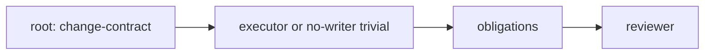

**Use.** LOW-blast trivial change — one-line fix, typo, comment correction, log-message tweak.
**Variables.** `root_title`, `scope`.
**Severity floor.** `low`.
**Differences from §2 canonical:** at `low` scrutiny, `code-sanity` is advisory (not a gate), `test-engineer` is skippable with reason, `security-auditor` is N/A. Reviewer Release Checklist still required (minimal pass).
**Anti-pattern.** Using `code-quick` for anything that touches more than one file or any sensitive surface. Auto-escalation (§2.4) promotes to `code-standard` when the bead's scope hits an escalation trigger.

### 3.2 `code-standard`

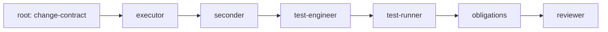

**Use.** The default for any production diff with normal scrutiny. ~70% of dispatches across the evidence corpus.
**Variables.** `root_title`, `scope`, optional `notes`.
**Severity floor.** `medium`.
**Differences from §2 canonical:** none — `code-standard` IS the §2 canonical shape, minus security-auditor (which auto-escalates in when scope matches sensitive surface per §2.4).

### 3.3 `code-with-advisors`

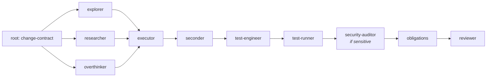

**Use.** HIGH/CRITICAL blast radius — cross-cutting refactor, external-library integration, architecture-level change, anything where the bead author isn't sure the executor has full context.
**Variables.** `root_title`, `scope`, `external_libs` (optional).
**Severity floor.** `high`.
**Differences from §2 canonical:** three advisors run in parallel pre-executor (explorer, researcher, overthinker — each writes findings to the chain channel, or its own discovered-from bead in pre-substrate land). Executor reads all three before opening any file. `security-auditor` is mandatory if scope matches sensitive surface (high floor + auto-escalation triggers).

### 3.4 `debug`

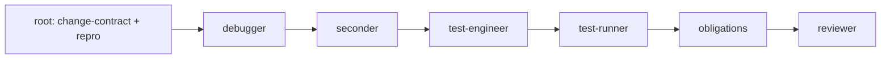

**Use.** Bug fix — root cause + targeted fix + regression test. `debugger` is non-skippable (cannot be inlined into `code-standard` even if the fix is small).
**Variables.** `root_title`, `failing_test_or_repro`, `scope`.
**Severity floor.** `medium` (raises to `high` if regression is severe — operator-declared).
**Differences from §2 canonical:** writer-role is `debugger` (not `executor`). Regression test is mandatory — a bug fix without a regression test produces a discovered-from followup.
**Critical orchestration rule.** Bug Diagnosis Chain (per `using-specialists-v3` Failure Recovery): orchestrator must NOT dispatch executor while bug cause is unknown. If `debugger` reports the root cause is architectural, escalate to `overthinker` / `planner` BEFORE attempting a code fix.

### 3.5 `security-deep`

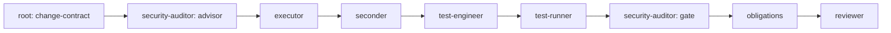

**Use.** Sensitive surface — auth, secrets, crypto, migrations, agent config, permissions, hooks, lockfiles.
**Variables.** `root_title`, `scope`, `sensitive_surface` (one of: auth, secrets, crypto, migration, hooks, permissions, lockfile, agent-config).
**Severity floor.** `critical`.
**Differences from §2 canonical:** `security-auditor` runs **twice** — as advisor pre-implementation (threat-model the diff before it's written), and as gate post-implementation (verify the diff matches the threat model). Reviewer Release Checklist gains explicit security-evidence lines. Behavioral QA evidence is required (smoke + telemetry assertions for security paths).

### 3.6 `release-prep`

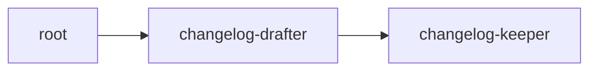

**Use.** Release preparation — reconcile `[Unreleased]` CHANGELOG section against actual diff between previous tag and HEAD, then bump version + tag + push.
**Variables.** `prev_tag`, `next_version`.
**Severity floor.** `medium` (release artifacts are not production-code paths).
**Differences from §2 canonical:** this is meta, not production code — no §2 pipeline applies. Operator-gated by design (operator inspects staged changelog + bump diff before `changelog-keeper` pushes the tag).

### 3.7 `triage`

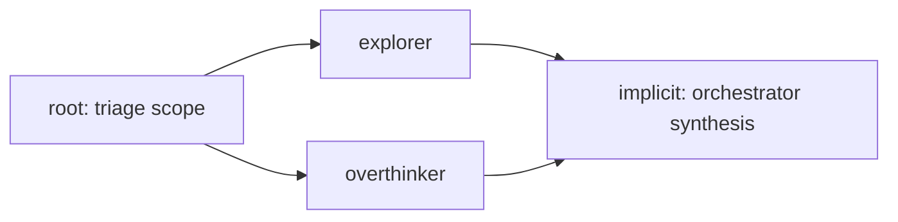

**Use.** Board hygiene — find duplicates / semantic clusters / orphans, propose rewires. Output is a recommended set of `bd dep` mutations (orchestrator applies after operator confirmation per `issue-triage` skill).
**Variables.** `triage_scope` (default: all open).
**Severity floor.** N/A (READ_ONLY chain — produces no code diff).

### 3.8 `research-only`

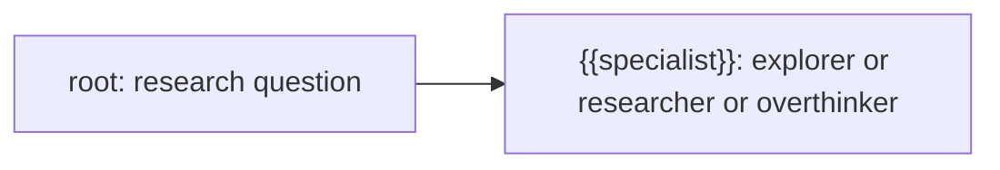

**Use.** Investigation that deliberately produces no code — answer a question, build a mental model, prepare for a future implementation epic.
**Variables.** `root_title`, `specialist` (one of `explorer` / `researcher` / `overthinker`).
**Severity floor.** N/A.

### 3.9 `restitch`

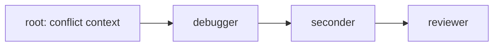

**Use.** Conflict recovery after a failed merge — `debugger` restitches the worktree against the new base, `code-sanity` verifies, reviewer confirms equivalence.
**Variables.** `original_chain_root`, `conflict_summary`.
**Severity floor.** Inherits original chain's SCRUTINY.
**Differences from §2 canonical:** this IS the recovery from a §2 pipeline that broke. Test-engineer / test-runner re-execution depends on whether the original chain's QA evidence is invalidated by the restitch (ddiff carry-forward applies).

### 3.10 `planning`

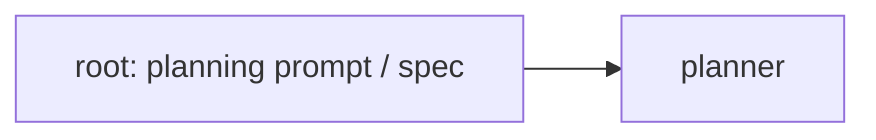

**Use.** Vague initiative → phased bd issue board. Planner produces decomposed bd issues with dependencies, contract drafts, recommended templates per leaf bead.
**Variables.** `root_title`, `spec_or_prompt`.
**Severity floor.** N/A.
**Note.** Planner output already proposes `recommended_template` per leaf bead (per roadmap D26 / Phase 0 bootstrap) — this is what makes template selection (phase 1 of §1) work without operator effort.

### 3.11 `premortem`

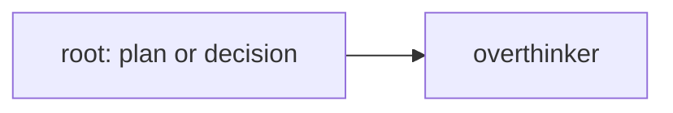

**Use.** Devil's-advocate before risky design commits — "assume this failed in 6 months, work backward to find every reason why."
**Variables.** `root_title`, `plan_or_decision`.
**Severity floor.** N/A.
**Trigger.** Via `premortem` skill — high cost-of-being-wrong contexts (architecture commits, hire decisions, strategy pivots, irreversible refactors).

### 3.12 `doc-sync`

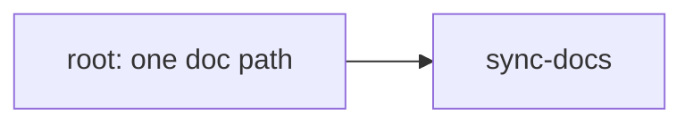

**Use.** Single-document drift-aware update after code changes. Hard-scoped to exactly one doc per chain (the `sync-docs` mandatory rule enforces this).
**Variables.** `doc_path`, `change_window` (commits to consider).
**Severity floor.** N/A.

### 3.13 `memory-hygiene`

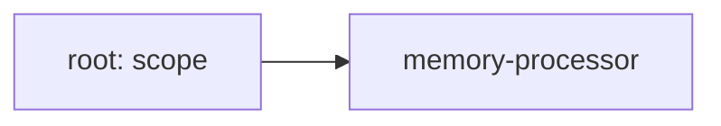

**Use.** Post-epic stale memory consolidation — prune memories tied to closed beads, demote tier on inactivity, mark superseded vs preserved.
**Variables.** `scope` (default: all memories), `dry_run` (default true).
**Severity floor.** N/A.

### 3.14 `code-with-tests`

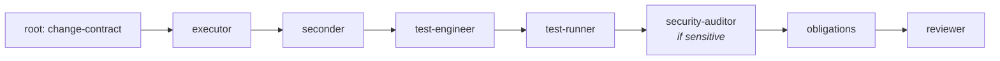

**Use.** Dual-writer chain for production-touching diffs at `high|critical` scrutiny — `executor` writes the production diff, `test-engineer` writes tests against the actual diff. Same shape as `code-standard` but with `test-engineer` promoted to a **planned writer** (not an opt-in QA addition). Lease handoff per substrate §6.9.6: executor acquires → writes production → releases on `agent_end` → seconder runs READ_ONLY → test-engineer acquires → writes tests → releases.
**Variables.** `root_title`, `scope` (production paths + intended test paths).
**Severity floor.** `high` (auto-selected when scope touches production code AND scrutiny ≥ high; explicit operator selection always permitted).
**Applies_when.** `type: [task, bug]` AND `scrutiny_gte: high` AND scope contains production paths (not solely test paths).
**Differences from `code-standard`:** test-engineer is a **planned secondary writer** (not opt-in). Reviewer mandate enriched to output `findings_per_writer` attribution (`executor` / `test-engineer` / `architectural`) so the channel reducer can route fix-loop work to the correct writer-step. Architectural findings (applicable to multiple writers together) escalate to the chain-coordinator borderline-judge (substrate §4.3 role 2). Test-engineer in this template is in **secondary-writer mode** (see §3.16 ambidextrous roles).

### 3.15 `test-only`

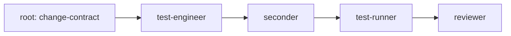

**Use.** Single-writer chain when the root contract is "add tests to module X" or "raise coverage from 60% to 90%" — no production diff produced, scope confined to test paths. test-engineer is the **primary writer**, not a secondary QA step.
**Variables.** `root_title`, `scope` (test paths), optional `coverage_target`.
**Severity floor.** `medium`.
**Applies_when.** `scope_matches: ["test/**", "**/__tests__/**", "*.spec.*", "*.test.*", "**/fixtures/**"]` AND no production file in scope.
**Differences from `code-standard`:** single writer (test-engineer in primary-writer mode — see §3.16); no security-auditor by default (test files rarely hit sensitive surface); no obligations-scanner by default (test code rarely introduces production TODO/FIXME markers); reviewer scope reduced to "test quality + coverage adequacy", not production-code adversarial audit. Seconder still applies (scope/quality dual-verdict, scoped to the test diff). Operator can opt-in security-auditor + obligations-scanner via explicit insertion if needed.

### 3.16 On ambidextrous roles

Some roles serve **two distinct positions in the chain depending on which template they appear in** — same role, same `.specialist.json`, same model, different *mandate per position*. The role's expertise is invariant; the position-specific behavior is injected via the step contract, not the specialist config.

**Established pattern: `security-auditor × 2 classes`** (substrate §6.2.1). In `security-deep` (§3.5) the same `security-auditor` runs twice: as a **pre-impl advisor** (threat-model the diff before it's written) and as a **post-impl gate** (verify the diff matches the threat model). Different class (advisor vs gate), different position, same expertise.

**New pattern: `test-engineer × 2 positions`** (this revision). In `test-only` (§3.15) `test-engineer` is the **primary writer** — the step contract says *"you are the primary writer; write tests that satisfy the bead contract."* In `code-with-tests` (§3.14) `test-engineer` is the **secondary writer after the executor** — the step contract says *"you are the secondary writer after the executor; write tests that validate their diff."* Different mandate, different position in the lease sequence, same `test-engineer.specialist.json`. The specialist's system prompt is written **mode-agnostic** (the expertise is "writing tests well"); the per-invocation mode comes from the step contract injected at chain composition.

**Authoring rule.** When authoring or refactoring an ambidextrous specialist, the `.specialist.json` system_prompt **must NOT** assume a single position. It declares the expertise; the step contract supplies position. If a specialist's prompt hardcodes "you are the gate" or "you are the writer", it cannot be ambidextrous — either restrict it to one position (single-mandate role) or refactor the prompt to be mode-agnostic.

**Future candidate ambidextrous roles** (not yet implemented): `reviewer × 2 positions` (final-gate vs in-chain mid-review for very long chains), `seconder × 2 positions` (post-writer-1 + post-writer-2 in multi-writer chains, if scope demands per-writer attribution at the seconder layer rather than only at reviewer). Both are speculative; document only when the operator's workload produces evidence for them.

---

## 4. DevOps gates — design pending

> **The only genuine gap.** Every other piece of the canonical pipeline (§2) and the template catalog (§3) is either shipping today (Iron via `using-specialists-v3`) or imminent (QA via `unitAI-sfwe1`). DevOps gates are the only part of the canonical pipeline still under design as of 2026-05-30.

**The problem.** Specialists touching operational surfaces — Dockerfile, compose, CI workflow, hook scripts, deploy scripts, agent-orchestration code, MCP servers — produce diffs whose correctness cannot be validated by behavioral tests alone. A change to a deploy envelope might pass `test-engineer` + `test-runner` (no test regression) and still break production because the actual deploy was never exercised. A hook change might lint-pass and still misfire in the agent harness because the test environment can't reproduce the hook context. A health-check change might be syntactically valid and silently miss a failure mode.

The canonical pipeline (§2) handles this gap partially: `test-engineer`'s `smoke_e2e_commands` + `telemetry_assertions` outputs CAN cover operational paths if the test-engineer is sophisticated enough to write them. But there is no specialist whose **dedicated mandate** is operational validation — verifying that the diff, when actually deployed/integrated/triggered, produces the expected operational behavior (log lines, telemetry events, health-check transitions, rollback paths, cleanup state).

**What's missing.** This section will be filled in the continuation of session 2026-05-30 (DevOps gates design segment). The fill will define:

- **The role(s).** Likely candidates: `ops-validator` (writes operational smoke harnesses against actual integrated boundaries — temp repo, container, hook context, fake-chain), `telemetry-validator` (verifies log/metric/event emissions at the integrated layer rather than at the unit-test layer), `deploy-rehearser` (dry-runs the deploy envelope + asserts pre/post state). Whether these are one specialist with broad scope or multiple narrow specialists is a design decision.
- **Where they fire in the canonical pipeline (§2.1).** Most likely between `test-runner` and `code-sanity` — after behavioral tests pass at the unit/integration layer, before code-quality gates fire. Alternative placement: between `code-sanity` and `obligations-scanner`, treating operational validation as a post-quality gate.
- **Severity sensitivity.** When are DevOps gates mandatory vs optional? Anticipated: mandatory when scope matches an ops-surface trigger (Dockerfile, compose, CI workflow, hook script, deploy script, MCP server, agent-orchestration code); optional otherwise. The trigger list will likely extend §2.4's auto-escalation table.
- **The contracts.** What does an `ops-validator` produce that `test-engineer`'s schema (§2.5) doesn't already cover? Likely: integrated-boundary smoke results + telemetry-from-real-emission (not from test stubs) + rollback/cleanup evidence + health-check transition traces.
- **Per-template applicability.** Which templates in §3 acquire DevOps gates? Anticipated: `code-standard`, `code-with-advisors`, `debug`, `security-deep` when scope is operational; opt-out otherwise. `release-prep` may acquire a DevOps preflight (verify deploy readiness before tag push).
- **Failure routing.** How does the failure-routing matrix (§2.5) extend? E.g., "integrated-deploy fails" → routes to `deploy-rehearser` (envelope wrong) or `executor` (source change broke deploy semantics) or `infrastructure` (transient).
- **Release Checklist additions.** What new lines (parallel to the QA evidence lines in §2.6) does the reviewer enforce on ops-shaped diffs?

**Until designed.** Specialists handling ops-shaped diffs use `test-engineer`'s `smoke_e2e_commands` + `telemetry_assertions` outputs as the best available substitute. This is a known gap, intentionally left for the upcoming design fill rather than papered over.

**Tracking.** A new bead will be filed at the start of the DevOps gates design segment; this section will be replaced with concrete content at that point.

---

## 5. Composition mechanism

The dispatcher resolves a chain shape deterministically — same inputs always produce the same chain. The composition order:

1. **Selected template's Layer-1 shape** from the `.formula.json` (the catalog declares this).
2. **Canonical pipeline application.** The dispatcher inserts the §2.1 canonical steps in their canonical positions for production-diff templates. (Read-only / decision / maintenance templates — §3.7–3.13 — don't trigger this; their chains are their full canonical shape.)
3. **Severity-tiered modulation.** §2.2 tier semantics decide which canonical steps fire. At `low`, code-sanity is advisory and test-engineer skippable; at `critical`, security-auditor runs twice and behavioral QA evidence is mandatory.
4. **Auto-escalation pass.** The reviewer's auto-escalation table (§2.4) runs against the bead's scope and raises the effective SCRUTINY floor when sensitive surfaces are touched. Floor changes promote conditional steps to mandatory.
5. **Operator inserts.** `sp chain insert <chain-id> <role> --before|--after <step>` (roadmap Opp 4) applies operator-requested additions. Operator inserts cannot remove canonical steps.
6. **Coordinator entry-gate** (post-substrate-landing only). The chain coordinator (substrate §4.3 role 1, §6.3.1) re-validates the composed chain from inside the container with fresh context; may propose additional `<insert-step>` elements within `autonomy_json` policy. Pre-substrate: this step does not exist.

**Idempotence.** Re-composing the same template against the same bead produces the same chain. `sp chain review` is read-only and can be run repeatedly. `sp chain approve` is the imperative gate that commits the resolved chain.

**Template extension** (per-repo). A per-repo `.formula.json` can `extends: ["code-with-advisors"]` and append additional steps. The extended template inherits the canonical pipeline application from §2. New steps added by extension declare their own canonical-pipeline relationship (e.g., `position: before-writer`, `position: after-test-runner`) via labels.

**Where canonical pipeline facts live.**

- **Template Layer-1 shape** → `.formula.json` (executable, versioned).
- **Canonical pipeline shape, severity tiers, auto-escalation, role contracts, Release Checklist, ddiff semantics** → this document §2 (canonical reference) + the operator-facing skill (`using-specialists-v4`, Phase 6 of roadmap).
- **Reviewer enforcement** → `config/specialists/reviewer.specialist.json` system prompt.
- **`bd create` hint** → Claude Code hook (roadmap §4) — proposes template + scrutiny at bead-create time.

**Substrate alignment of the composition mechanism.** Substrate §6.9.3 frames the canonical pipeline steps that compose onto Layer-1 templates as a **mandatory layer** — schema-declarative rules that the dispatcher applies. When substrate lands, the migration is: this §2 canonical pipeline → substrate's `mandatory_layer` declarative rows; §2.4 auto-escalation table → dispatcher policy on `recommended_template` (substrate §6.4); §3 catalog → `substrate.chain_templates` rows. The data is already shaped this way; substrate executes, this document teaches.

---

## 6. Evolution protocol

This document, the canonical pipeline, and the template catalog are **living artifacts** — they evolve as we learn.

**When to add a new template.** Three or more distinct chains across two or more repositories exhibiting the same Layer-1 shape that none of the existing 13 templates covers cleanly. The pattern must be repeated (not a one-off), stable (not in flux), and distinct (not a degraded form of an existing template). Evidence comes from `.xtrm/reports/*.md` across repos.

The new template is added by: (a) drafting a `.formula.json` in `chain-templates/`; (b) adding a §3.N entry to this document with mermaid + use + variables + severity floor + differences from §2 canonical; (c) updating `chain-templates/README.md`; (d) cross-referencing in `using-specialists-v4` SKILL; (e) noting in substrate.md §6.9.10 catalog.

**When to add a new canonical-pipeline step.** A new step is added to §2 only when a gate or set of gates applies **broadly to all production-diff chains** (not template-specific) and represents a **distinct concern** orthogonal to existing canonical steps. Iron's `code-sanity` + `obligations-scanner` + `reviewer` were the original canonical gates; `test-engineer` + upgraded `test-runner` (QA) are the imminent-canonical additions; DevOps gates (§4) are the next anticipated addition. Each was/is a distinct concern (code-quality, behavioral validation, operational validation) applicable across every production-diff template.

A new canonical step lands in: (a) §2.1 shape diagram; (b) §2.3 roles table; (c) §2.6 Release Checklist; (d) the reviewer prompt; (e) the relevant per-template §3 entries; (f) substrate.md §6.9.10 catalog and §6.9.3 mandatory-layer declaration.

**When to update a per-template canonical chain.** When a template's resolved chain changes (e.g., `code-quick` raises `code-sanity` from advisory to gate because we observed too many post-merge regressions on trivial-looking changes), the change lands in:

1. This document §3 entry (the canonical declaration of the template's resolved chain).
2. The §2.2 severity-tier semantics if the change reflects a tier-rule shift.
3. The reviewer prompt (enforcement gate).
4. The `bd create` hint (so operators see the new default at bead-create time).
5. A note in CHANGELOG for the next release.

**When to fold session findings.** Per-session: orchestrator captures observations as `bd remember` memories tagged `convention` or `behavioral`. Per-design-pass: a design session (like this one) reviews recent memories and folds durable lessons into this document, the reviewer prompt, and the chain-templates catalog.

This document's revision header lists the date of each substantive fold so the lineage is greppable.

**Substrate alignment.** When substrate lands, this document remains the *philosophy* that explains why the canonical pipeline and the catalog are shaped the way they are. Substrate.md §6.9 will execute the data shape; this document teaches the reasoning.

---

## 7. Cross-references

**Foreground (today):**
- `docs/design/roadmap/chain-templates/*.formula.json` — executable formulas.
- `docs/design/roadmap/chain-templates/README.md` — operator quick-start; catalog table points back here for canonical pipeline detail.
- `docs/design/roadmap/specialists-roadmap.md` — D-decisions (§0), the twelve opportunities (§3), Opp 4 (`sp chain review/approve/insert`), Opp 5 (step-bead conventions), Opp 13 (`sp stop --all` + `sp chain stop`), Opp 14 (QA pipeline integration), Phase 6 (`using-specialists-v4` SKILL).
- `config/skills/using-specialists-v3/SKILL.md` — the operator skill that already enforces the Iron portion of §2 canonical pipeline (in production today). `using-specialists-v4` (Phase 6 of roadmap, canonical post-roadmap) is the derived how-to once QA and the rest land.

**Background (canonical future):**
- `docs/design/substrate/substrate.md` §6.9 chain templates and composition (§6.9.10 catalog, §6.9.2 step-issues, §6.9.3 mandatory layer, §6.9.5 composition in three moments); §4.3 chain coordinator (entry-gate at container start); §6.3.1 third validation moment.

**Implementation tracking:**
- `unitAI-sfwe1` — test-engineer specialist + test-runner upgrade (epic with children).
- `unitAI-f9kku` — chain_template formula integration (blocked on sfwe1.1/.2).
- `unitAI-heukb` — Opp 13 sp stop --all and sp chain stop.

**Archived (this document supersedes):**
- `docs/archive/iron-review-hardening.html` — content absorbed into §2 (canonical pipeline) and §2.4 (auto-escalation) and §2.6 (Release Checklist).
- `docs/archive/iron-review-hardening-qa-chain-substrate.md` — content absorbed into §2 (canonical pipeline roles + behavioral validation contract + failure routing).

**Companion (non-maintained):**
- `docs/design/chain-templates.html` — editorial snapshot in `substrate.html` style; preserved for external reading; **not updated going forward**. This Markdown is the only living source.

---

## Revision history

- **2026-05-30 (initial).** Promoted from `iron-review-hardening.html` + `iron-review-hardening-qa-chain-substrate.md` absorption. Initial framing used "overlay" vocabulary (Iron / QA / DevOps as composable add-ons).
- **2026-05-30 (restructure same-day).** Dropped "overlay" framing. Iron is canonical via `using-specialists-v3` (in production); QA is imminent-canonical via `unitAI-sfwe1`; neither is opt-in or modular. Restructured: §2 is now "The canonical pipeline" describing what every production-diff chain runs (severity-modulated). §3 catalog entries describe each template's resolved canonical chain inline. §4 is the only genuine pending gap (DevOps gates — design fill follows in continuation of this session). §5 is engineering composition reference. Companion HTML retained as snapshot, not maintained going forward.
- **2026-05-31 (contract-coverage gate insertion — SUPERSEDED same-day).** Overthinker analysis on `unitAI-wf834` (Candidate F) proposed extracting reviewer's phase-1 as standalone `contract-coverage` gate between writer and `code-sanity`. Order updated in §2.1 + all production-diff template diagrams in §3. SCRUTINY framing in §2.2 corrected (quality invariant; chain-structure modulation; `none` tier added; required-at-creation rule). This revision was committed in `539570ec` and **then partially reverted** in the next revision (see below) — the SCRUTINY framing and `none` tier rules KEEP; the `contract-coverage` separate-gate fragment is REVERTED in favor of seconder fusion.
- **2026-05-31 (seconder fusion — supersedes contract-coverage extraction).** Designer + operator review brought empirical data the overthinker had not grounded against: real bead contracts are long, executors regularly modify 3+ files of 500+ lines, operator's nano-gpt subscription (asian providers — deepseek/qwen) makes the "cheap dispatch" assumption optimism not real saving, and **scope-FAIL and quality-FAIL correlate empirically** (when an executor errs, it usually errs on both dimensions together). The theoretical short-circuit motivating contract-coverage's separation (scope-FAIL blocks before quality check) does not pay on this workflow. Decision: **fuse `contract-coverage` + `code-sanity` into a single `seconder` step** with structured dual-verdict output (`scope_verdict` + `quality_verdict` + `overall_verdict`, findings tagged per dimension). Single dispatch, capable model (`openai-codex/gpt-5.4-mini` inherited from `code-sanity` + fallback `zai/glm-5-turbo`), one place for the bead-compliance check + the cheap-quality smell pass. Reviewer's refactor (phase-1 removed, phase-2 + Release Checklist + ddiff kept) is preserved — phase-1 now lives inside `seconder.scope_verdict`. Updated: §2.1 shape diagram, §2.3 roles table (seconder row + reviewer phase-2-only framing), §2.6 Release Checklist (dual-verdict lines), §2.9 substrate alignment (seconder maps to `class:gate, role:seconder`), §3 production-diff template mermaid diagrams. SCRUTINY framing kept as-is from prior revision (no reversal there). Implementation epic Opp 15 rescoped to "seconder fusion" not "contract-coverage extraction."
- **2026-05-31 (templates `code-with-tests` + `test-only` + ambidextrous roles pattern).** Operator + designer added two new templates to the catalog (§3.14, §3.15) covering the multi-writer-planned case (executor + test-engineer with substrate §6.9.6 lease handoff) and the test-only case (test-engineer as primary writer, no production diff). Established the "ambidextrous roles" pattern (§3.16) as the canonical answer to *role serving two positions in the chain depending on template*: same `.specialist.json`, same expertise, position-specific mandate injected via step contract. Existing precedent: `security-auditor × 2 classes` in `security-deep`. New instance: `test-engineer × 2 positions`. Authoring rule: ambidextrous specialists' system_prompt must be mode-agnostic; position is supplied by the step contract.
