# Chain Templates — Canonical Reference

> **Status.** Canonical. Living document — updated as new templates, overlays, and per-template lessons emerge. Last revision: 2026-05-30 (initial promotion absorbing `iron-review-hardening.html` + `iron-review-hardening-qa-chain-substrate.md`).
>
> **Audience.** Operator (deciding which template fits a given bead), planner (composing chains), specialist authors (knowing which overlays apply to a role), substrate designers (the catalog substrate §6.9.10 absorbs at landing).
>
> **Scope.** This document is the source of truth for: (a) the catalog of available chain templates and what each one does; (b) the overlay system (Iron / QA / DevOps) that composes on top of templates; (c) severity-tiered depth rules; (d) per-template overlay obligations; (e) the evolution protocol that folds new lessons back here.
>
> **Reference layout.** Foreground (today): `docs/design/roadmap/chain-templates/*.formula.json` — the executable formula files; `docs/design/roadmap/chain-templates/README.md` — operator quick-start. Background (substrate-canonical): `docs/design/substrate/substrate.md` §6.9.10 — the substrate-side framing of the same catalog. This document is the **conceptual bridge** between the two — neither implementation detail nor substrate primitive, but the *philosophy* both sides agree on.
>
> **Companion.** `docs/design/chain-templates.html` is the editorial mirror in `substrate.html` style — same canonical content, different reading mode. Neither is a render of the other; both evolve together (cf. the `substrate.md` / `substrate.html` pattern).

---

## Table of contents

1. **Concept** — what a chain template is, and why templates instead of ad-hoc dispatch
2. **Catalog** — the 13 templates, one section each, with mermaid shape diagrams
3. **Overlays** — the gates that compose across templates
   - 3.1 Iron overlay — code review hardening (absorbs `iron-review-hardening.html`)
   - 3.2 QA overlay — test-engineer + test-runner upgrade (absorbs `iron-review-hardening-qa-chain-substrate.md`)
   - 3.3 DevOps overlay — *placeholder, design pending* (handoff to session continuation)
4. **Severity-tiered depth** — `SCRUTINY` → overlay obligations
5. **Per-template overlay matrix** — the big table: rows × columns × default state
6. **Composition rules** — how overlays compose with templates and with each other
7. **Evolution protocol** — how new templates, overlays, and per-template lessons get absorbed
8. **Cross-references**

---

## 1. Concept

A **chain template** is a named, reusable shape for a multi-step specialist chain. It encodes:

- **The step DAG** — which roles run, in what order, with what dependencies.
- **Per-step contracts** — the MANDATE/INPUTS/OUTPUTS/SCOPE/NON_GOALS for each step's bead (root carries the change-contract).
- **Overlay obligations** — which gates (Iron, QA, future DevOps) apply, and at what severity floor.

Templates exist because **ad-hoc dispatch produced inconsistent chains**. Across 96+ session reports (explorer pass 2026-05-27 over mercury / gitboard / specialists) the same recurring shapes emerged: a single-line fix didn't need executor + reviewer + advisors; a security-sensitive surface needed the auditor twice (advisor + gate); a debugger needed to be non-skippable for bug fixes; a release prep needed exactly two steps in lockstep. Naming these shapes — and making each a versionable artifact — turns "what chain do I run" from per-bead reasoning into per-bead *selection*.

**Three phases, three concerns.**

1. **Selection.** Given a bead (its type, scope, scrutiny, keywords), which template fits? Lives in: the Claude Code `bd create` hook (roadmap §4) + `sp chain plan` dispatcher (roadmap Opp 4). **NOT** in formula files — `bd formula` doesn't support `applies_when`.
2. **Composition.** Given a selected template, pour the formula → create the molecule (the chain identity bd issue) + child step beads with the right dependency edges. Reviewed/approved/insert-mutated via `sp chain review/approve/insert` (roadmap Opp 4). Substrate's eventual equivalent: `sb chain review/approve/insert` 1:1.
3. **Execution.** The composed chain runs step-by-step; gates (overlays) fire at the right points; coordinator (when substrate lands) judges borderlines.

This document concerns itself with **what templates exist** and **what overlays apply** — it does not redocument the formula schema (that's in `chain-templates/README.md`) or the dispatcher semantics (that's in the roadmap).

**One source of truth principle.** When this document and a `.formula.json` disagree, **the formula wins** for step shape (it is the executable artifact). When this document and `using-specialists-v4` SKILL disagree, **this document wins** for design intent (the SKILL is the operator how-to derived from this). When this document and substrate.md §6.9.10 disagree, **substrate wins post-substrate-landing**, **this document wins pre-substrate-landing** (substrate is the future canonical; this is the bridge canonical).

---

## 2. Catalog

13 default templates ship in `docs/design/roadmap/chain-templates/`. Each is a `.formula.json` file using only `[package]`-tier specialists (cross-repo defaults). Per-repo extension is supported via `extends` (see `chain-templates/README.md` for the market-data `quant-validation` example).

The catalog is **evidence-backed** — every template name maps to a recurring chain shape observed in real session reports. New templates are added through the evolution protocol (§7), not on speculation.

> **Mermaid diagrams below** show the **default Layer-1 shape** (the steps the formula declares). **Overlays compose on top** — see §5 for the matrix of which overlays apply to which template, and §3 for the overlay specs themselves. A chain *as dispatched* includes both the Layer-1 template shape and the Layer-2 overlay gates.

### 2.1 `code-quick`

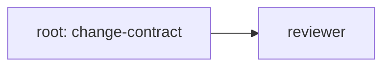

**Use.** LOW-blast trivial change — one-line fix, typo, comment correction, log-message tweak.
**Variables.** `root_title`, `scope`.
**Overlays default.** Iron overlay: code-sanity OFF (gate floor `SCRUTINY: medium+`); obligations-scanner ON; reviewer ON (minimal pass). QA overlay: test-engineer OFF (skippable with reason). DevOps overlay: N/A.
**Anti-pattern.** Using `code-quick` for anything that touches more than one file or any sensitive surface. Auto-escalation rules in §4 promote to `code-standard` when the bead's scope hits an escalation trigger.

### 2.2 `code-standard`

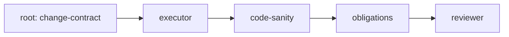

**Use.** The default for any production diff with normal scrutiny. Iron pipeline applied in full.
**Variables.** `root_title`, `scope`, optional `notes`.
**Overlays default.** Iron overlay: code-sanity MANDATORY (seconder gate); obligations-scanner MANDATORY; reviewer with Release Checklist. QA overlay: test-engineer MANDATORY (writes/updates tests post-impl, before code-sanity); test-runner executes exact commands. DevOps overlay: opt-in per scope.
**Behavior.** This is the workhorse — the template the `bd create` hook proposes whenever scrutiny is `medium` and scope is "normal source code." Approximately 70% of dispatches across the evidence corpus.

### 2.3 `code-with-advisors`

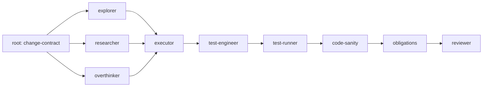

**Use.** HIGH/CRITICAL blast radius — cross-cutting refactor, external-library integration, architecture-level change, anything where the bead author isn't sure the executor has full context.
**Variables.** `root_title`, `scope`, `external_libs` (optional).
**Advisors run in parallel pre-executor.** Each writes findings to the chain channel (or its own discovered-from bead in pre-substrate land); executor reads all three before opening any file.
**Overlays default.** Iron MANDATORY (high-scrutiny floor: code-sanity + obligations + reviewer); QA MANDATORY (test-engineer with smoke/E2E + telemetry assertions); security-auditor auto-attached if scope matches sensitive surface (§4 auto-escalation); DevOps overlay opt-in.

### 2.4 `debug`

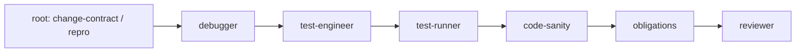

**Use.** Bug fix — root cause + targeted fix + regression test. `debugger` is non-skippable (cannot be inlined into `code-standard` even if the fix is small).
**Variables.** `root_title`, `failing_test_or_repro`, `scope`.
**Critical rule.** Bug Diagnosis Chain (per `using-specialists-v3` Failure Recovery): orchestrator must NOT dispatch executor while bug cause is unknown — chain is `debugger → test-engineer → test-runner → code-sanity/security → reviewer`. If `debugger` reports root cause is architectural, escalate to `overthinker`/`planner` BEFORE attempting a code fix.
**Overlays default.** Iron MANDATORY; QA MANDATORY (regression test mandatory — bug-without-test is a discovered-from followup); DevOps opt-in.

### 2.5 `security-deep`

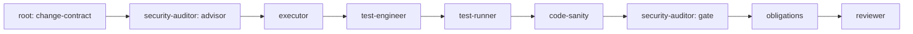

**Use.** Sensitive surface — auth, secrets, crypto, migrations, agent config, permissions, hooks, lockfiles. `security-auditor` runs **twice**: as advisor pre-implementation (threat-model the diff before it's written), and as gate post-implementation (verify the diff matches the threat model). Scrutiny floor `critical` by default.
**Variables.** `root_title`, `scope`, `sensitive_surface` (one of: auth, secrets, crypto, migration, hooks, permissions, lockfile, agent-config).
**Overlays default.** Iron MANDATORY at critical floor (reviewer's Release Checklist gains security-evidence lines); QA MANDATORY (behavioral smoke + telemetry assertions for security paths); DevOps mandatory if scope is `migration` or `hooks` (deploy-shaped).

### 2.6 `release-prep`

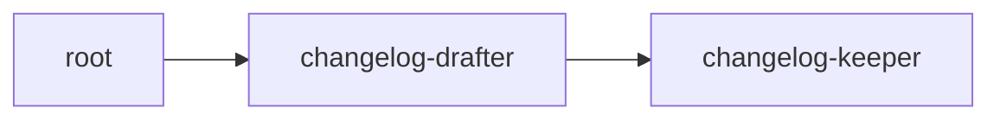

**Use.** Release preparation — reconcile `[Unreleased]` CHANGELOG section against actual diff between previous tag and HEAD, then bump version + tag + push.
**Variables.** `prev_tag`, `next_version`.
**Overlays default.** No Iron overlay (this is meta, not production code). No QA overlay (release artifacts aren't tested behaviorally). DevOps overlay: optional release-readiness preflight if integrated.
**Operator interaction.** This is operator-gated by design — the operator inspects the staged changelog + bump diff before `changelog-keeper` is allowed to push the tag. Two-step is deliberate.

### 2.7 `triage`

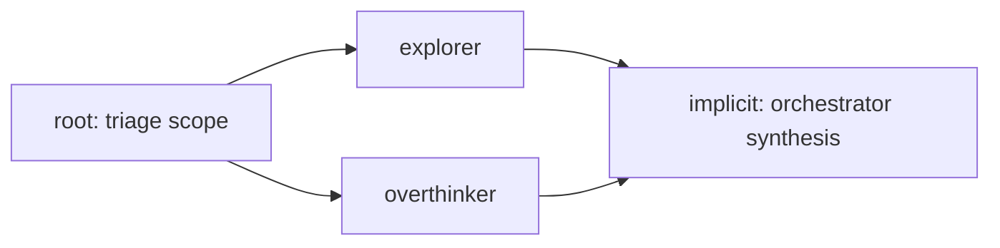

**Use.** Board hygiene — find duplicates / semantic clusters / orphans, propose rewires. Output is a recommended set of `bd dep` mutations (the orchestrator applies after operator confirmation per `issue-triage` skill).
**Variables.** `triage_scope` (default: all open).
**Overlays default.** No overlays (READ_ONLY chain — produces no code diff, no test coverage gap, no release artifact).

### 2.8 `research-only`

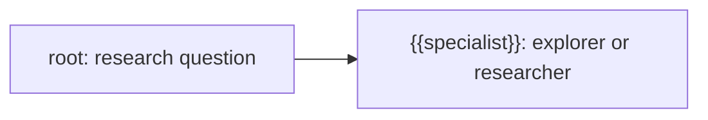

**Use.** Investigation that deliberately produces no code — answer a question, build a mental model, prepare for a future implementation epic.
**Variables.** `root_title`, `specialist` (one of `explorer` / `researcher` / `overthinker`).
**Overlays default.** No overlays (READ_ONLY).
**Note.** This template uses a `{{specialist}}` template variable so the same shape serves three roles depending on the research kind (codebase = explorer, external docs = researcher, architectural devil's-advocate = overthinker).

### 2.9 `restitch`


**Use.** Conflict recovery after a failed merge — `debugger` restitches the worktree against the new base, `code-sanity` verifies, reviewer confirms equivalence.
**Variables.** `original_chain_root`, `conflict_summary`.
**Overlays default.** Iron MANDATORY (this IS the recovery from an Iron pipeline that broke); QA only if the original chain had QA evidence to preserve (carry-forward via ddiff semantics).

### 2.10 `planning`

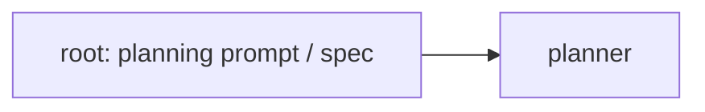

**Use.** Vague initiative → phased bd issue board. Planner produces decomposed bd issues with dependencies, contract drafts, recommended templates per leaf bead.
**Variables.** `root_title`, `spec_or_prompt`.
**Overlays default.** No overlays (planner output is bd metadata, not code).
**Note.** Planner is the substrate-future-aware role — its output already proposes `recommended_template` per leaf bead (per roadmap D26 / Phase 0 bootstrap), which is what makes selection (phase 1 above) work without operator effort.

### 2.11 `premortem`

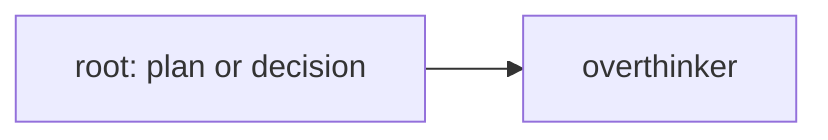

**Use.** Devil's-advocate before risky design commits — "assume this failed in 6 months, work backward to find every reason why."
**Variables.** `root_title`, `plan_or_decision`.
**Overlays default.** No overlays (decision output, not code).
**Trigger.** Via `premortem` skill — high cost-of-being-wrong contexts (architecture commits, hire decisions, strategy pivots, irreversible refactors).

### 2.12 `doc-sync`

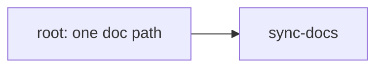

**Use.** Single-document drift-aware update after code changes. Hard-scoped to exactly one doc per chain (the `sync-docs` mandatory rule enforces this).
**Variables.** `doc_path`, `change_window` (commits to consider).
**Overlays default.** No overlays (docs not gated by Iron/QA — but sync-docs itself runs drift detection + truthfulness checks via its own mandatory rules).

### 2.13 `memory-hygiene`

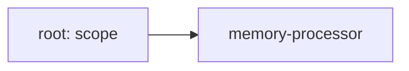

**Use.** Post-epic stale memory consolidation — prune memories tied to closed beads, demote tier on inactivity, mark superseded vs preserved.
**Variables.** `scope` (default: all memories), `dry_run` (default true).
**Overlays default.** No overlays.

---

## 3. Overlays

An **overlay** is a set of gates / steps that applies *across* templates — not template-specific shape. Overlays are how the chain templates evolve without re-defining each formula every time we learn something new.

Three overlays today:

- **§3.1 Iron** — code review hardening (Jane Street Iron-inspired).
- **§3.2 QA** — test-engineer + test-runner upgrade (behavioral validation between executor and code-sanity).
- **§3.3 DevOps** — *placeholder, design pending* (operational/telemetry/health-check validation for deploy/agent/hook surfaces).

An overlay declares: (a) which roles it adds or modifies; (b) the severity floor at which it becomes mandatory; (c) the templates it applies to; (d) the obligations it places on the reviewer's Release Checklist.

**Overlays compose** with templates and with each other per §6 composition rules.

### 3.1 Iron overlay — code review hardening

> **Absorbs:** `docs/design/iron-review-hardening.html` (archived 2026-05-30, redirect to here).

**Problem.** The pre-Iron pipeline applied the same review depth to a two-line test tweak and a payment-flow rewrite. `code-sanity` was advisory and frequently skipped. After `PARTIAL` verdicts, reviewers re-audited the entire diff instead of just the delta. In-code obligations (`TODO`/`HACK`/`FIXME`) landed in production without a gate. Sensitive surfaces inherited whatever scrutiny the bead author requested — not what the content demanded.

**Iron concepts adopted** (concepts only — no Iron code imported):

| Iron concept | Our adoption |
|---|---|
| Scrutiny profiles | `SCRUTINY: low\|medium\|high\|critical` field on every bead (§4) |
| Mandatory seconders | `code-sanity` as mandatory gate (not advisor) on production diffs |
| Obligations tracking | `obligations-scanner` as mandatory gate; structured `TODO(<bead-id>):` format permitted, unstructured markers blocked |
| ddiff re-review | On `PARTIAL` verdict, reviewer re-reviews **the delta only**; prior approvals carry forward |
| Formal release gates | Reviewer outputs a **Release Checklist** every chain |
| Auto-escalation on sensitive surfaces | Reviewer auto-raises SCRUTINY floor on auth/config/specialists/lockfiles/migrations/permissions/hooks |

**Steps added/modified.**

- `code-sanity` — promoted from advisor to mandatory seconder gate for production diffs. Skip only allowed for test-only or new-file-only diffs (and explicitly logged).
- `obligations-scanner` — NEW gate. READ_ONLY specialist, scans diff for newly-introduced `TODO/FIXME/HACK/XXX/TEMP/WIP/NOTE(release)` markers. Distinguishes production vs test paths. Recognizes structured `TODO(<bead-id>):` format. Verdict `CLEAN|OBLIGATIONS_FOUND|BLOCKED`.
- `reviewer` — gains SCRUTINY-aware behavior, ddiff re-review on PARTIAL, mandatory Release Checklist in every verdict, auto-escalation table for sensitive surfaces.

**Auto-escalation table** (the reviewer raises SCRUTINY floor regardless of what the bead requested):

| If scope touches | Minimum SCRUTINY |
|---|---|
| `src/auth/**`, secrets / token / credential code | `critical` |
| `config/specialists/**` | `high` |
| `package.json`, `*lock*`, `bun.lock`, `package-lock.json`, requirements | `high` |
| `migrations/**`, schema files | `high` |
| `.claude/**`, `.xtrm/hooks/**`, `permissions/**` | `high` |
| Default | bead-declared `SCRUTINY` |

**Manual git workflow is canonical.** Per CLAUDE.md rule #9 (current): `sp merge` and `sp epic merge` are PROHIBITED. Manual `git merge --no-ff` per chain + the Cherry-Pick Playbook are the canonical multi-chain integration paths. This is an Iron-aligned position: the merge gate is the operator's, not the tool's.

**Reviewer prompt — required Release Checklist lines** (illustrative; full prompt lives in `config/specialists/reviewer.specialist.json`):

```text
- [ ] SCRUTINY tier confirmed (auto-escalation triggered: yes|no, reason)
- [ ] code-sanity verdict: OK|FINDINGS|BLOCKED|skipped (reason)
- [ ] obligations-scanner verdict: CLEAN|OBLIGATIONS_FOUND|BLOCKED
- [ ] security-auditor (if applicable): PASS|FINDINGS|BLOCKED|N/A
- [ ] test-engineer required: yes|no|not-required (reason)
- [ ] test-engineer completed: yes|no|N/A
- [ ] test-runner commands executed: yes|no|N/A
- [ ] smoke/E2E evidence present: yes|no|N/A
- [ ] telemetry/log assertions present: yes|no|N/A
- [ ] failures classified and routed: yes|no|N/A
- [ ] obligations introduced: count + structured-vs-unstructured breakdown
- [ ] ddiff applied (on PARTIAL re-review): yes|no|N/A
```

The QA-related lines (test-engineer / test-runner / smoke/E2E / telemetry / failures-classified) are owned by §3.2 QA overlay; the Iron overlay places them in the checklist as required when QA overlay is active.

**Where Iron lives in formulas.** Iron overlay is implied by every template that includes `code-sanity` + `obligations-scanner` + `reviewer` in its Layer-1 shape (i.e. all production-diff templates: `code-standard`, `code-with-advisors`, `debug`, `security-deep`, `restitch`). For `code-quick`, Iron is degraded: code-sanity is skippable at `SCRUTINY: low`; obligations + reviewer remain.

### 3.2 QA overlay — test-engineer + test-runner upgrade

> **Absorbs:** `docs/design/substrate/iron-review-hardening-qa-chain-substrate.md` (archived 2026-05-30, redirect to here).

**Problem.** Iron hardens the review pipeline, but leaves one gap in autonomous chains: *who turns a production diff into the right behavioral tests, smoke/E2E checks, and telemetry assertions before the reviewer sees it?* The answer should not be the generic executor (it's busy implementing) and should not be `test-runner` (which only executes). The QA overlay introduces `test-engineer` and upgrades `test-runner`.

**Roles.**

| Role | Owns | Permission | Phase |
|---|---|---|---|
| `planner` + xtrm `test-planning` skill | Pre-implementation: expected coverage contract (logging/telemetry + smoke/E2E specifications) | LOW | pre-impl |
| `executor` / `debugger` | Production source change + static lint/typecheck | HIGH | impl |
| **`test-engineer`** (NEW) | Reads actual diff, writes/updates tests + fixtures + smoke scripts + telemetry assertions, emits exact `test-runner` commands | MEDIUM | post-impl |
| `test-runner` (UPGRADED) | Executes exact commands, classifies failures by owner, captures log/telemetry artifacts | LOW | post-test-write |
| `code-sanity` | Iron seconder | LOW | post-QA |
| `obligations-scanner` | Iron obligations gate | LOW | post-sanity |
| `security-auditor` (if applicable) | Sensitive-surface scan | LOW | post-obligations |
| `reviewer` | Final PASS/PARTIAL/FAIL + Release Checklist (consumes QA evidence) | LOW | final gate |

**Chain shape after QA overlay** (the canonical post-overlay chain for `code-standard` at `SCRUTINY: medium+`):

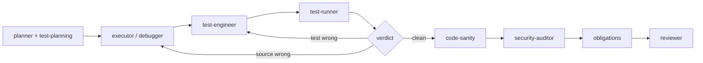

**`test-engineer` required output schema** (JSON):

```json
{
  "status": "tests_written|blocked|source_bug_suspected",
  "files_changed": ["tests/..."],
  "coverage_map": [
    {"impl_path": "src/...", "test_path": "tests/...", "critical_path": "..."}
  ],
  "smoke_e2e_commands": ["..."],
  "telemetry_assertions": [
    {"event": "...", "fields": ["..."], "query_or_grep": "...", "redaction": "..."}
  ],
  "test_runner_commands": ["..."],
  "known_deferred_paths": [
    {"path": "...", "reason": "...", "follow_up_bead": "..."}
  ],
  "source_bug_suspicions": ["..."]
}
```

If `test-engineer` discovers the implementation is not testable without a source change, it returns `source_bug_suspected` and files a discovered-from followup. It does NOT silently patch production code.

**`test-runner` upgraded contract.**

- Prefer exact commands supplied by `test-engineer` / orchestrator.
- Run smoke/E2E/live-contract checks when requested, not only manifest suites.
- Capture requested log/telemetry artifacts.
- **Classify failures by owner:**
  - `test_engineer` — bad expectation / fixture / harness / flaky shape.
  - `debugger_or_executor` — source regression / unhandled behavior.
  - `infrastructure` — missing service / network / credentials / unavailable DB.
  - `pre_existing` — failure already present outside the chain scope.
- Never silently expand a pinned test scope. If no exact commands supplied, run safe manifest-detected smoke/default and **clearly label it as fallback**.

**Feedback routing matrix.**

| `test-runner` finding | Next recipient | Example instruction |
|---|---|---|
| Test expectation wrong | `test-engineer` | "Expected JSON field renamed by accepted implementation; update assertion only." |
| Fixture/harness broken | `test-engineer` | "Fixture omits required env var; fix setup/teardown, rerun same command." |
| Required telemetry missing | `debugger` or `executor` | "Implementation never emits `component=runner event=job_finished`; add source instrumentation." |
| Source behavior regression | `debugger` | "Smoke exits 0 but state is stale; root-cause before edits." |
| New source feature untested | `test-engineer` | "Diff added retry fallback; add failure-path test + log assertion." |
| Infrastructure unavailable | orchestrator / reviewer note | "Prometheus unavailable; mark infra failure, use recorded fallback if defined." |
| Pre-existing unrelated failure | reviewer note | "Classify as pre-existing; do not block unless critical-path overlap." |

**Channel messages.** When channels v0 ships (substrate-dependent), QA introduces two message kinds before the Iron gates:

```text
executor/debugger posts: turn(diff)
test-engineer wakes on:  turn(diff)
test-engineer posts:     qa_plan_and_tests + test_runner_commands
test-runner wakes on:    qa_plan_and_tests
test-runner posts:       test_verdict
```

Routing on `test_verdict.owner` follows the matrix above. ddiff semantics intact: prior clean test-runner evidence carries forward unless the new diff touches the tested path.

**Pre-channels (today).** No channel messages — orchestrator carries the verdicts hand-over-hand via bead notes (each step's output auto-appended to its bead). The substrate channel form is the migration target; the pre-substrate form works through the runtime's existing append-to-bead-notes mechanism.

**Severity-tiered obligation** (cf. §4):

| SCRUTINY | test-engineer obligation |
|---|---|
| `low` | optional (skip with reason) |
| `medium` | recommended (skip requires explicit operator override) |
| `high` | MANDATORY (skip = PARTIAL verdict) |
| `critical` | MANDATORY + behavioral QA evidence required in Release Checklist |

For docs-only or static-analysis-only diffs at any scrutiny, test-engineer can be skipped with `not-required` + reason. For shell/boundary/operational/devops work at `high|critical`, skipping is an escalation event.

**Implementation status.** `test-engineer` specialist + `test-runner` upgrade tracked under epic `unitAI-sfwe1` (children .1, .2, .3, .5). Formula file integration tracked under `unitAI-f9kku` (blocked on sfwe1.1/.2).

### 3.3 DevOps overlay — *placeholder*

> **Status.** Design pending. To be filled in the continuation of session 2026-05-30 (DevOps overlay design segment).
>
> **Anticipated scope** (subject to confirmation during the upcoming design segment):
> - Operational specialists for deploy/health-check/telemetry-validation surfaces.
> - Severity-tier mapping for ops-shaped diffs (Dockerfile, compose, CI workflow, hook scripts, deploy scripts).
> - Per-template applicability (likely: `code-standard`, `code-with-advisors`, `debug`, `security-deep` when scope is operational; opt-out otherwise).
> - Integration with QA overlay's telemetry-assertion contract.
>
> **Until designed:** specialists handling ops-shaped diffs use the QA overlay's smoke/E2E + telemetry-assertion contracts as the best available substitute. This is a known gap, intentionally left for the upcoming design fill rather than papered over.
>
> **Tracking.** A handoff entry for the DevOps overlay design will land in a new bead at session continuation; this section will be replaced with concrete content at that point.

---

## 4. Severity-tiered depth

`SCRUTINY: low|medium|high|critical` is a **required field** on every bead's change-contract. It drives overlay obligations across the system.

**Tier semantics.**

| Tier | Cost-of-being-wrong | Overlay floor | Typical bead shape |
|---|---|---|---|
| `low` | Trivial — single-file, single-concept, easily-reverted | Iron: minimal (reviewer + obligations). QA: optional. DevOps: N/A. | One-line fixes, typos, log strings |
| `medium` | Normal — production code, multi-file possible, reverting is cheap | Iron MANDATORY (code-sanity + obligations + reviewer). QA recommended. DevOps opt-in. | Most production diffs (~70% of dispatches) |
| `high` | Significant — cross-cutting, library boundary, public API, persistence | Iron MANDATORY. QA MANDATORY. security-auditor on sensitive surfaces. DevOps mandatory for ops-shaped diffs. | Refactors, schema changes, integration work |
| `critical` | Severe — auth, money, data integrity, irreversible state, security-sensitive | Iron MANDATORY at critical floor. QA MANDATORY + behavioral evidence in Release Checklist. security-auditor as gate (post-impl) + advisor (pre-impl). DevOps MANDATORY on any ops touch. | Auth flows, payment paths, migrations, security |

**Auto-escalation.** Reviewer raises the SCRUTINY floor when scope hits sensitive surfaces per the Iron auto-escalation table (§3.1). The bead's declared SCRUTINY is the *floor* the reviewer can raise — never lower. If a bead declares `medium` but scope includes `src/auth/`, the reviewer treats it as `critical`.

**Operator override.** The operator can declare `SCRUTINY: critical` on an arbitrarily small bead — that's their right (cost-of-being-wrong is operator judgment). The system never *lowers* declared scrutiny.

**Per-template severity floors** (each template ships with a default minimum scrutiny — beads pour against the template inherit this floor):

| Template | Default SCRUTINY floor |
|---|---|
| `code-quick` | `low` |
| `code-standard` | `medium` |
| `code-with-advisors` | `high` |
| `debug` | `medium` (raises to `high` if regression is severe — operator-declared) |
| `security-deep` | `critical` |
| `release-prep` | `medium` (release artifacts are not production-code paths) |
| `triage` / `research-only` / `planning` / `premortem` / `doc-sync` / `memory-hygiene` | N/A (READ_ONLY chains) |
| `restitch` | inherits original chain's SCRUTINY |

---

## 5. Per-template overlay matrix

The big table. Rows = templates. Columns = overlay obligations.

Legend: `M` = mandatory, `R` = recommended, `O` = optional (skip with reason), `N` = not applicable, `M*` = mandatory if scope matches trigger surface.

| Template | Iron: code-sanity | Iron: obligations | Iron: reviewer | Iron: security-auditor | QA: test-engineer | QA: test-runner | DevOps overlay |
|---|---|---|---|---|---|---|---|
| `code-quick` | O | M | M | N | O | O | N |
| `code-standard` | M | M | M | M* | M | M | O (opt-in) |
| `code-with-advisors` | M | M | M | M* | M | M | O (opt-in) |
| `debug` | M | M | M | M* | M (regression test) | M | O (opt-in) |
| `security-deep` | M | M | M | **M (twice: advisor + gate)** | M (behavioral) | M | M* (if ops-touch) |
| `release-prep` | N | N | N | N | N | N | O (preflight) |
| `triage` | N | N | N | N | N | N | N |
| `research-only` | N | N | N | N | N | N | N |
| `restitch` | M | M | M | inherits | inherits | inherits | inherits |
| `planning` | N | N | N | N | N | N | N |
| `premortem` | N | N | N | N | N | N | N |
| `doc-sync` | N | N | N | N | N | N | N |
| `memory-hygiene` | N | N | N | N | N | N | N |

**Reading the table.** A cell value is the *default* overlay obligation for that template at its default SCRUTINY floor (§4). Auto-escalation can raise an `M*` to `M` (e.g., `code-standard` touching `src/auth/` → security-auditor mandatory). Operator override can lower an `R` to `O` (with reason in the bead). `M` cannot be lowered.

**Rendered example — `code-standard` at `SCRUTINY: high`, scope includes `src/auth/`** (Layer-1 template + active overlays):

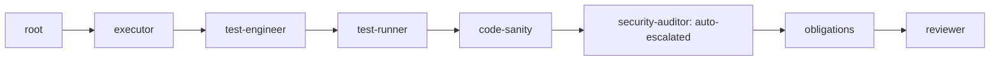

The base `code-standard` is `root → executor → code-sanity → obligations → reviewer`; QA overlay inserts `test-engineer + test-runner` between executor and code-sanity; Iron auto-escalation inserts `security-auditor` between code-sanity and obligations because scope matched auth.

---

## 6. Composition rules

**Order of composition** (deterministic — same inputs always produce same chain):

1. **Template Layer-1 shape** from the `.formula.json` (this is the foundation — overlays cannot remove Layer-1 steps).
2. **Overlay obligations** applied in declaration order: Iron → QA → DevOps. Each overlay inserts steps into the Layer-1 shape at well-defined positions (Iron gates at the tail, QA between writer-role and code-sanity, DevOps between test-runner and code-sanity when applicable).
3. **Auto-escalation pass.** Reviewer's auto-escalation table runs against the bead's scope and raises the effective SCRUTINY floor. Floor changes can promote `R/O/M*` cells to `M` (but never demote `M`).
4. **Operator inserts.** `sp chain insert <chain-id> <role> --before|--after <step>` (roadmap Opp 4) applies operator-requested additions. Operator inserts cannot remove or reorder template Layer-1 or overlay-mandatory steps.
5. **Coordinator entry-gate** (post-substrate-landing). The chain coordinator (substrate §4.3 role 1, §6.3.1) re-validates the composed chain from inside the container with fresh context; can propose additional `<insert-step>` elements within `autonomy_json` policy. Pre-substrate: this step does not exist.

**Mutual exclusion.** Overlays do not conflict by design — they target different gate positions. Iron owns the tail (code-sanity → obligations → reviewer); QA owns the writer-to-sanity gap; DevOps (anticipated) owns the test-to-sanity gap with telemetry/ops focus. If two overlays propose the same step (e.g., both QA and DevOps want `test-runner`), the later overlay extends the earlier's contract (DevOps passes additional telemetry-assertion commands to QA's `test-runner`) rather than duplicating the step.

**Idempotence.** Re-composing the same template against the same bead produces the same chain. `sp chain review` is read-only and can be run repeatedly. `sp chain approve` is the imperative gate that commits the resolved chain.

**Template extension** (per-repo). Per the `chain-templates/README.md` extension pattern, a per-repo `.formula.json` can `extends: ["code-with-advisors"]` and append additional steps. The extended template inherits all overlay obligations from its parent. New steps added by extension declare their own overlay applicability via labels (e.g., `overlay:qa-required`).

**Where lessons live.**

- **Template shape** → `.formula.json` (executable, versioned).
- **Overlay obligations** → this document (canonical reference) + reviewer prompt (enforced gate).
- **Per-template severity floors** → this document §4 (canonical reference) + planner prompt (auto-applied at composition time).
- **Auto-escalation table** → this document §3.1 + reviewer prompt + Claude `bd create` hook (proposed at bead-create time).
- **Operator-facing how-to** → `using-specialists-v4` SKILL (Phase 6 of roadmap).

---

## 7. Evolution protocol

The catalog and overlays are **living artifacts** — they evolve as we learn. This section defines how lessons get absorbed.

**When to add a new template.**

A new template is justified when **3+ distinct chains across 2+ repos** exhibit the same Layer-1 shape that none of the existing 13 templates covers cleanly. Evidence comes from `.xtrm/reports/*.md` across repos. The pattern must be:

- **Repeated** (not a one-off — three or more independent chains).
- **Stable** (not in flux — the shape didn't change across iterations).
- **Distinct** (not a degraded form of an existing template).

The new template is added by: (a) drafting a `.formula.json` in `chain-templates/`; (b) adding a §2.N entry to this document with mermaid + use + variables + overlays; (c) adding a row to §5 matrix; (d) updating `chain-templates/README.md` table; (e) cross-referencing in `using-specialists-v4` SKILL; (f) noting in substrate.md §6.9.10 catalog.

**When to add a new overlay.**

A new overlay is justified when a gate or set of gates applies **broadly across multiple templates** (not template-specific shape) and represents a **distinct concern** orthogonal to existing overlays. Iron, QA, DevOps are examples — review hardening, behavioral validation, operational validation are three distinct concerns each applicable to multiple production-diff templates.

The new overlay is added by: (a) writing a §3.N section in this document (concept + adoptions + steps added/modified + reviewer-checklist additions + severity-tiered obligation); (b) adding a column to §5 matrix; (c) defining mutual-exclusion / extension rules vs existing overlays in §6; (d) updating the reviewer prompt to enforce the new Release Checklist lines; (e) updating `using-specialists-v4` SKILL.

**When to update a per-template overlay obligation.**

When a per-template obligation changes (e.g., `code-quick` raises `code-sanity` from `O` to `R` because we observed too many post-merge regressions on trivial-looking changes), the change lands in:

1. This document §5 matrix (the canonical declaration).
2. The reviewer prompt (the enforcement gate).
3. The `bd create` hint (so operators see the new default at bead-create time).
4. A note in CHANGELOG for the next release.

**When to fold session findings.**

After any chain that produces a meaningful observation about template/overlay applicability — an operator manually inserts a step that should be a default, an overlay is repeatedly skipped because the reviewer's enforcement is wrong, a template's auto-escalation rule fires on false positives — the lesson gets folded:

- **Per-session** (immediate): the orchestrator captures the observation as a `bd remember` memory tagged `convention` or `behavioral`.
- **Per-design-pass** (deliberate): a design session (like this one) reviews recent memories and folds the durable lessons into this document, the reviewer prompt, and the matrix.

This document's revision header lists the date of each substantive fold so the lineage is greppable.

**Substrate alignment.** Substrate.md §6.9.10 lists the same template roster from a substrate primitive perspective (each template = a `chain_template` row, each overlay = a `mandatory_layer` declaration). When substrate lands, the migration is: (a) the `.formula.json` files become rows in `substrate.chain_templates`; (b) the overlay obligations from §5 of this document become declarative rules in `substrate.mandatory_layers`; (c) this document remains the *philosophy* doc that explains why the data is shaped the way it is. Substrate executes; this document teaches.

---

## 8. Cross-references

- **Foreground (today):** `docs/design/roadmap/chain-templates/*.formula.json` — executable formulas; `docs/design/roadmap/chain-templates/README.md` — operator quick-start (catalog table now points here for full coverage).
- **Roadmap:** `docs/design/roadmap/specialists-roadmap.md` — §0 D-decisions, §3 12 opportunities (Opp 4 `sp chain review/approve/insert`, Opp 5 step-bead conventions, Opp 13 chain-stop, Opp 14 QA chain integration), Phase 6 `using-specialists-v4` SKILL.
- **Substrate (background canonical future):** `docs/design/substrate/substrate.md` §6.9 chain templates and composition (§6.9.10 catalog, §6.9.2 step-issues, §6.9.3 mandatory layer, §6.9.5 composition in three moments); §4.3 chain coordinator (four roles, including entry-gate at container start); §6.3.1 third validation moment.
- **SKILL (operator):** `using-specialists-v4` (Phase 6 of roadmap; canonical post-roadmap) — the operator how-to derived from this design canonical.
- **Implementation:** `unitAI-sfwe1` epic (test-engineer + test-runner upgrade); `unitAI-f9kku` (chain_template integration of test-engineer step); `unitAI-heukb` (Opp 13 `sp stop --all` + `sp chain stop`).
- **Archived (this document supersedes):** `docs/archive/iron-review-hardening.html` (§3.1 absorbs); `docs/archive/iron-review-hardening-qa-chain-substrate.md` (§3.2 absorbs).
- **Companion:** `docs/design/chain-templates.html` — editorial mirror in `substrate.html` visual style.

---

## Revision history

- **2026-05-30.** Initial promotion. Absorbed `iron-review-hardening.html` (→ §3.1 Iron overlay) and `iron-review-hardening-qa-chain-substrate.md` (→ §3.2 QA overlay). Established §3.3 DevOps overlay as design-pending placeholder. Catalog from `chain-templates/README.md` lifted into §2 with mermaid diagrams; per-template overlay matrix §5 introduced. Severity-tiered depth §4 made explicit (was implicit in Iron HTML). Evolution protocol §7 documented for the first time.
