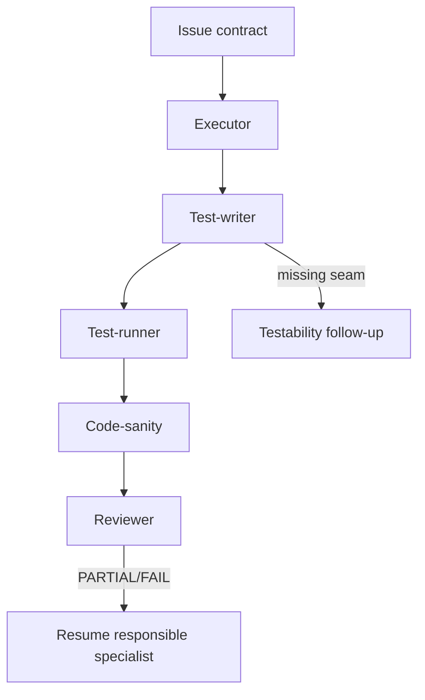
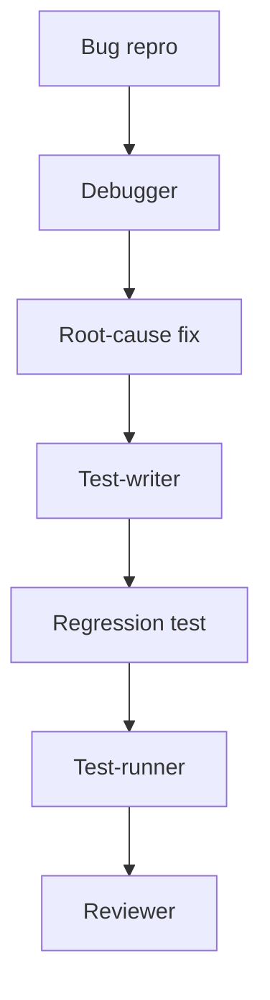

# Test-Writer Specialist

Status: design capture. Do not implement in this task.

This document captures the proposed `test-writer` specialist: a dedicated specialist that writes behavior-first tests independently from the implementation specialist.

## Why this exists

Implementation quality improves when code authoring, test authoring, test execution, and review are separate cognitive roles.

A single executor can write implementation and tests, but that often creates weak tests:

- tests mirror implementation details
- tests assert internal shape instead of observable behavior
- tests are written to justify the diff rather than verify the issue contract
- executor self-bias leaks into validation

A `test-writer` specialist gives the system an independent testing faculty.

It should derive tests from the bead/spec/repro and desired behavior, not from the executor's private reasoning.

## Position in the chain

For non-trivial feature work:

```text
planner/test-planning
→ executor
→ test-writer
→ test-runner
→ code-sanity
→ reviewer
```

For unknown-cause bugs:

```text
debugger
→ test-writer
→ test-runner
→ code-sanity
→ reviewer
```

For simple work, `test-writer` should be conditional rather than mandatory.

Use it when:

- new behavior was added
- bug fix needs regression coverage
- executor changed logic without tests
- reviewer finds missing coverage
- test-planning says coverage is required
- feature spans multiple layers
- acceptance criteria are behavior-heavy
- no existing test clearly covers the changed behavior

Skip it when:

- docs-only
- changelog/release-only
- formatting-only
- config-only with no harness
- existing tests already cover acceptance criteria and `test-runner` confirms

## Relationship to existing specialists

| Role | Writes tests? | Runs tests? | Fixes production code? | Purpose |
|---|---:|---:|---:|---|
| `test-writer` | yes | targeted smoke only, if needed | no | Add or improve behavior/regression tests |
| `test-runner` | no | yes | no | Execute and classify tests |
| `executor` | maybe, when explicitly scoped | validation only | yes | Implement scoped production/doc changes |
| `debugger` | maybe regression test if seam is obvious | repro command | yes | Diagnose and fix root cause |
| `reviewer` | no | may inspect evidence | no | Judge diff/tests against contract |

Do not overload `test-runner`. It should remain low-permission and execution/classification focused.

## Core contract

`test-writer` writes tests from the issue contract, not from implementation internals.

Inputs:

- bead/issue contract
- PRD/spec acceptance criteria, if present
- original bug repro, if any
- debugger/executor handoff
- changed diff for context only
- existing test patterns
- project test conventions

Primary source of truth order:

1. issue contract / acceptance criteria
2. user-visible behavior / public API
3. original repro or failing command
4. existing test conventions
5. implementation diff, only to locate seams and touched behavior

The implementation diff is not the spec.

## Mandatory behavior rules

Suggested mandatory rule set: `test-writer-behavior-first`.

```text
- Write tests against public interfaces and observable behavior, not private implementation details.
- Derive expected behavior from bead/spec/repro, not from production diff internals.
- Do not modify production code unless explicitly authorized for a minimal test seam or fixture.
- Prefer vertical tracer bullets: one behavior test at a time.
- Convert minimized repros into regression tests when a correct seam exists.
- If no correct test seam exists, report BLOCKED with architecture/testability finding.
- Do not mock internal collaborators merely to make the current implementation easy to test.
- Preserve existing test style and project runner conventions.
- Report untested acceptance criteria explicitly.
```

## Anti-patterns

`test-writer` must avoid:

- testing private methods directly
- asserting internal call order unless that is public behavior
- snapshotting implementation-shaped data without user-facing meaning
- writing tests after reading only the diff
- adding broad brittle mocks to avoid real integration seams
- changing production code to satisfy tests unless explicitly allowed
- declaring coverage complete when acceptance criteria remain untested

## Output contract

Final report should include:

```text
STATUS: PASS | PARTIAL | BLOCKED
TESTS_CHANGED:
- path/to/test

BEHAVIORS_COVERED:
- acceptance criterion or repro case covered

UNTESTED_ACCEPTANCE_CRITERIA:
- any remaining gaps, or none

COMMANDS_TO_RUN:
- exact test command(s)

TESTABILITY_FINDINGS:
- missing seam, brittle seam, or none

PRODUCTION_CODE_CHANGED:
- no, or explicit explanation if authorized
```

Machine-readable summary should be suitable for reviewer/test-runner consumption.

## Testability blocker behavior

If no correct seam exists, `test-writer` should not invent shallow tests for false confidence.

It should report:

```text
BLOCKED: no correct regression-test seam
```

and explain:

- what behavior needs testing
- why available seams are too shallow or too coupled
- what architecture/testability follow-up is needed
- whether `overthinker` or `planner` should create a refactor/testability issue

This finding is valuable. It means the codebase architecture is preventing the bug or feature from being locked down.

## Chain examples

### Feature chain



### Bug chain



## Reviewer expectations

Reviewer should check that `test-writer`:

- read the issue/spec/repro first
- covered acceptance criteria, not just changed lines
- used public interfaces
- did not add implementation-coupled assertions
- reported gaps instead of hiding them
- provided exact commands for `test-runner`

Reviewer should not treat “tests were added” as sufficient. Tests must be meaningful against the contract.

## Implementation notes for later

A future specialist definition should likely be:

- name: `test-writer`
- category: `testing`
- permission: `MEDIUM` or `HIGH` because it writes test files
- worktree: required
- keep-alive: useful, so reviewer can ask for coverage fixes
- model: cheaper capable coding model may be enough if contract is good
- mandatory rules:
  - `test-writer-behavior-first`
  - `gitnexus-required` only if modifying existing symbols or test helpers
  - `serena-cheatsheet`
  - `per-turn-handoff-schema`
  - `bead-id-verbatim`

Possible chain update in `using-specialists`:

```text
executor → test-writer → test-runner → code-sanity → reviewer
```

but only when the issue shape requires independent test authoring.

## Open questions

- Should `test-writer` be allowed to create test fixtures under production-adjacent directories?
- Should it ever change production code to expose a seam, or always file follow-up?
- Should it run targeted tests itself, or leave all execution to `test-runner`?
- Should planner automatically add a test-writer stage for feature beads with new behavior?
- Should reviewer downgrade verdict when test-writer was skipped on behavior-heavy work?

## Summary

`test-writer` exists to decouple implementation from validation.

It should be an independent testing faculty that turns issue contracts, repros, and acceptance criteria into behavior tests. It is valuable precisely because it starts from a fresh context and does not share the executor's implementation bias.
