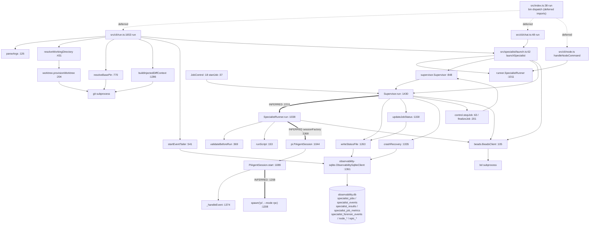

# XTRM-93 — Legacy Core Execution Graph (GitNexus)

**Lane:** I (architecture maps and cut-line overlay)
**Source of truth:** git `master` `472b1aef` + one local commit (`unitAI-rx1bu`); worktree HEAD `6553ef05`.
**Audited tree:** `/home/dawid/dev/specialists/.xtrm/worktrees/specialists-xt-pi-akkh` (branch `xt/akkh`).
**Index used:** `repo="/home/dawid/dev/specialists/.xtrm/worktrees/specialists-xt-pi-akkh"` — a **fresh worktree index**.
`gitnexus status` reports `Indexed commit: 6553ef0 == Current commit: 6553ef0`, 742 files / 22 207 symbols / 54 636 edges,
CLI 1.6.11. The index is marked "stale" only because ten `docs/migrations/xtrm-93/*.md` files were added after indexing;
**no source file differs from the index**. The repo-wide `/home/dawid/dev/specialists` index (`ce33c31`) was **not** used.

**Conventions**

- `uid` is a stable local label; the authoritative GitNexus node id is the file/name/line triple in the same row.
- Edge class `live execution` = a GitNexus `CALLS` edge with `confidence >= 0.80`, or a non-type `IMPORTS` edge.
- Edge class `type-only` = GitNexus `IMPORTS` with reason `typescript-scope: import (type-only)`.
- Edge class `INFERRED` = the graph did **not** resolve the edge; the reason is stated in the row. Every INFERRED edge carries a `file:line`.
- `HAS_METHOD` edges (Class → Method) are implied by the node rows (`Supervisor.run` etc.) and are not repeated as separate edges.

---

## 1. Node inventory

| uid | file:line | layer | role |
|---|---|---|---|
| `cli/bin` | `src/index.ts:38` | L0 CLI dispatch | subcommand dispatcher; deferred-imports every cli/* and mcp/v2-server |
| `cli/run.run` | `src/cli/run.ts:1653` | L1 CLI entry | `sp run` entry: parse args, resolve workdir/base pin, build injected diff vars, launch |
| `cli/run.parseArgs` | `src/cli/run.ts:126` | L1 CLI entry | argv parse -> RunArgs |
| `cli/run.resolveWorkingDirectory` | `src/cli/run.ts:431` | L1/L8 | resolves worktree, calls provisionWorktree |
| `cli/run.resolveBasePin` | `src/cli/run.ts:770` | L8 git | pins base SHA via git rev-parse/merge-base |
| `cli/run.startEventTailer` | `src/cli/run.ts:541` | L1/L6 | tailing events.jsonl + SQLite for live feed |
| `cli/run.buildInjectedDiffContext` | `src/cli/run.ts:1286` | L1 | reads git diff/merge-base into reviewer/writer variables |
| `cli/chat.run` | `src/cli/chat.ts:48` | L1 CLI entry | interactive TUI; calls launchSpecialist |
| `cli/node.handleNodeCommand` | `src/cli/node.ts:1006` | L1 CLI entry | legacy node/orchestration subcommand; builds SpecialistRunner |
| `launch.launchSpecialist` | `src/specialist/launch.ts:62` | L2 launcher | constructs SpecialistRunner + Supervisor, runs job, writes footer/handoff |
| `launch.onJobStarted` | `src/specialist/launch.ts:100` | L2 launcher | writes pr_drift_state row; writes job-id handoff file; starts event tailer |
| `runner.SpecialistRunner` | `src/specialist/runner.ts:1011` | L3 runner | owns sessionFactory and output-contract validation |
| `runner.run` | `src/specialist/runner.ts:1038` | L3 runner | assembles prompt/tool contract, creates PiAgentSession, drives turn |
| `runner.startAsync` | `src/specialist/runner.ts:1545` | L3 runner | fire-and-forget wrapper |
| `runner.validateBeforeRun` | `src/specialist/runner.ts:369` | L3 admission | admission gate: skill paths, external commands, required tools |
| `runner.runScript` | `src/specialist/runner.ts:153` | L3 runner | pre/post script execution via shell |
| `supervisor.Supervisor` | `src/specialist/supervisor.ts:848` | L3 supervisor | job lifecycle owner: status file + SQLite + timeline + signals |
| `supervisor.run` | `src/specialist/supervisor.ts:1430` | L3 supervisor | the job loop: status, claim, runner.run, timeline, terminal |
| `supervisor.updateJobStatus` | `src/specialist/supervisor.ts:1158` | L3 supervisor | writes status file + SQLite status row + status_change event |
| `supervisor.writeStatusFile` | `src/specialist/supervisor.ts:1263` | L6 job state | atomic jobs/<id>/status.json write + SQLite upsert |
| `supervisor.emitControlEvent` | `src/specialist/supervisor.ts:1144` | L5 control | control-signal timeline event (stop/steer) |
| `supervisor.emitTimelineEvent` | `src/specialist/supervisor.ts:1153` | L5 control | generic timeline event append |
| `supervisor.readStatus` | `src/specialist/supervisor.ts:1009` | L6 job state | SQLite-first, file-fallback status read |
| `supervisor.crashRecovery` | `src/specialist/supervisor.ts:1335` | L6 job state | reconciles dead PIDs / stale jobs on start |
| `supervisor.gc` | `src/specialist/supervisor.ts:1321` | L6 job state | prunes old job dirs |
| `supervisor.dispose` | `src/specialist/supervisor.ts:902` | L3 supervisor | closes SQLite client and session |
| `supervisor.finalizeWaitingJob` | `src/specialist/supervisor.ts:1090` | L5 control | closes keep-alive 'waiting' jobs |
| `supervisor.aggregateJobMetricsBestEffort` | `src/specialist/supervisor.ts:1183` | L6 telemetry | writes specialist_job_metrics |
| `supervisor.listJobs` | `src/specialist/supervisor.ts:1192` | L6 job state | enumerates jobs for ps/status |
| `pi.PiAgentSession` | `src/pi/session.ts:1044` | L4 Pi process | wraps the `pi` CLI in --mode rpc |
| `pi.create` | `src/pi/session.ts:1077` | L4 Pi process | static factory; binds session metadata |
| `pi.start` | `src/pi/session.ts:1089` | L4 Pi process | builds arg vector (tool contract, fences) and spawns `pi` |
| `pi.prompt` | `src/pi/session.ts:1662` | L4 RPC | sends prompt command over RPC |
| `pi.waitForDone` | `src/pi/session.ts:1676` | L4 RPC | awaits agent_end / done |
| `pi._handleEvent` | `src/pi/session.ts:1374` | L4/L6 | parses RPC event stream -> metrics/callbacks |
| `pi.close` | `src/pi/session.ts:1727` | L4 Pi process | graceful RPC close |
| `pi.kill` | `src/pi/session.ts:1756` | L4 Pi process | SIGTERM/SIGKILL of the pi child |
| `pi.resolveRuntimeToolContract` | `src/pi/session.ts:383` | L4/L3 | resolves the --tools surface from permission tier |
| `jobcontrol.JobControl` | `src/specialist/job-control.ts:18` | L3.5 job control | programmatic supervisor wrapper (create/steer/stop/wait) |
| `jobcontrol.startJob` | `src/specialist/job-control.ts:37` | L3.5 job control | creates Supervisor, kicks run(), resolves on onJobStarted |
| `jobcontrol.waitForTerminal` | `src/specialist/job-control.ts:121` | L3.5 job control | polls readStatus with backoff |
| `jobcontrol.writeFifoMessage` | `src/specialist/job-control.ts:144` | L5 control | appends resume/steer/close JSON to the job FIFO |
| `control.stopJob` | `src/specialist/control.ts:63` | L5 control | CLI stop: status mark, SIGTERM/SIGKILL, tmux kill, bead close |
| `control.finalizeJob` | `src/specialist/control.ts:201` | L5 control | reviewer-PASS cascade finalize |
| `tel.ObservabilitySqliteClient` | `src/specialist/observability-sqlite.ts:1361` | L6 telemetry | SQLite interface for job rows/events/results/metrics/forensics |
| `tel.initSchema` | `src/specialist/observability-sqlite.ts:479` | L6 telemetry | creates/migrates the observability schema |
| `tel.claimJobStartWithStore` | `src/specialist/observability-sqlite.ts:1270` | L6 telemetry | atomic job-start claim + run_start event + status row |
| `tel.hasRunCompleteEvent` | `src/specialist/observability-sqlite.ts:3363` | L6 telemetry | terminal-state probe used by stop/finalize |
| `tel.createObservabilitySqliteClient` | `src/specialist/observability-sqlite.ts:3414` | L6 telemetry | resolves DB path and opens the client |
| `beads.BeadsClient` | `src/specialist/beads.ts:105` | L7 Beads | shells out to `bd` for bead reads/writes/close |
| `beads.buildBeadContext` | `src/specialist/beads.ts:29` | L7 Beads | renders bead + blockers + epics into prompt context |
| `beads.createBeadFromContract` | `src/specialist/beads.ts:271` | L7 Beads | creates a bead from an inline contract |
| `worktree.provisionWorktree` | `src/specialist/worktree.ts:204` | L8 worktree/git | git worktree add/branch provisioning |
| `worktree.findExistingWorktree` | `src/specialist/worktree.ts:110` | L8 worktree/git | branch -> worktree reuse lookup |
| `worktree.resolveCoordinatorBase` | `src/specialist/worktree.ts:134` | L8 worktree/git | resolves the coordinator/base repo root |

## 2. Edge inventory (GitNexus `CALLS`, confidence >= 0.80)

| from | kind | to | edge class | evidence |
|---|---|---|---|---|
| `cli/chat.run` | CALLS | `launch.launchSpecialist` | live execution | `src/cli/chat.ts:48` -> `src/specialist/launch.ts:62` |
| `cli/node.handleNodeCommand` | CALLS | `tel.createObservabilitySqliteClient` | live execution | `src/cli/node.ts:1005` -> `src/specialist/observability-sqlite.ts:3414` |
| `cli/run.run` | CALLS | `cli/run.parseArgs` | live execution | `src/cli/run.ts:1653` -> `src/cli/run.ts:126` |
| `cli/run.run` | CALLS | `cli/run.resolveWorkingDirectory` | live execution | `src/cli/run.ts:1653` -> `src/cli/run.ts:431` |
| `cli/run.run` | CALLS | `cli/run.resolveBasePin` | live execution | `src/cli/run.ts:1653` -> `src/cli/run.ts:770` |
| `cli/run.run` | CALLS | `beads.buildBeadContext` | live execution | `src/cli/run.ts:1653` -> `src/specialist/beads.ts:29` |
| `cli/run.run` | CALLS | `beads.BeadsClient` | live execution | `src/cli/run.ts:1653` -> `src/specialist/beads.ts:105` |
| `cli/run.run` | CALLS | `launch.launchSpecialist` | live execution | `src/cli/run.ts:1653` -> `src/specialist/launch.ts:62` |
| `cli/run.run` | CALLS | `tel.createObservabilitySqliteClient` | live execution | `src/cli/run.ts:1653` -> `src/specialist/observability-sqlite.ts:3414` |
| `cli/run.run` | CALLS | `runner.SpecialistRunner` | live execution | `src/cli/run.ts:1653` -> `src/specialist/runner.ts:1011` |
| `cli/run.run` | CALLS | `supervisor.Supervisor` | live execution | `src/cli/run.ts:1653` -> `src/specialist/supervisor.ts:848` |
| `cli/run.run` | CALLS | `supervisor.readStatus` | live execution | `src/cli/run.ts:1653` -> `src/specialist/supervisor.ts:1009` |
| `cli/run.run` | CALLS | `supervisor.dispose` | live execution | `src/cli/run.ts:1653` -> `src/specialist/supervisor.ts:902` |
| `cli/run.startEventTailer` | CALLS | `cli/run.startEventTailer` | live execution | `src/cli/run.ts:1992` -> `src/cli/run.ts:541` |
| `cli/run.resolveWorkingDirectory` | CALLS | `worktree.provisionWorktree` | live execution | `src/cli/run.ts:431` -> `src/specialist/worktree.ts:204` |
| `cli/run.startEventTailer` | CALLS | `tel.createObservabilitySqliteClient` | live execution | `src/cli/run.ts:541` -> `src/specialist/observability-sqlite.ts:3414` |
| `pi.create` | CALLS | `pi.PiAgentSession` | live execution | `src/pi/session.ts:1077` -> `src/pi/session.ts:1044` |
| `pi.start` | CALLS | `pi._handleEvent` | live execution | `src/pi/session.ts:1089` -> `src/pi/session.ts:1374` |
| `pi.start` | CALLS | `pi.resolveRuntimeToolContract` | live execution | `src/pi/session.ts:1089` -> `src/pi/session.ts:383` |
| `control.finalizeJob` | CALLS | `supervisor.readStatus` | live execution | `src/specialist/control.ts:200` -> `src/specialist/supervisor.ts:1009` |
| `control.finalizeJob` | CALLS | `supervisor.dispose` | live execution | `src/specialist/control.ts:200` -> `src/specialist/supervisor.ts:902` |
| `control.finalizeJob` | CALLS | `supervisor.emitTimelineEvent` | live execution | `src/specialist/control.ts:200` -> `src/specialist/supervisor.ts:1153` |
| `control.finalizeJob` | CALLS | `supervisor.finalizeWaitingJob` | live execution | `src/specialist/control.ts:200` -> `src/specialist/supervisor.ts:1090` |
| `control.stopJob` | CALLS | `beads.BeadsClient` | live execution | `src/specialist/control.ts:62` -> `src/specialist/beads.ts:105` |
| `control.stopJob` | CALLS | `supervisor.emitControlEvent` | live execution | `src/specialist/control.ts:62` -> `src/specialist/supervisor.ts:1144` |
| `control.stopJob` | CALLS | `supervisor.aggregateJobMetricsBestEffort` | live execution | `src/specialist/control.ts:62` -> `src/specialist/supervisor.ts:1183` |
| `control.stopJob` | CALLS | `supervisor.updateJobStatus` | live execution | `src/specialist/control.ts:62` -> `src/specialist/supervisor.ts:1158` |
| `control.stopJob` | CALLS | `supervisor.readStatus` | live execution | `src/specialist/control.ts:62` -> `src/specialist/supervisor.ts:1009` |
| `control.stopJob` | CALLS | `supervisor.Supervisor` | live execution | `src/specialist/control.ts:62` -> `src/specialist/supervisor.ts:848` |
| `control.stopJob` | CALLS | `supervisor.dispose` | live execution | `src/specialist/control.ts:62` -> `src/specialist/supervisor.ts:902` |
| `control.stopJob` | CALLS | `supervisor.finalizeWaitingJob` | live execution | `src/specialist/control.ts:62` -> `src/specialist/supervisor.ts:1090` |
| `jobcontrol.startJob` | CALLS | `supervisor.Supervisor` | live execution | `src/specialist/job-control.ts:37` -> `src/specialist/supervisor.ts:848` |
| `jobcontrol.startJob` | CALLS | `supervisor.run` | live execution | `src/specialist/job-control.ts:37` -> `src/specialist/supervisor.ts:1430` |
| `launch.onJobStarted` | CALLS | `launch.onJobStarted` | live execution | `src/specialist/launch.ts:100` -> `src/specialist/launch.ts:100` |
| `launch.onJobStarted` | CALLS | `tel.createObservabilitySqliteClient` | live execution | `src/specialist/launch.ts:100` -> `src/specialist/observability-sqlite.ts:3414` |
| `launch.launchSpecialist` | CALLS | `runner.SpecialistRunner` | live execution | `src/specialist/launch.ts:61` -> `src/specialist/runner.ts:1011` |
| `launch.launchSpecialist` | CALLS | `supervisor.Supervisor` | live execution | `src/specialist/launch.ts:61` -> `src/specialist/supervisor.ts:848` |
| `launch.launchSpecialist` | CALLS | `supervisor.run` | live execution | `src/specialist/launch.ts:61` -> `src/specialist/supervisor.ts:1430` |
| `launch.launchSpecialist` | CALLS | `supervisor.readStatus` | live execution | `src/specialist/launch.ts:61` -> `src/specialist/supervisor.ts:1009` |
| `tel.hasRunCompleteEvent` | CALLS | `tel.createObservabilitySqliteClient` | live execution | `src/specialist/observability-sqlite.ts:3363` -> `src/specialist/observability-sqlite.ts:3414` |
| `runner.run` | CALLS | `pi.resolveRuntimeToolContract` | live execution | `src/specialist/runner.ts:1038` -> `src/pi/session.ts:383` |
| `runner.run` | CALLS | `beads.BeadsClient` | live execution | `src/specialist/runner.ts:1038` -> `src/specialist/beads.ts:105` |
| `runner.run` | CALLS | `runner.validateBeforeRun` | live execution | `src/specialist/runner.ts:1038` -> `src/specialist/runner.ts:369` |
| `runner.run` | CALLS | `runner.runScript` | live execution | `src/specialist/runner.ts:1038` -> `src/specialist/runner.ts:153` |
| `runner.startAsync` | CALLS | `runner.run` | live execution | `src/specialist/runner.ts:1545` -> `src/specialist/runner.ts:1038` |
| `supervisor.finalizeWaitingJob` | CALLS | `supervisor.updateJobStatus` | live execution | `src/specialist/supervisor.ts:1090` -> `src/specialist/supervisor.ts:1158` |
| `supervisor.finalizeWaitingJob` | CALLS | `supervisor.aggregateJobMetricsBestEffort` | live execution | `src/specialist/supervisor.ts:1090` -> `src/specialist/supervisor.ts:1183` |
| `supervisor.finalizeWaitingJob` | CALLS | `supervisor.readStatus` | live execution | `src/specialist/supervisor.ts:1090` -> `src/specialist/supervisor.ts:1009` |
| `supervisor.updateJobStatus` | CALLS | `supervisor.readStatus` | live execution | `src/specialist/supervisor.ts:1158` -> `src/specialist/supervisor.ts:1009` |
| `supervisor.updateJobStatus` | CALLS | `supervisor.writeStatusFile` | live execution | `src/specialist/supervisor.ts:1158` -> `src/specialist/supervisor.ts:1263` |
| `supervisor.run` | CALLS | `supervisor.gc` | live execution | `src/specialist/supervisor.ts:1430` -> `src/specialist/supervisor.ts:1321` |
| `supervisor.run` | CALLS | `supervisor.writeStatusFile` | live execution | `src/specialist/supervisor.ts:1430` -> `src/specialist/supervisor.ts:1263` |
| `supervisor.run` | CALLS | `supervisor.aggregateJobMetricsBestEffort` | live execution | `src/specialist/supervisor.ts:1430` -> `src/specialist/supervisor.ts:1183` |
| `supervisor.run` | CALLS | `supervisor.crashRecovery` | live execution | `src/specialist/supervisor.ts:1430` -> `src/specialist/supervisor.ts:1335` |
| `supervisor.run` | CALLS | `supervisor.dispose` | live execution | `src/specialist/supervisor.ts:1430` -> `src/specialist/supervisor.ts:902` |
| `worktree.provisionWorktree` | CALLS | `worktree.findExistingWorktree` | live execution | `src/specialist/worktree.ts:204` -> `src/specialist/worktree.ts:110` |
| `worktree.provisionWorktree` | CALLS | `worktree.resolveCoordinatorBase` | live execution | `src/specialist/worktree.ts:204` -> `src/specialist/worktree.ts:134` |

### 2a. INFERRED edges (graph could not resolve them)

| from | kind | to | edge class | why the graph could not confirm it | evidence |
|---|---|---|---|---|---|
| `supervisor.Supervisor.run` | CALLS | `runner.run` | live execution (INFERRED) | The call target is a property on the injected `opts.runner` object (`runner.run(...)`); the index records only a *type-only* import of `SpecialistRunner` from `supervisor.ts`, so no `CALLS` edge exists (verified: `MATCH (a)-[:CodeRelation {type:'CALLS'}]->(b) WHERE a.filePath='src/specialist/supervisor.ts' AND b.filePath IN ['src/specialist/runner.ts','src/pi/session.ts']` returns 0 rows). | `src/specialist/supervisor.ts:23` (type import), `src/specialist/supervisor.ts:2219` (`await runner.run(`) |
| `runner.run` | CALLS | `pi.PiAgentSession.create` | live execution (INFERRED) | The factory is captured with `.bind()` into `this.sessionFactory`, so the graph sees `PiAgentSession` only as a class node, never as a call target. | `src/specialist/runner.ts:1016` (`PiAgentSession.create.bind(PiAgentSession)`), `:1368` (`await this.sessionFactory({...})`) |
| `supervisor.run` | CALLS | `tel.upsertStatusWithEvent`, `tel.claimJobStart`, `tel.appendEvent`, `tel.upsertResult` | live execution (INFERRED) | Writes are method calls on `this.sqliteClient` (a property), so only `supervisor.constructor -> createObservabilitySqliteClient`, `supervisor.run -> readStatus`, `crashRecovery -> listActiveJobs` and `dispose -> close` are in the graph. | `src/specialist/supervisor.ts:1635`, `:1650`, `:1597`, `:1996`, `:2722`, `:2891`; `src/specialist/observability-sqlite.ts:1270,2002,2036,2073,2134` |
| `supervisor.writeStatusFile` | CALLS | `fs.writeFileSync` (jobs/<id>/status.json) | live execution (INFERRED) | Node built-in, outside the indexed call graph. | `src/specialist/supervisor.ts:1260` |
| `beads.BeadsClient` methods | CALLS | `bd` (subprocess) | live execution (INFERRED) | Executes the external `bd` binary; no in-graph callee. | `src/specialist/beads.ts:124,137,203,214,224,241`; `src/specialist/launch.ts:129,155` (`execSync('bd kv …')`) |
| `pi.start` | SPAWNS | `pi --mode rpc` | live execution (INFERRED) | OS subprocess spawn of the external `pi` binary; not a graph edge. | `src/pi/session.ts:1208` |
| `supervisor.run` | SPAWNS | node watchdog, `mkfifo`, `tmux` | live execution (INFERRED) | `spawn`/`execFileSync` of external processes. | `src/specialist/supervisor.ts:762` (watchdog), `:1662` (mkfifo), `:3006` (tmux kill) |
| `launch.launchSpecialist` | CALLS | `SpecialistRunner` / `Supervisor` | live execution (INFERRED) | `new`-instantiation is a `CALLS` edge to the **class** node (present in the edge table); the constructor body itself is outside this node set. | `src/specialist/launch.ts:64,71` |

## 3. Mermaid — legacy execution graph

## 4. Entry points

| entry | file:line | how it starts the legacy stack |
|---|---|---|
| package bin `specialists` / `sp` | `package.json` `bin.specialists = dist/index.js`; `src/index.ts:38` | `run()` dispatches every CLI subcommand by **deferred** dynamic import. `sp run` -> `src/cli/run.ts`. `sp serve` -> `src/mcp/v2-server.ts` (native). |
| `sp run` | `src/cli/run.ts:1653` | parse args, resolve worktree/base-pin, build injected diff vars, call `launchSpecialist`. |
| `sp chat` | `src/cli/chat.ts:48` | interactive TUI that also calls `launchSpecialist`. |
| `sp node …` | `src/cli/node.ts:handleNodeCommand` | legacy node/orchestration commands; builds a `SpecialistRunner` directly. |
| `sp stop` / `sp finalize` | `src/specialist/control.ts:63` / `:201` | job control over an existing `Supervisor` + job dir. |
| programmatic | `src/specialist/job-control.ts:18` | `JobControl.startJob()` creates a `Supervisor` and returns a job id. |

## 5. Terminal side effects

### 5.1 Files written (job filesystem)

| artifact | writer | evidence |
|---|---|---|
| `jobs/<id>/status.json` (atomic tmp+rename) | `Supervisor.writeStatusFile` | `src/specialist/supervisor.ts:1253-1261` |
| `jobs/<id>/result.txt` | `Supervisor.run` terminal paths | `src/specialist/supervisor.ts:1993, 2687` |
| `jobs/<id>/events.jsonl` | `Supervisor.appendEventBestEffort` | `src/specialist/supervisor.ts:1124-1131` |
| `jobs/latest` | `Supervisor.run` | `src/specialist/supervisor.ts:1552-1554` |
| `jobs/ready/<id>` | `Supervisor.writeReadyMarker` | `src/specialist/supervisor.ts:962-965` |
| `jobs/<id>/fifo` | `Supervisor.run` (`mkfifo`) | `src/specialist/supervisor.ts:1662` |
| `jobs/<id>/death.txt` | status watchdog | `src/specialist/supervisor.ts:843` |
| custom `output_file` | `Supervisor.run` | `src/specialist/supervisor.ts:1862-1864` |
| job-id handoff file (`SPECIALISTS_BG_JOB_ID_PATH`) | `launch.onJobStarted` | `src/specialist/launch.ts:117-119` |

### 5.2 Database rows written (`observability.db`)

Schema owner: `src/specialist/observability-sqlite.ts:479 initSchema`. Written by the legacy flow:

| table | writer call | evidence |
|---|---|---|
| `specialist_jobs` (+v2/v3 migration) | `upsertStatus`, `upsertStatusWithEvent`, `upsertStatusWithEvents`, `upsertStatusWithEventAndResult` | `observability-sqlite.ts:2002, 2036, 2046, 2062`; called from `supervisor.ts:1650, 2891, 2958, 989, 1174-1281` |
| `specialist_events` | `appendEvent` | `observability-sqlite.ts:2073`; `supervisor.ts:1597, 1129, 1177` |
| `specialist_results` | `upsertResult` | `observability-sqlite.ts:2134`; `supervisor.ts:1996, 2722, 2756` |
| `specialist_job_metrics` | `aggregateJobMetricsBestEffort` | `supervisor.ts:1183-1189` |
| `specialist_forensic_events` | `appendForensicEvent` | `observability-sqlite.ts:2085` |
| `node_runs` / `node_members` / `node_events` / `node_memory` | node orchestration | `observability-sqlite.ts:417-459`; `cli/node.ts` |
| `epic_runs` / `epic_chain_membership` | `upsertEpicRun`, `upsertEpicChainMembership` | `observability-sqlite.ts:2024, 2030`; `supervisor.ts:1281, 1295` |
| `branch_integration_events` | PR/merge drift | `observability-sqlite.ts:655` |
| `pr_drift_state` | `updatePrDriftState` | `observability-sqlite.ts:1313-1341`; `launch.ts:106-111` |
| claim row + run_start event | `claimJobStart` | `observability-sqlite.ts:1785`; `supervisor.ts:1635` |

### 5.3 Subprocesses spawned

| process | spawn site | evidence |
|---|---|---|
| `pi --mode rpc` (the Pi agent) | `PiAgentSession.start` | `src/pi/session.ts:1105` (args), `:1208` (`spawn('pi', args)`) |
| `bd` (Beads reads/writes/close) | `BeadsClient` methods | `src/specialist/beads.ts:105-255`; `launch.ts:129,155` |
| `git` (`worktree add`, `rev-parse`, `status`, `commit`, `diff`, `merge-base`) | `worktree.ts`, `supervisor.ts`, `cli/run.ts` | `worktree.ts:204-277`; `supervisor.ts:342,515,562,576,589,1886-1891`; `cli/run.ts:696-768` |
| pre/post scripts (`/bin/sh` grammar) | `SpecialistRunner.runScript` | `src/specialist/runner.ts:153-189` |
| node status watchdog (`node -e …`) | `Supervisor.run` | `src/specialist/supervisor.ts:762` |
| `mkfifo` | `Supervisor.run` | `src/specialist/supervisor.ts:1662` |
| `tmux kill-session` | `control.stopJob` / `Supervisor.run` | `src/cli/tmux-utils.ts:77`; `supervisor.ts:3006` |
| `npx gitnexus analyze` (post-run analyzer) | `triggerGitnexusAnalyzeIfNeeded` | `src/specialist/supervisor.ts:634` |
| `gh pr view` | PR-evidence step | `src/specialist/supervisor.ts:1786` |

**Beads side effects:** `bd update --assignee` / `bd show` (parent notification, `supervisor.ts:292-330`),
`bd create` (`beads.ts:124`), `bd update --append-notes` (`beads.ts:224`), `bd close` (`beads.ts:203,214`),
plus `bd kv set/clear "bead-claim:<id>"` around launch (`launch.ts:129,155`).

## 6. Graph coverage notes

- The graph resolves the whole CLI → launcher → Supervisor shell but **breaks at three dynamic-dispatch seams**:
  `Supervisor -> Runner`, `Runner -> PiAgentSession.create`, and `Supervisor -> sqliteClient.*`.
  Those are reconstructed above from source and marked INFERRED; a cutover that trusts the graph alone would
  under-count the legacy blast radius.
- The graph *does* confirm the supervisor-local edges (status/control/timeline/crash-recovery) and the
  CLI/control edges into the Supervisor (see edge table).
- `gitnexus query "supervisor job run specialist runner pi rpc"` returned only generic intra-community processes
  (`Constructor → SqliteClient`, `Constructor → ParseJournalMode`, …). No end-to-end legacy job flow is extracted,
  so this map is built from the raw `CALLS`/`IMPORTS` edge sets, not from `Process` nodes.
