# Specialists as an Agent Mind

This note sketches why `specialists` is not just “many agents”, but a way to keep an orchestrator coherent while delegating cognition into fresh, scoped, contract-bound sessions.
The core idea: a single long-running agent chat accumulates context, bias, stale assumptions, and task residue. A specialist pipeline lets the orchestrator stay central while spawning short-lived expert contexts that receive only the contract, rules, and evidence they need.

## 1. Single-agent chat: everything accumulates in one mind

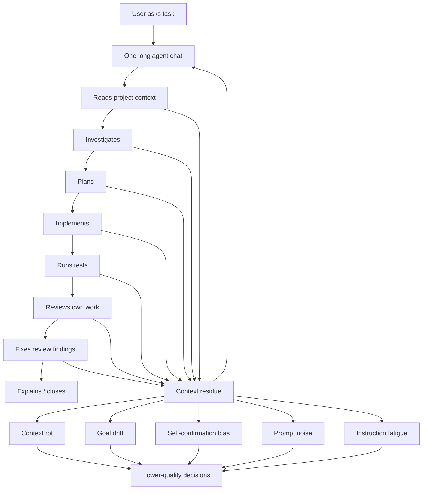
In the single-chat model, the agent is doing every cognitive role in the same context window:
- explorer
- planner
- implementer
- tester
- reviewer
- debugger
- security reviewer
- memory keeper
- release operator
That sounds convenient, but each step leaves residue. Old hypotheses, abandoned plans, partial files, failed commands, stale assumptions, and emotional momentum all stay in the same working memory.
The agent begins to carry too much of its own history.
Over time, the session starts behaving less like a clean reasoning system and more like a tired developer with too many browser tabs open.

## 2. Failure modes of the single-agent model

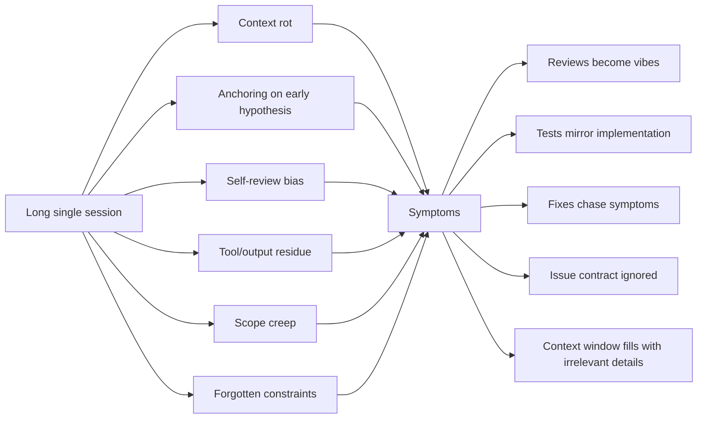
The dangerous part is not only token count. The dangerous part is cognitive contamination.
A long session makes it easier for the agent to:
- defend its own implementation during review
- test what it built instead of what the issue asked for
- keep following an early wrong hypothesis
- silently widen scope
- forget old constraints buried thousands of tokens back
- treat completion claims as evidence

## 3. Specialist pipeline: orchestrator as central mind

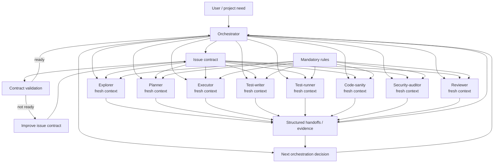
In the specialist model, the orchestrator does not try to become every expert itself.
Instead, it keeps the global thread:
- what the user wants
- what the issue contract says
- which specialist should run next
- what evidence has been produced
- whether the chain is allowed to continue
- whether the work is done
The specialists are spawned as fresh, narrow cognitive modules.
Each specialist receives:
- the issue contract
- role-specific system prompt
- mandatory rules
- scoped context
- relevant prior evidence
- output contract
Then it returns a structured handoff.
The orchestrator keeps continuity without filling its own context with every implementation detail.

## 4. The human mind analogy

This is close to how a human mind works when it is healthy.
You do not keep every low-level motor action, memory, belief, and skill in conscious attention all at once. You have a central executive that delegates to specialized subsystems:
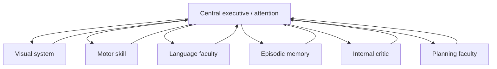
You do not consciously compute every word, muscle movement, and perceptual edge. Specialized systems do their work and report back.
`specialists` gives an AI agent a similar structure:
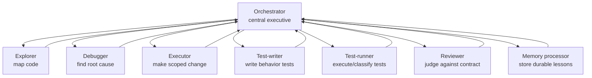
The orchestrator remains the “self”.
The specialists are capabilities and bounded memories that can be activated without permanently polluting the central context.

## 5. Contract-bound cognition

The crucial mechanism is the issue contract.
Without a good contract, specialists are just fragmented chaos. With a good contract, each specialist has a narrow frame and a clear success target.
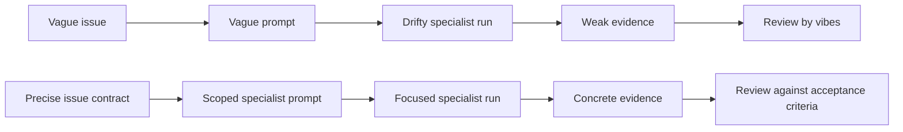
A dispatchable issue should say:
- problem
- desired outcome
- scope
- non-goals
- acceptance criteria
- validation
- dependencies
- risk
- suggested chain
- issue-local mandatory rules
Then each specialist can work from the same contract, but from a fresh context.

## 6. Context engineering instead of context hoarding

Single-agent sessions often hoard context:
```text
read everything → keep everything → reason in one giant window
```
Specialist orchestration uses context engineering:
```text
contract → select role → inject only relevant context → require structured output
```
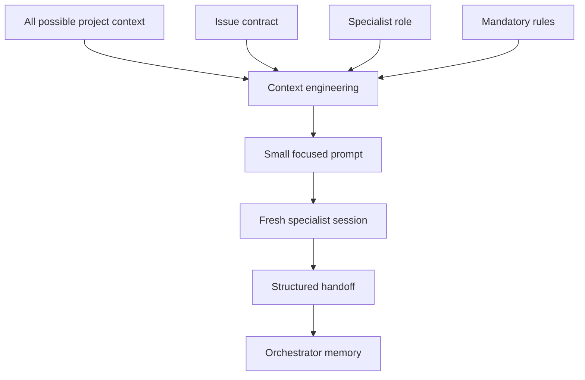
The aim is not to give every agent everything.
The aim is to give each agent exactly what lets it make a good local decision.

## 7. Full-ish specialist pipeline

A strong implementation chain looks like this:
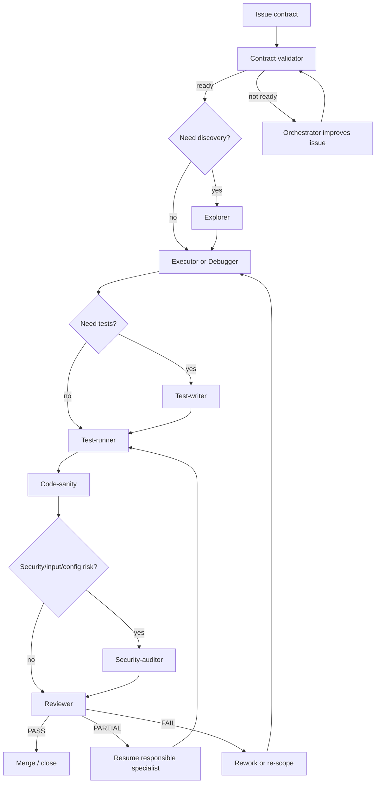
Not every task needs the full chain. The point is that the orchestrator chooses deliberately instead of letting one chat absorb every role.

## 8. Why this reduces drift

Specialists reduce drift because each role starts clean.
Executor does not carry the whole planning debate.
Reviewer does not share the executor’s self-justification.
Test-writer can be told to test the contract, not the implementation.
Security-auditor does not inherit the implementer’s optimism.
Code-sanity can look only for maintainability and type-risk.
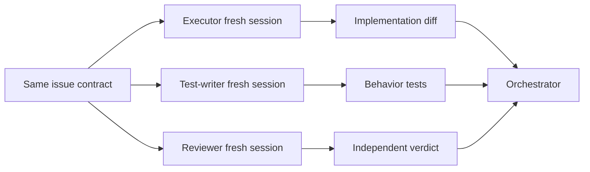
The orchestrator then compares independent outputs against the same contract.
That is the real advantage: independence with shared constraints.

## 9. What the orchestrator becomes

The orchestrator is not “the agent doing all work”.
It is closer to:
- working memory
- executive function
- scheduler
- judge of readiness
- context router
- evidence integrator
- keeper of task identity
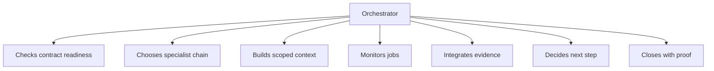
Specialists become capabilities the orchestrator can invoke without becoming them.
This lets the system scale task complexity without turning the central session into an overloaded memory dump.

## 10. Short version

Single-agent chat:
```text
One mind does everything → context fills → bias/drift/rot accumulates → self-review weakens.
```
Specialist pipeline:
```text
Central orchestrator keeps identity → specialists run fresh scoped cognition → structured evidence returns → reviewer checks contract.
```
Human analogy:
```text
Conscious attention does not contain every skill. It invokes specialized faculties, receives results, and decides what to do next.
```
For agents, `specialists` is that architecture.
It turns one overloaded chat into a coordinated mind with bounded expert subprocesses.

## 11. Herd memory system

The specialist system should not remember by stuffing everything into one orchestrator context.
It should remember through the herd.

Each specialist run produces artifacts:

- structured handoff
- investigation report
- root cause explanation
- test evidence
- review verdict
- runtime observation
- follow-up issue
- memory note

Those artifacts become shared memory for future runs.

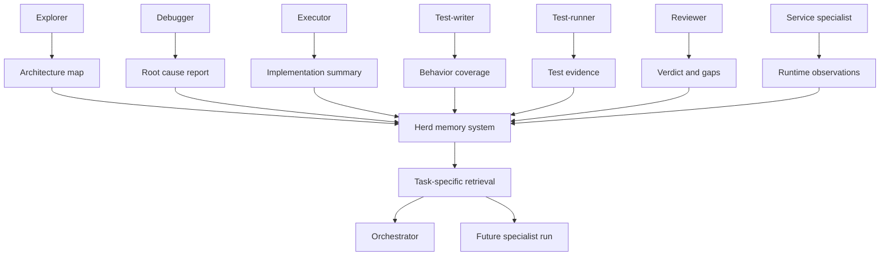

The herd remembers through artifacts, not through one giant context window.

This matters because memory becomes queryable, compressible, and attributable. A future debugger can retrieve the prior root-cause report without inheriting the entire emotional and tool-output history of the previous session. A future reviewer can inspect evidence without carrying the executor’s self-justification. The orchestrator can stay light while still having access to durable collective memory.

## 12. Adaptive pipelines

There is no single correct specialist chain.

The orchestrator should choose a pipeline based on task shape, issue contract, risk, and available evidence.

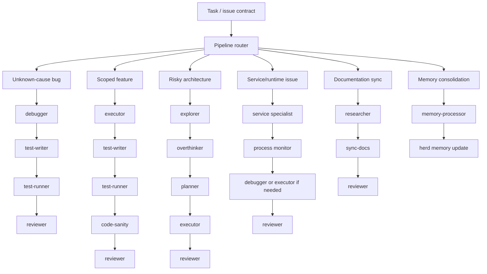

Examples:

```text
bug unknown cause:
debugger → test-writer → test-runner → reviewer

feature scoped:
executor → test-writer → test-runner → code-sanity → reviewer

risky architecture:
explorer → overthinker → planner → executor → reviewer

service/runtime issue:
service-specialist → process monitor → debugger/executor if needed → reviewer

knowledge/doc sync:
researcher → sync-docs → reviewer

memory consolidation:
memory-processor → herd memory update
```

The pipeline is itself part of the orchestration decision. A good orchestrator does not blindly run the same chain every time. It routes cognition.

## 13. Service specialists and long-running processes

Some specialists are not one-shot workers.

A service specialist can own a long-running process, monitor it, summarize it, and alert the orchestrator only when something meaningful changes.

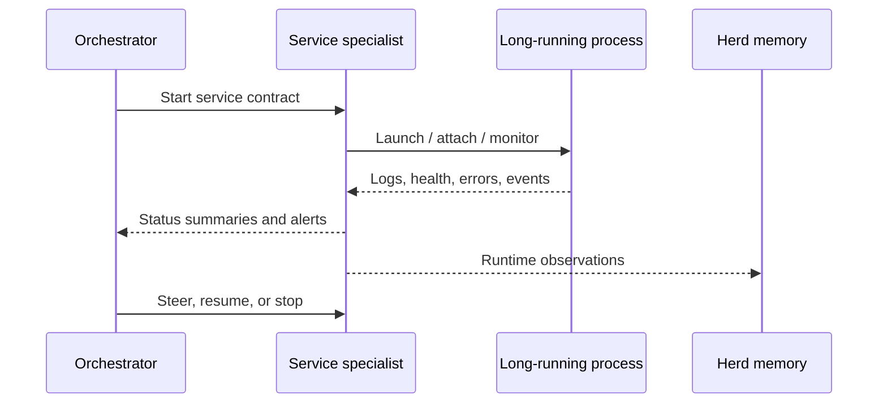

This is different from executor/debugger work.

A service specialist behaves more like a daemon faculty: it maintains a relationship with a runtime surface without forcing the orchestrator to keep raw logs, health checks, stack traces, and timing observations in central context.

Useful service-specialist responsibilities:

- run dev servers
- monitor test watchers
- track logs
- watch health endpoints
- summarize recurring failures
- detect readiness transitions
- preserve runtime observations into herd memory
- wake the orchestrator only for meaningful events

This is especially important for long-running test and preflight flows. Long runs are valuable stress harnesses, but their raw output should not become orchestrator context rot.

## 14. User specialists as custom faculties

Package specialists are the base faculties.
User specialists are custom faculties.

The specialists in paths like:

```text
/home/dawid/second-mind/.specialists/user
```

are examples of how the mind extends itself for personal or project-specific work.

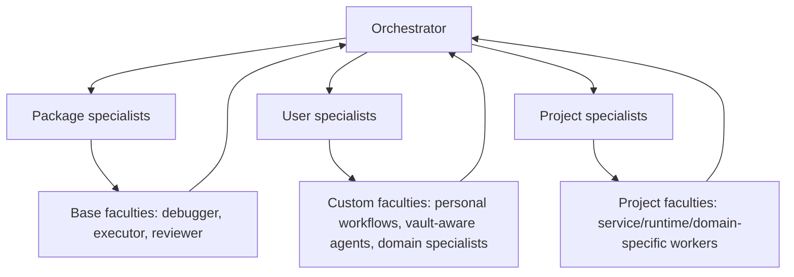

This makes the system extensible in the same way a person develops new skills.

The core mind does not need to permanently contain every domain. It can install or author a new specialist, then invoke that specialist when the right contract appears.

That means the specialists ecosystem is not just parallelization. It is a growing capability graph.

## 15. Updated short version

Single-agent chat:

```text
One mind does everything → context fills → bias/drift/rot accumulates → self-review weakens.
```

Specialist pipeline:

```text
Central orchestrator keeps identity → specialists run fresh scoped cognition → structured evidence returns → reviewer checks contract.
```

Herd memory:

```text
The system remembers through durable artifacts and retrieval, not by keeping every run in one context window.
```

Adaptive pipelines:

```text
Task shape chooses chain. Bug, feature, architecture, service runtime, docs, and memory work use different specialist paths.
```

Service specialists:

```text
Long-running processes are monitored by dedicated faculties, not by bloating orchestrator context with raw logs.
```

User specialists:

```text
Custom faculties extend the mind for personal, project, and domain-specific work.
```

For agents, `specialists` is a coordinated mind: central executive, fresh expert faculties, herd memory, and adaptable pipelines.
